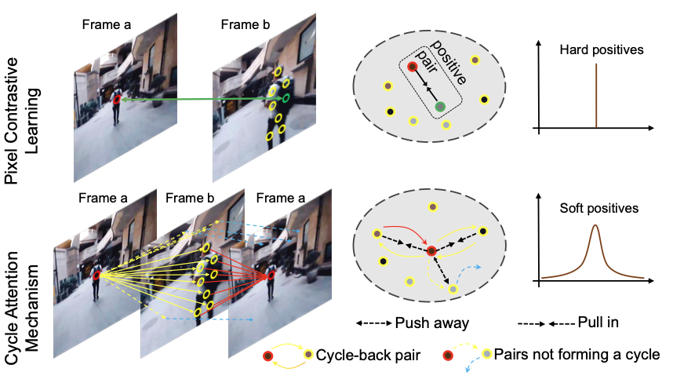
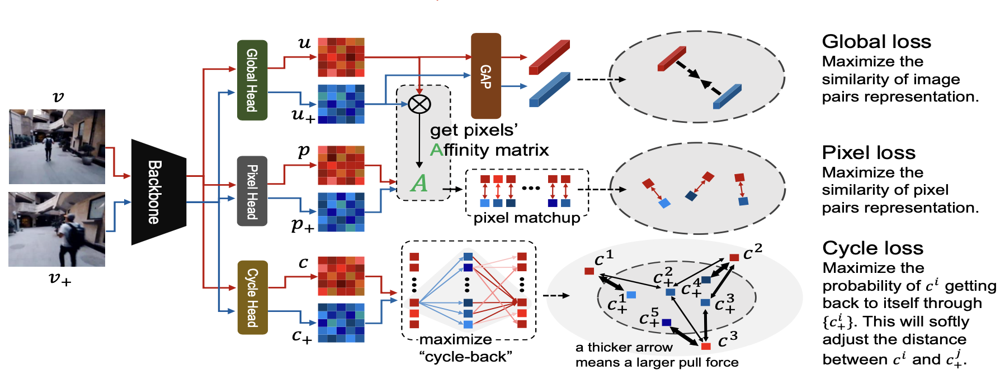
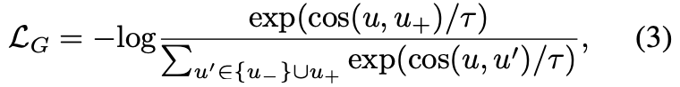
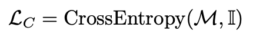

## [Unsupervised Representation for Semantic Segmentation by Implicit Cycle-Attention Contrastive Learning](https://www.aaai.org/AAAI22Papers/AAAI-243.PangB.pdf)

* Bo Pang , Yizhuo Li , Yifan Zhang , Gao Peng , Jiajun Tang , Kaiwen Zha , Jiefeng Li , Cewu Lu

* Shanghai Jiao Tong University, MIT

* AAAI 2022

* Code not provided

### Motivation and Problem Formulation

* What is the high-level problem?
  * End-to-end unsupervised learning for semantic segmentation on videos

* Previous works in two major lines
  * Design better pre-training methods which are more suitable for dense tasks
    * **Cons:** need to fine-tune models with supervision on downstream tasks

  * Adopt a two-stage scheme: (i) use optical flow or saliency estimation to generate preliminary intermediate results, (ii) contrastive framework for learning representations
    * **Cons:** Need complicated and supervised techniques from other fields to obtain the intermediate results

  * In contrast, this paper proposes end-to-end unsupervised learning with contrastive learning

As shown in the above image, traditional pixel contrastive learning can only extract pixel-level information. The cycle attention machanism is inspired from [this NeurIPS 2020 paper](https://arxiv.org/abs/2006.14613). Using in contrastive learning, the cycle attention mechanism can extract more meaningful patterns, like the auto-encoder

* What are the challenges?
  * Extract diverse positive pairs
  * Balance between global and local semantics

### Method

* They proposed Cycle-Attention Contrastive Learning (CACL)
  * Positive samples are extracted from the same video, negative samples are extracted from different videos
  * Inspired by the cycle-consistency mechanism, CACL digs more diverse positive pairs
  * CACL has three loss functions as shown below

* The first global loss is the global pixel contrastive loss
  

* The second pixel loss reorders the pixels and maximize the similarity. The affinity re-matching can extract local patterns above the pure pixels. Balancing the global loss and pixel loss can balance global and local semantics

* The third cycle loss is the key design that utilizes cycle attention

  * The "transition" is computed with the softmax function, and the loss function is the cross-entropy of the "cycle-back" transition probability
    

    

  * Use softmax function to change the similarity into transition probability ("jump")
  * A great representation should make most pixels "jump back" to themself (similar as autoencoder)

### Evaluations

* Datasets
  * Offline unsupervised training on ImageNet and Kinetics-400
  * Evaluations on PASCAL-VOC and Cityscapes (both image datasets?)

* Baselines: SimCLR, BYOL, MoCo-v2, etc., latest contrastive learning frameworks
  * Cons: No Siamese

* Metrics: linear protocol and limited-sample supervision
* Results: CACL outperforms the strong baselines by 4.5 mIoU

### Pros and Cons (Your thoughts)

* Pros: Very nice figures and nice writing
* Cons: Method seems to be complex to tune, for example, balance between three losses
* Other notes
  * Weak-supervision learning is a trend
  * Contrastive learning is promising for various apps. The key question is how to select positive and negative pairs?
  * The power of softmax is interesting, which can be used in various novel ideas. Using softmax as a transition for representation learning is interesting