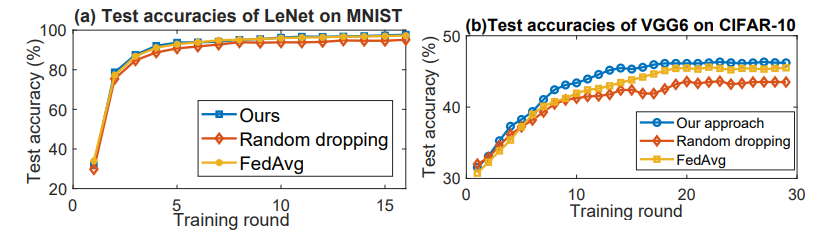
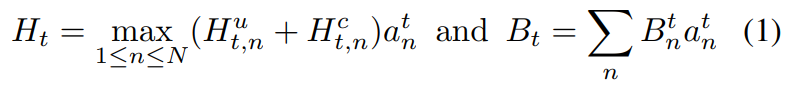
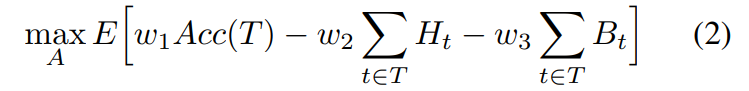
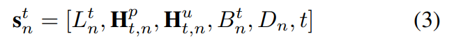
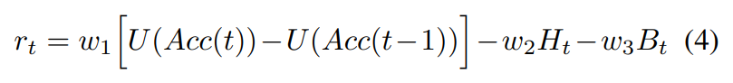
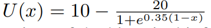
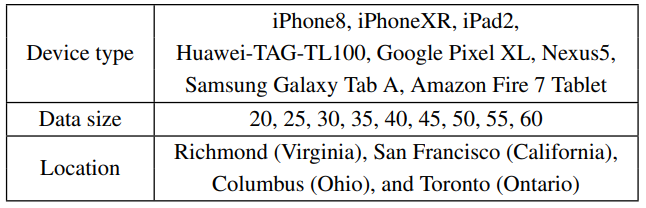
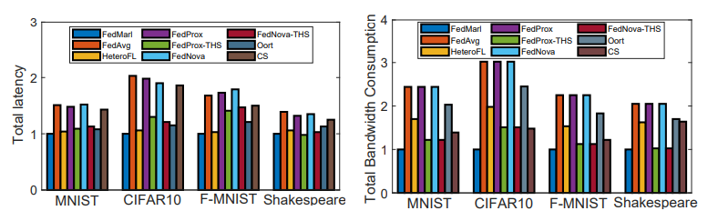
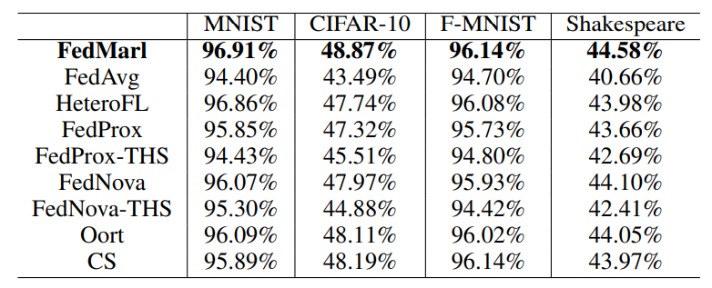
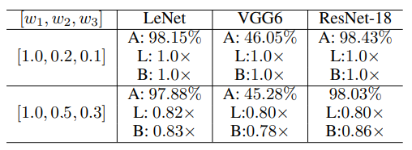

## [Learning Advanced Client Selection Strategy for Federated Learning](https://www.aaai.org/AAAI22Papers/AAAI-12714.ZhangS.pdf)

* Harvard University, University of Toronto, Microsoft

* AAAI 2022

* Code Not Provided

### Motivation and Problem Formulation

* **Motivation**: Client selection in Federated Learning is a important way to improve system efficiency and performance by reducing computing and communication overhead and avoiding non-iid client data.
* **Pervious Works**
    * Three main challenges in FL system:
      * Communicaation cost / latency from model transfer.
      * Client computational cost/ latency for local model training.
      * Bias form non-iid client data
    * Many past works on improving FL efficiency only target one of aforementioned challenges and often with the cost of other aspects of FL system.
* **Related works**
    * Federated Learning: Distributed learning paradigm where clients collectivelly train a comperhensive global model without sharing raw data and perserves privacy.
    * Multi-agent Reinforcement Learning (MARL): Reinforcement learning where multiple agents are trained in an environment with reward to achieve optimal individual actions.
* **Challenges**
    * Address all three FL challenges at the same time.
    * Method transferable for all FL system and adaptative to different priorities (Latency / Accuracy).

### Experiment on Probing Loss
* Probing Loss: Loss after first epoch of local training on local data.
* Including client with non-iid data in FL round can degrade global model performance for non-iid data can introduce bias.
* Bias data would cause trained model to have low accuracy on iid test set.
* Assuming Clients have access to a set of iid data, experiment shows that training loss after first epoch can be a good indicator for iid/non-iid data. \
  
    * Experiment using probing loss to drop 50% of clients show improvment.
* Hence probing loss as bias indicator can be useful in training multi-agent system.

### Problem Formulation
\ 
* Ht denotes the total latancy of t-th FL training, it is defined to be the maximum value of the sum of training and communication latancy across all selected clients.
* Bt is the total communication cost of selected clients in a given round.
* Training Objective:
* Client Selection Objective \

  * A is a T x N binary matrix indicates whether or not a client is selected for FL training in a round.
  * w are weights assigned for each sub-objective to make system adaptive to different priority.

### MARL Training
* Used Value Decomposition Network(VDN) for for jointly training agents in cooperative MARL (Another large topic).
* Above mentioned FL optimization problem can be translated to a MARL problem.
* Each client is represented in server as a MARL agent with two possible actions:
  * 1 - usable in current round of FL training.
  * 0 - Client will introduce bias, eraly termination
* Each agent is a Multi-layer perceptron. Every round each agent take in current state and output an action to achieve client selection.
* Agent state input

  * First term is Probing loss for the client.
  * Second term is current and historical probing latancy vector.
  * Third term is current and historical communication latancy.
  * Forth term indicate communication cost for the client.
  * D inidicate local data size.
  * Last term is the FL training round index.
* Reward Function \

 \
  * Base on changes in global accuracy. 
  * Reward function for VDN training
  * Function U makes sure moderate chanage even if Acc(t) improvement is small near the end of the FL process.

### Systemflow
\ 
* Three main components:
  * Model Storage for federated global model and model aggregation using FedAvg.
  * MARL for agent models, MARL training and selection decision making.
  * Statistics Collection stores current and historical latency / loss infomation as well as other relvent information for agent state input.

### Experiment
* Setup
  * Evaluated on different popular DNN model
    * LeNet on MNIST
    * VGG6 on CIFAR10
    * Resnet-18 on FashionMNIST
* Device heterogeneity \

  * Each client is generated randomly base on the table for different computation / communication and client data characteristic.
* Result \
 \

  * Proposed Client selection stratagy achieve better accuracy with no additional cost or latency
* Adaptivity \

  * Proposed method can be tranfer to different FL system with different priority.

### Pro / Con
* Pro
  * Address three major FL challenges at once.
  * Method is adaptive and transferable to different FL system.
  * Interesting client generating idea.

* Con
  * Server computation overhead.
  * How agents share model weights.
  * How function U is chosen.
  * VDN ? (Need further reading)

