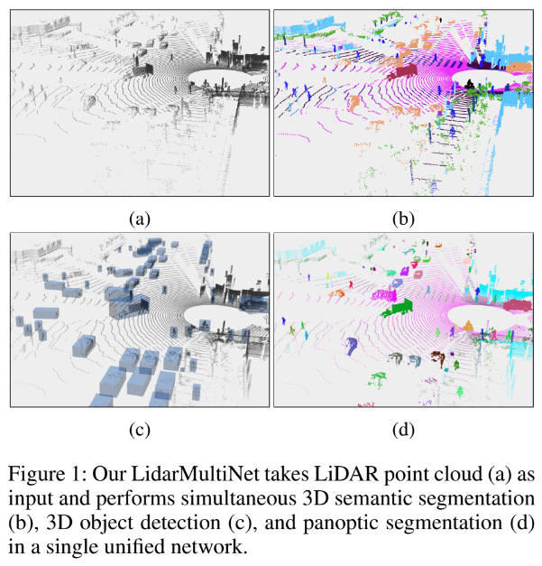
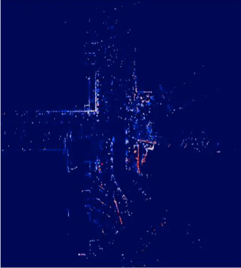
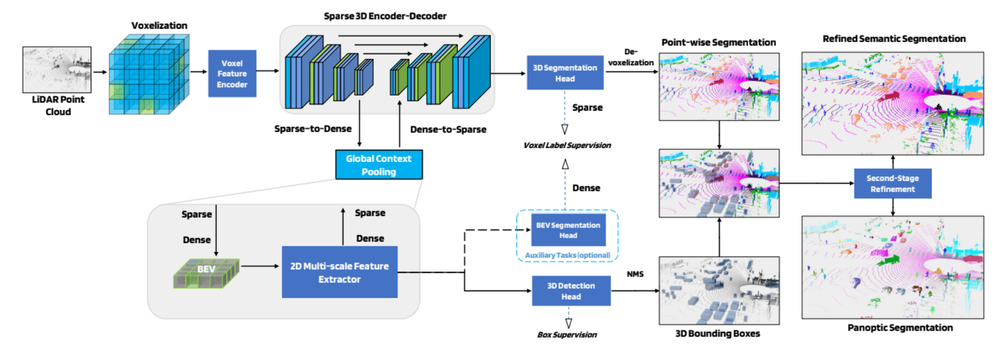
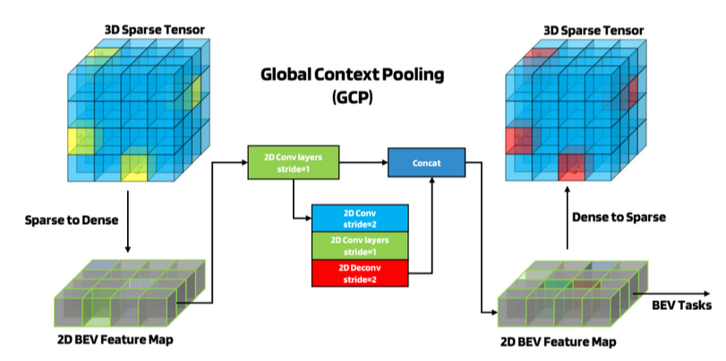
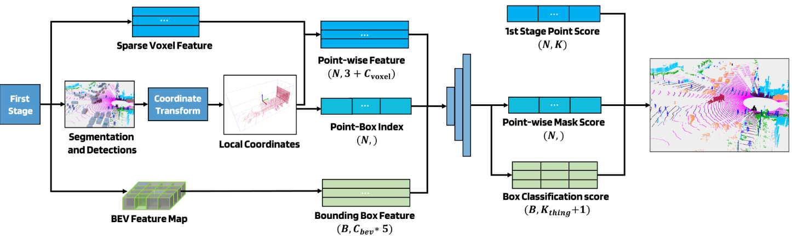
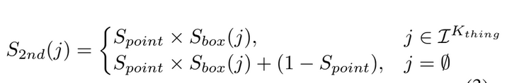
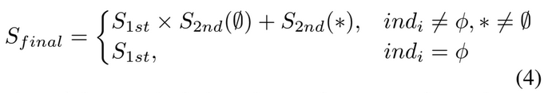
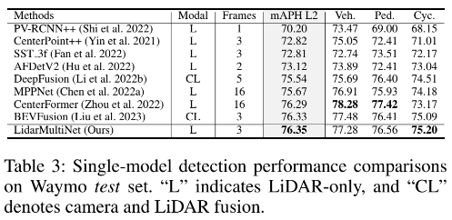
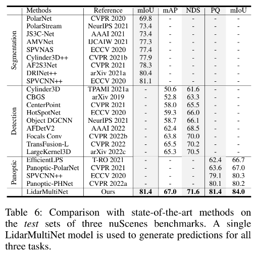
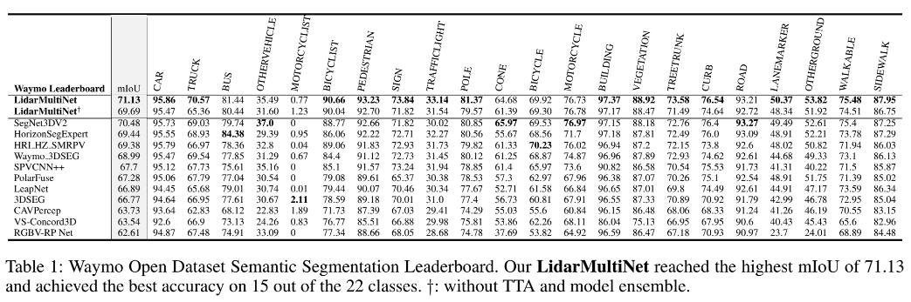

## [LidarMultiNet: Towards a Unified Multi-Task Network for LiDAR Perception](https://arxiv.org/abs/2209.09385)

* Dongqiangzi Ye (TuSimple), Zixiang Zhou (TuSimple & University of Central Florida), Weijia Chen (TuSimple), Yu Wang (TuSimple), Panqu Wang (TuSimple) & Hassan Foroosh (University of Central Florida)

* AAAI 2023

* No code available

### Motivation and Problem Formulation

* **Problem**: 3D Object Detection (identify object), Semantic Segmentation (classify each pixel) and Panoptic Segmentation (Semantic Segmentation + Classification per Instance for each object) are implemented in specialized networks. This can seen in the following image:

    

* **Importance**: LiDAR-based perception is necessary in autonomous driving.
* **Challenges**:
   * Difficult to adapt to other tasks.
   * How to efficiently encode the large-scale sparsely distributed point cloud to a uniform feature representation?
   * In panoptic segmentation you usually lose height information from bottom-up segmentation so it’s difficult to adjust to segmentation.
* **Major Contributions**:
   * Novel voxel-based LiDAR multi-task network.
   * Global Context Pooling (GCP) to improve global feature learning.
   * 2nd stage refinement module for refinement of semantic segmentation and ponoptic segmentation results.
   * Outperforms SOA on 5 LiDAR benchmarks even with LiDAR-only non-ensemble methods.
* **Previous Works**:
   * Prior LiDAR multitask networks have underperformed compared to single task + fail SOA performance.
   * Learn features using 3D -> 2D voxelation with Bird’s Eye View (BEV) or range-view projection. The examples of this 2 views can be seen in the next images:
      * Birds Eye View

        

      * Range View
    
        

   * Object Detection:
      * 3D sparse tensor -> 2D BEV feature map and perform detection in BEV
      * Anchor free detectors (Center-based detection instead of axis-based)
   * Segmentation: Needs a larger feature map to reduce error when transforming voxel to points.
   * Panoptic Segmentation: LiDAR panoptic segmentation still underperform compare to independently combined detection + segmentation.
   * Multitask Networks: Unify closely related tasks by sharing the weights and computations among them to boost performance
      * MultiNet: Image based that unifies object detection + road understanding tasks
      * LidarMTL: LiDAR-based multitask network object detection + road understanding not major perception tasks
* **Assumptions**: Multiple frequent LiDAR scans like from autonomous vehicles (dense point cloud) + A lot of data (Multiple LiDAR scans).

### Method

* **LidarMultiNet**: Unify 3D semantic segmentation, 3D Object Detection and panoptic segmentation in a versatile network that exploits relationship in these tasks.
* **Main Architecture**:

   

   * Voxelization step: converts LiDAR -> Regular voxel grid
   * VFE: MLP + Max pooling layers to generate enhanced sparse voxel features
   * 3D Sparse U-Net architecture: Lateral skip-connected features from encoder are concatenated with voxel features decoder
      * 4 stages of 3D sparse convolutions with increasing channel width
      * Each stage = Sparse Convolutional Layer + 2 Submanifold sparse convolutional blocks
   * Global Context Pooling (GCP)
   * 3D segmentation head: outputs voxel-level prediction -> point level (de-voxelization)
   * 3D Detection Head: Anchor free 3D detector CenterPoint
   * BEV Segmentation Head: Coarse segmentation results helpful in training
   * Each head has it’s particular losses
* **Global Context Pooling**:

   

   * Extracts large-scale information from dense BEV feature map.
   * Useful for:
      * Learn global contextual information for segmentation
      * Object detection and other BEV tasks
   * Transformation sparse to dense with concatenation
   * Use 2D multi-scale CNN for long-range extraction
   * Reshape encoded BEV feature representation -> dense voxel map -> sparse voxel with a reverse conversion.
* **Second-stage Refinement**:

    

   * Get local coordinates of points in each box and concatenate with voxel features
   * Assign point-box index to the points in each box 0 <= ind_i <= B.
   * PointNet-like network (MLP + Attention module + Aggregation module) to predict point-wise mask scores and box classification
   * Refined segmentation scores = merging 1st and 2nd stage results -> assign to class with max score
   * To get the 2nd. stage results the following formula is used:
 
     

   * To get the final results results the following formula is used:
 
     

   * In the past formulas, they are using the following characters:
 
     
 
### Evaluations

* Dataset
   * Waymo Open Dataset (WOD)
      * Object Detection, Semantic Segmentation
      * 2 Levels based on difficulty
      * 23 classes
   * nuScene:
      * Object Detection, Semantic Segmentation, Panoptic Segmentation
      * 10 Foreground classes (things) + 6 Background classes (stuff)
* Metric
   * WOD:
      * Average Precision Weighted by Heading (APH) for detection
      * Intersection Over Union (IOU) for segmentation
   * nuScene:
      * Mean Average Precision (mAP) + NuScene Detection Scores (NDS) for detection
      * mIoU for semantic segmentation
      * Panoptic Quality (PQ) for panoptic segmentation
* Implementation:
   * WOD merge every 2 frames + nuScenes merges every 9 frames for denser clouds.
   * Data Augmentation: Random flipping, global scaling, rotation and translation.
   * 8 A100 GPUs -> Batch = 2 + 20 epochs
* Baselines: SOA Algorithms seen in tables
* Key results:
   * Table 3: Highest mAPH in L2 Test sets in detection task for WOD
 
     

   * Table 6: Outperforms the previous SOA single-task models in nuScene
 
     

   * Table 1: Final WOD semantic segmentation leaderboard and shows that LidarMultiNet achieves mIoU of 71.13 on the leaderboard.
      * TTA = Test-Time Augmentation and model ensemble to further improve the performance
    
     

### Pros and Cons (Your thoughts)

* Pros:
   * Really good difference with SOA
* Cons:
   * Hard to follow through + Assumes a lot of previous knowledge
   * Weird that camera + lidar doesn’t have better accuracy than only LiDAR
   * No RGB Values on the dataset
   * Claims “notable efficiency” but only shows prediction runtime, not training which might be slow because there’s 3 different trained heads + 8 GPUs seems to indicate this.
