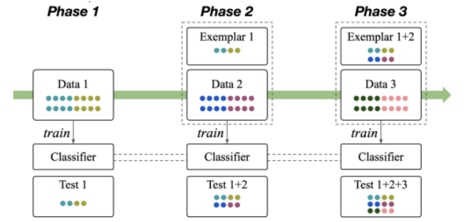
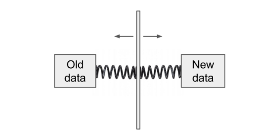
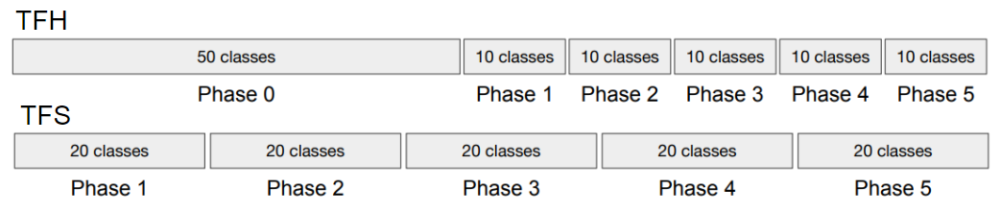
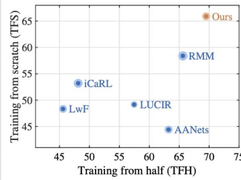
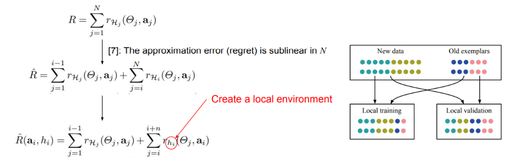
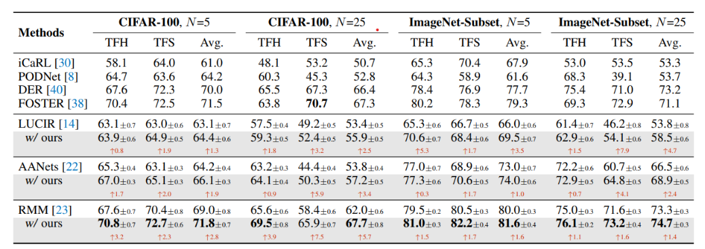

## [Online Hyperparameter Optimization for Class-Incremental Learning](https://arxiv.org/pdf/2301.05032.pdf)

* Max Planck Institute for Informatics, California Institute of Technology, Singapore Management University

* AAAI 2023

* Code Not Provided

### Motivation and Problem Formulation
* The core of lifelong learning problem is the balance elasticity and stability. 
  * Elasticity: Ability to learning and adapt shifting distribution
  * Stability: Ability to retain previous knowledge
* Lifelong learning form learning perspective
  * Depending on use case, some time prioritize one over other is beneficial

* Previous works
  * Previous works focus on architectural perspective for LL problems
  * Previous works offer fixed Elasticity and Stability.

### Problem Formulation

* Can not revisit sample from previous phase
* Expand exemplars at each phase
* Incremental testing on each phase
* Training can not access test data

### Trade offs

* Higher stability weakens the model from learning the data of new classes
* Higher plasticity results in the forgetting of old classes (i.e., “catastrophic forgetting”)
* There are hyperparameters can balance the two or prioritize one.

* Different data-receiving settings require different stability/plasticity
  
  * The “training-from-half” (TFH) setting requires higher stability
  * The “training-from-scratch” (TFS) setting requires higher plasticity
  * TFH or TFS is often unknown before hand.
    * How to balance the two dynamically

* Existing CIL methods pre-fix the tradeoff balancing methods
  
  * LUCIR, AANets, and RMM are more suited for TFH
    * Reason: using strong (feature) knowledge distillation (KD) → high stability
  * iCaRL[5] and LwF[6] are more suited for TFS
    * Reason: using weak (logit) knowledge distillation (KD) → high plasticity
  
  
### Method

* Model as an online MPD
  * State: model
  * Action: Hyperparameters
  * Reward: Validation acc at each phase
* Objection: Learn policy maximize the cumulative reward

* Due to online setting, rewards can not be directly calculated
  * Construct local environment to estimate
    * Based on exemplars and current phase data

* Learning policy
  

* Action space
  * constants for losses for staability.
  * Classifier (FC, NSM)
  * Learning rate
  * Continuous parameters are discretized so action space is finite

### Experiment

* On CIFAT 10, 100 and ImageNet

### Pro / Con
* Pro
  * Interesting perspective on training. (Training parameters, like model, can be learned)
  * Applicable to other LL problems and even problem outside of LL domain.
* Con 
  * Unrealistic assumption: expanding exemplar set
  * Unfair comparison.
  * Is invoking MDP really necessary

