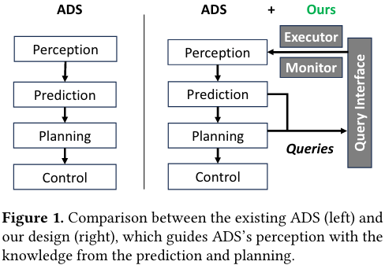
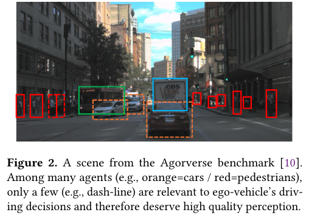
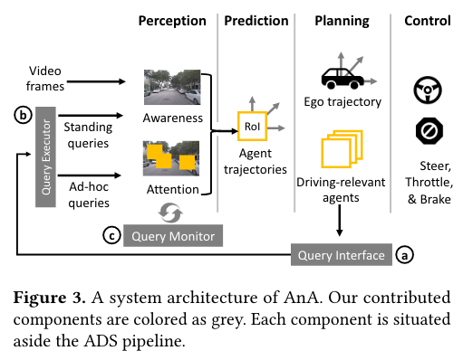
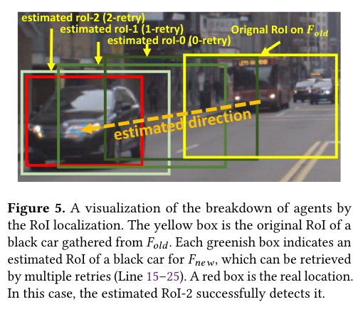
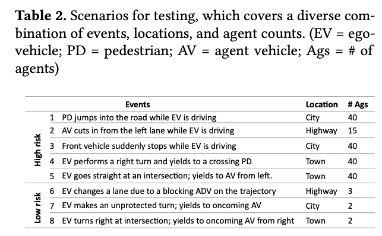
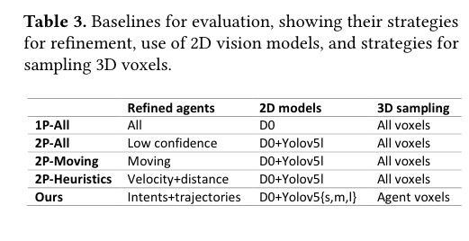
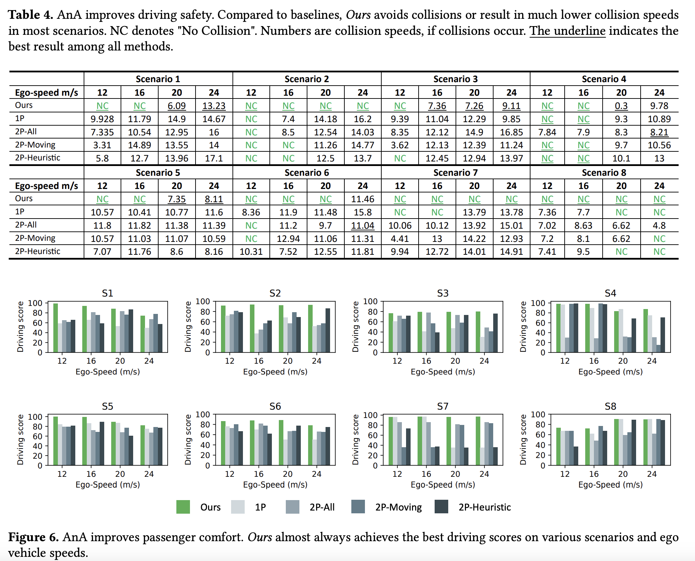
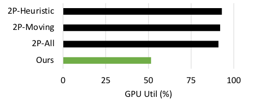
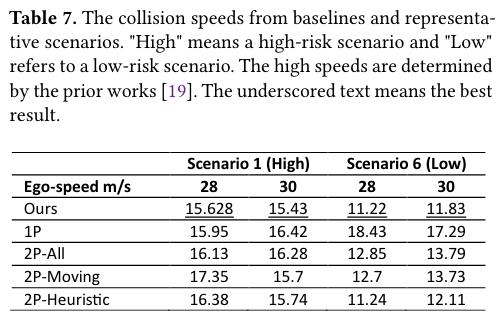

## [AnA: An Attentive Autonomous Driving System](https://dl.acm.org/doi/pdf/10.1145/3669940.3707261) [ASPLOS'25]

* Wonkyo Choe, Rongxiang Wang, Felix Xiaozhu Lin, University of Virginia

* ASPLOS'25

* Code not provided

### Motivation and Problem Formulation

* What is the high-level problem?

  * Building efficient and safe autonomous driving systems (ADS)

    

* Why is it important?

  * Efficiency and safety are key bottlenecks of ADS

* What are the challenges?

  * Accuracy vs. Latency vs. resource constraints

* What is missing from previous works?

  * Existing systems are oblivious to the **human driving knowledge**, e.g., the current driving 
    risks, the predicted trajectory of surrounding agents

    * **→ not efficient and safe**

    

* What are the key assumptions?

  * An implicit assumption: The speed of the vehicle is typically less than 30m/s (108km/h)

### Method

* What are the major contributions?

  * This paper proposes two new construction principles for ADS
    * Guiding perception with driving knowledge

    * Separating perception mechanisms for awareness vs. for attention

  * This paper presents AnA, which *proactively* attends to high-risk agents (surrounding objects, e.g., cars, pedestrians)
    * AnA has three major components

  * They implemented AnA atop an ADS software stack, applying it to both 2D and 3D perception
    * Results show that AnA strengths safety and efficiency

* AnA Overview

  

  * Three key components

    * **Query interface:** register continuous interests in agents
      * Standing queries - awareness
      * Ad-hoc queries - attention (important)

    * **Query executor:** translates queries to vision tasks while configuring frame rates
    * **Query monitor:** tracks in-flight tasks
      * Such as, whether a task completes within target latency and yields sufficient confident

  * Query interface

    * **Standing queries: <S_g, C_g>**
      * S_g: probabilistic location
      * C_g: class of agents
      * First pass: All agents, only pass the interested agents to the 2nd pass

    * **Ad-hoc queries:** <L_g, E_g, C_g>
      * L_g: query latency
      * E_g: error bound
      * C_g: Speed class of the agent
      * Second pass: Generated by evaluating the possible overlapping future trajectories

    * Note: g represents one perception

  * Query executor

    * Two-pass mechanism that aligns with human psychology

    * **First pass: dispatch standing query**

      * Control ingestion rate w.r.t. How busy the environment is 

    * **Second pass: dispatch an-hoc query**

      * (1) Assign variants of object detectors to ad-hoc queries

      * (2) Locate suitable Region-of-interests (RoIs) and pick the right frame for each object detector

        

  * Query monitor

    * Two exceptions and the behaving protocol
    * Latency violation w.r.t. L_g
      * → Pass an indication of exception to planning, which suggests the use of low-level vision operator

    * Error bounds violation w.r.t. E_g
      * → Mark the RoIs and indicate it requires a higher-level vision operator

### Evaluations

* How they evaluate their method (experimental setup)? 

  * System implemented on Pylot and CARLA simulator

    * Including both 2D and 3D vision (depth value)

  * **Test platform:** AMD Ryzen 9 3950X 16-Core CPU, 32 GB of DRAM, one NVIDIA Geforce GTX 1080 Ti GPU

  * **Test scenarios** and **baselines**

    

    

  * **Metrics**

    * Driving safety - collision rate
    * Driving comfort - comfort level score (high is better)
      * Defined by the CARLA driving challenge
      * The score is a product of the percentage of completed route distance and infraction penalty
        * Penalty includes sudden lane changes, collision and driven distance

    * Efficiency - GPU utilization

* What are the key results?

  * Main results

    * AnA outperforms competitive baselines: it responds to adversarial events timely, reducing collisions by 2x; it reduces compute usage by 44% without compromising driving safety

      

    

  * Very detailed ablation studies

  * Sensitivity to system environments

    * Scene complexity

      * In low-risk scenarios (S6-S8), AnA’s efficiency is more pronounced
      * In high-risk scenarios (S1-S5), AnA’s safety is more pronounced

    * High Speed

      * The advantage of AnA diminish at high vehicle speed

        

    * More expensive hardware

      * Test on NVIDIA RTX 4090: Both AnA and baseline results are improved
      * Abundant resources are more forgiving to suboptimal optimizations

### Pros and Cons (Your thoughts)

* Pros: Very interesting paper and comprehensive evaluations
  * I learn a lot about ADS
* Cons:
  * Did not explicitly compare with SOTA systems, e.g., D3 [EuroSys’22]
  * A lot of details are not super clear, I suspect this is because they use manual/heuristic design
    * E.g., vision task assignment, planning

