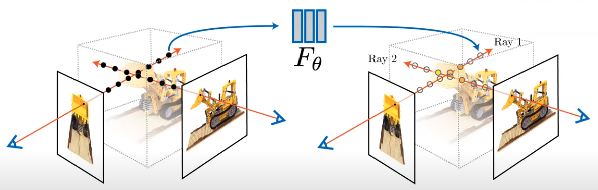

## [MetaSapiens: Real-Time Neural Rendering with Efficiency-Aware Pruning and Accelerated Foveated Rendering](https://dl.acm.org/doi/10.1145/3669940.3707227) [ASPLOS'25]

* Weikai Lin, Yu Feng, Yuhao Zhu

* ASPLOS'25

* https://horizon-lab.org/metasapiens/

### Motivation and Problem Formulation

* What is the high-level problem?
  * Point-Based Neural Rendering (PBNR) on mobile devices

* Why is it important?
  * Real-time photorealistic rendering is important in AR/VR and digital twins

* What are the challenges?
  * PBNR is still far from real-time on mobile devices, generally < 10 FPS on NVIDIA Xavier

* What is missing from previous works?
  * Foveated Rendering, e.g., Fov-NeRF [IEEE TVCG’22]
    * Cons: NeRF is different from PBNR

  * Efficient PBNR using pruning points [CVPR’24, ECCV’24], vector quantization [NeurIPS’24]
    * Cons: # of points is not indicative of performance → naive pruning may not be effective

  * Neural Rendering accelerator
    * Cons: Most works focus on NeRF. Only GSCore [ASPLOS’24] focuses on 3DGS, a particular PBNR model

* What are the key assumptions?
  * The resource level of (mobile) AR/VR headset is similar to NVIDIA Xavier

### Background

* Neural Radiance Field (NeRF)

  * Generate image at different views

    

* Point-Based Neural Rendering (PBNR) 

  * A newer class of neural rendering techniques, after NeRF

  * Example: 3D Gaussian Splatting (3DGS)

  * More efficient than NeRF, usually >1000x

    * Using discrete points (rather than voxels) to avoid redundant computations
    * Rendering via a lightweight rasterization process (splatting), rather than heavy MLP

  * Three steps: (1) Projection (2) Sorting (3) Rasterization

    

    

* Foveated Rendering

  * Human visual “sharpness” drop as moving away from the “visual center”

  * Intuition: this can be used for improving efficiency

  * Question: how to quantify the human visual quality?

    * They leverage a **Human Visual System Quality (HVSQ)** metric

      

    * Intuition: as long as the statistics of the content in a spatial pooling between two images are close, humans cannot discriminate between them

### Method

* What are the major contributions?

  * MetaSapiens: the first PBNR system that delivers real-time neural rendering on mobile devices, while maintaining visual quality

  * They propose an **efficiency-aware pruning** method for PBNR, rather than merely reducing point counts

  * They propose the first **foveated rendering** method for PBNR, based on a new point representation

  * They introduce a **training framework that incorporates** both pruning and foveated rendering, while maintaining subjective visual quality

  * They co-design an **accelerator** architecture which addresses the load imbalance issue

* Efficiency-Aware Pruning

  * **Motivation:** the number of tile-ellipse intersection is the real driving factor for latency, not point count

    

  * **Proposal 1:** a new pruning metric called Computational Efficiency (CE)

    

  * **Proposal 2:** scale decay, to focus on ellipses that are both large and are used by a lot of tiles in rendering

    

  * Putting it all together - make it an iterative training process

    

* Foveated PBNR

  * **Challenges:** Performance & Storage overhead + controlling quality

  * **Proposal 1:** efficient data representation, i.e., points used to render a lower quality level are strictly a subset of the points of a higher quality model

  * **Proposal 2:** Use HVSQ to guide L2-L4 model pruning from L1 model

    

* Hardware accelerator

  * Built on top of GSCore [ASPLOS’24]

  * Added two new hardware components (yellow areas) to support two new stages: Filtering and blending

    

  * New proposals - to address workload imbalances

    * Tile merging unit

    * Incremental pipelining with line buffer

      

### Evaluations

* Experimental setup

  * Hardware implementation
    * RTL design via Synopsys synthesis and Cadence layout tools in TSMC 16 nm FinFET technology
    * Overall area: 2.73mm^2

  * Datasets: three real world datasets, MipNerf360, Tanks & Temple, DeepBlending
  * Baselines
    * **Dense PBNR models:** 3DGS [Transactions on Graphics’23], MIP-Splatting [CVPR’24], StopThePop [Transactions on Graphics’24]. Mini-Splatting-D [ECCV’24]
    * **Pruned PBNR models:** LightGS [NeurIPS’24], CompactGS [CVPR’24], Mini-Splatting [ECCV’24]
    * **Foveated Rendering methods:** Single-Model FR, Multi-model FR [TVCG’22]

  * Metrics
    * **Render quality:** PSNR, SSIM, LPIPS
    * **Efficiency:** FPS
    * **Real user study:** 12 participants, present MetaSapiens and Mini-Splatting-D to the participants, and ask which one they prefer

* Rendering quality-FPS trade-off on NVIDIA Xavier

  * MetaSapiens is 1.9-7.9x faster than the fastest baseline while having better or similar rendering quality

    

* User study

  * Users either have no preference or prefer their model

    

* Hardware acceleration results

  * Even the base accelerator achieves a 18.5x speedup compared to the GPU baseline

    

* Ablation study

* Comparison to other foveated rendering methods

### Pros and Cons (Your thoughts)

* Pros:
  * Very comprehensive evaluation
  * Latest baseline
* Cons:
  * Ideas are very intuitive (if this is a cons)