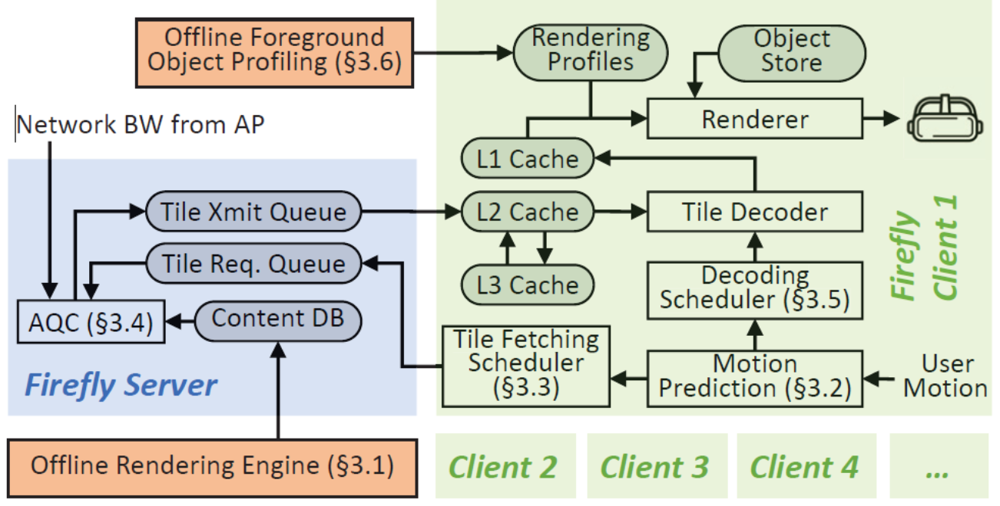
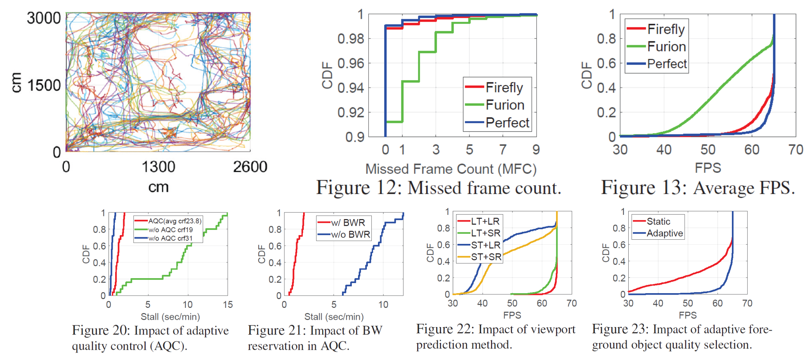

## [Firefly: Untethered Multi-user VR for Commodity Mobile Devices](https://www.usenix.org/system/files/atc20-liu-xing.pdf)

* Xing Liu, University of Minnesota, Twin Cities; Christina Vlachou, Hewlett Packard Labs; Feng Qian and Chendong Wang, University of Minnesota, Twin Cities; Kyu-Han Kim, Hewlett Packard Labs

* USENIX 2020

* Code not provided

### Motivation and Problem Formulation

* What is the high-level problem?
  * Determine the feasibility of multi-user VR using common hardware

* What are the challenges?
  * Server
  * Rendering
  * Efficiency
  * Bandwidth
  * Movement
 
* Previous works
  * MUVR
  * Furion

* Assumptions
  * Close proximity to WAP
  * BYOD
  * VR Headset

### Method

* What they propose to solve the problem?
  * Server
    * Desktop, Octa-core 3.6GHz
    * 16 GB RAM, 1 TB HD
    * Ubuntu 16.04

  * Devices
    * 5 COTS Android Smartphones
    * 10 Raspberry Pi 4s

  * WAP
    * 802.11 ac

    

### Results

  *   
       

### Pros and Cons 

* Pros:
  * Ability to adapt to different devices
  * Scalability

* Cons:
  * 10 of 15 devices were simulated
  * Need to pre-render scene

* Something I learned from the paper:
  * Ease of VR accessibility  
