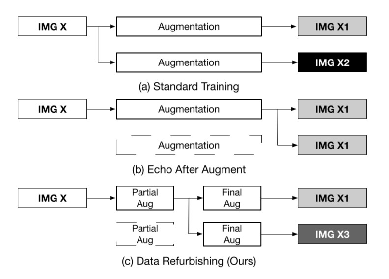
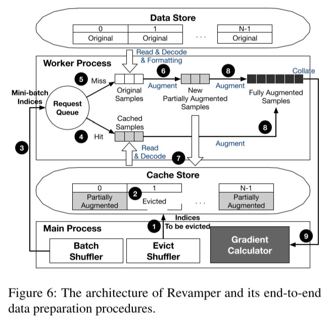
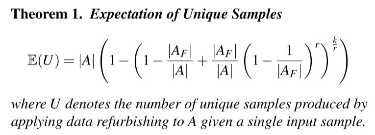
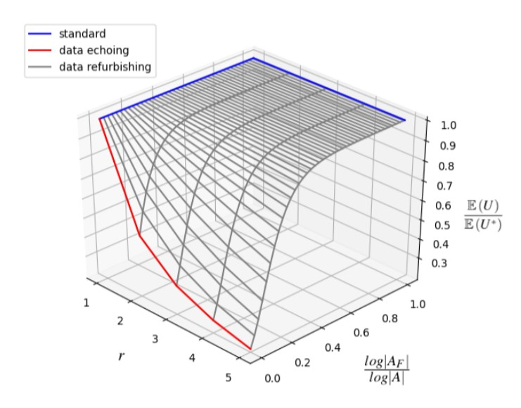
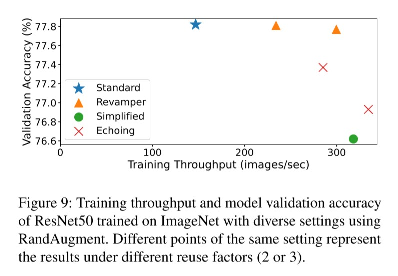
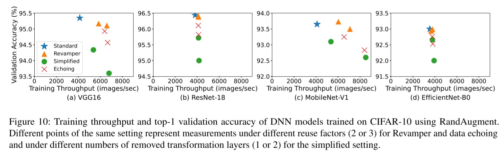

## [Refurbish Your Training Data: Reusing Partially Augmented Samples for Faster Deep Neural Network Training](https://www.usenix.org/system/files/atc21-lee.pdf)

* Gyewon Lee, Ahnjae Shin and Byung-Gon Chun Seoul National University and FriendliAI; Irene Lee, Georgia Institute of Technology; Hyeonmin Ha, Kyunggeun Lee, and
Hwarim Hyun, Seoul National University;

* ATC 2021

* No code provided

### Motivation and Problem Formulation

* Data augmentation often suffers from heavy CPU overhead, which can degrade the training speed.
    * It causes a performance bottleneck in DNN training
* Challenges: Reduce the overhead but maintain the diversity of samples.
* Previous Works:
    * NVIDIA DALI and TrainBox: hardware accelerators Such as GPUs and FPGAs to optimize data augmentation but due to stochastic nature of data augmentation makes it difficult to parallelize.
    * Data echoing: reduce computation by splitting training pipelines and reusing previously prepared samples but it considers augmentation as a black-box operation and splits the DNN training pipeline only before or after the augmentation which decreases the number of unique samples.
* Assumptions:
    * Training data must be accessible from the local disk, this means the training data must be lower than the capacity of local disk
    * Good split policy

### Method

* Data Refurbishing:

    

    * Split into partial augmentation (which can be reused by caching the samples and kept a specific number of epochs) and final augmentation used for gradient computation which renewed to preserve diversity and leeds to reduce CPU Computation
* Revamper: New data loading system
    
    
    
    * It maximizes the overlap between CPU and deep learning accelerators by keeping the CPU processing time of each training step constant.
    * Addresses challenges specific to DNN
        * CPU fluctuations due to cached misses which is solved with balanced eviction
        * Intra-epoch computation skew which is solved with cache aware shuffle
    * Overrides PyTorch dataloader
* Steps in the process:
    1. Evict shuffler selects the samples to be evicted following the balanced eviction strategy by assuring that each cached sample is reused for the same number of times
    2. Cache store then invalidates the selected samples
    3. Main process allocates mini-batch indices to each worker sampled from the batch shuffler
    4. Hit samples = the worker process reads from the cached samples
    5. Missed samples = the worker process reads the original training samples
    6. Partial augmentation of the samples
    7. Stores the new partially augmented samples in the cache
    8. Applies the final augmentation
* Balanced Eviction: At the start of each training epoch, the evict shuffler samples $(N/r)$ indices to be evicted  replaced with new partially augmented samples, where N denotes the number of training samples and r denotes the reuse factor. All the cached samples are also evicted every r epochs because the evict shuffler always selects indices in a same order.
* Cache-aware shuffle:  The cache-aware shuffle prepares mini-batches in a way that each mini-batch has the same ratio of cached to non-cached samples.
* Why does it work?
    
    
    
    * Specifies uniqueness given by the number of functions in the final augmentation $(|A_F|)$, the number of total functions $(|A|)$, $r$ = reuse factor, $k$ = number of epochs
    
    
    
    * The image shows how it can can save computation without significant loss of the model generalization as long as the final augmentation provides sufficient sample diversity.

### Evaluations

* DNN Models + Dataset:
    * ResNET-50 on ImageNet.
    * VGG-16, ResNET18, MobileNet, and EfficientNet-B0 with CIFAR-10.
* Baseline: Standard, Data Echoing, Simplified (same as standard but with less transformation layers)
* Metric = Top-1 Accuracy VS Training Throughput (images/sec)

* In Figure 9: it shows how with ResNet-50, Revamper achieves top-1 accuracy comparable to the accuracy of 77.82% under the standard setting with better training throughput.

* In Figure 10: it shows how with VGG-16 (Figure 10 (a)) and MobileNet-V1 (Figure 10 (c)), Revamper achieves 1.42×–1.73× speed-up while maintaining validation accuracy comparable to the standard setting. However, for ResNet-18 (Figure 10 (b)) and EfficientNet-B0 (Figure 10 (d)), Revamper does not show significant training throughput improvement, exhibiting only 1.03×–1.08× speed-up. This is because these models require more GPU computation time for the gradient computation, so the problem is not data augmentation bottleneck.

### Pros and Cons (Your thoughts)

* Pros: Paper is explained thoroughly + Computational efficiency from the algorithm
* Cons: 
    * Does not consider network overhead from fetching data from the cloud
    * The code has to be manually allocated in PyTorch by replacing their current dataloader, which might be complicated
