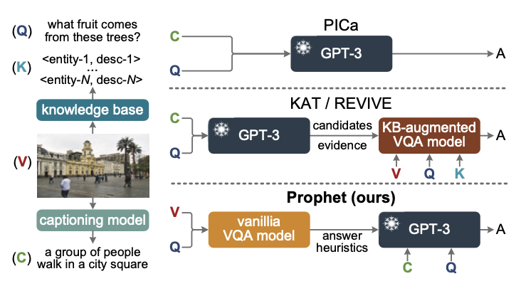
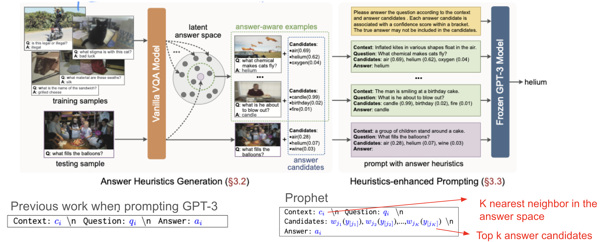
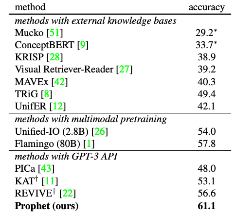
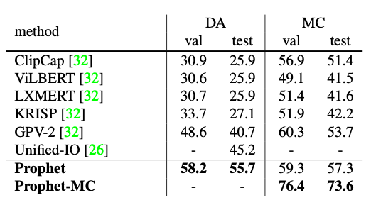

## [Prompting Large Language Models With Answer Heuristics for Knowledge-Based Visual Question Answering](https://arxiv.org/abs/2303.01903v2)

* Zhenwei Shao, Zhou Yu, Meng Wang, Jun Yu, multiple organizations in China

* CVPR 2023

* https://github.com/MILVLG/prophet

### Motivation and Problem Formulation

* What is the high-level problem?
* Knowledge-based visual question answering (VQA): Retrieve external knowledge beyond the image to answer the question
  * Open-domain knowledge (this paper) vs. structured knowledge bases (early research)

* What is missing from previous works?
  *  knowledge entries from explicit KB, e.g., Wikipedia and ConceptNet
    * **Cons:** limited performance due to missing key knowledge or retrieving irrelevant knowledge

  * Query GPT-3 (implicit knowledge engine) with formatted prompts
    * **Cons:** have not fully activated GPT-3
      

* What are the key assumptions?
  * Previous works have not fully activated the capacity of GPT-3, with two major limitations

### Method

* **Contribution:** Prophet

  * A simple framework to prompt GPT-3 with answer heuristics for knowledge-based VQA

* **Key background:** GPT-3 uses a few-shot learning paradigm

  * To adapt to a new task, GPT-3 only needs to concatenate a few examples of the task with the input as the prompt at inference time, no parameter updates

* **Key intuition / why this works**

  * Two major limitations in previous works (Both related to the ‘C’ input to GPT-3)
    * The generated captions (C) cannot cover all the necessary information in the image
    * The performance largely relies on the choice of few-shot examples (C) as input to GPT-3

* Therefore, Prophet proposes to first feed the images to a vanilla VQA model to generate two types of answer heuristics

* Two types of answer heuristics to augment GPT-3

  * Answer candidates: a list of promising answers to the testing input
  * Answer-aware examples: a smarter way to select context examples (C)

  

### Evaluations

* **Implementation**

  * ·MCAN-large [CVPR’19, from the same group] as the vanilla VQA model with some changes, pretrained on VQAv2 dataset (different one)
  * OSCAR+ [CVPR’21] as the caption model
  * **Datasets:** OK-VQA [CVPR’19], A-OKVQA [ECCV’22]
  * **Baselines:** PICa [AAAI’22], KAT [NAACL’22], REVIVE [NeurIPS’22]
  * **Metric:** answer accuracy specifically defined in each dataset
  * **GPU:** a single 3090

* Main results

  * Prophet outperforms all baselines, with potential efficiency gains (have 1 sentence discussion, but no empirical results in the main paper)

  * Rank [#3 in A-OKVQA](https://paperswithcode.com/sota/visual-question-answering-on-a-okvqa?p=prompting-large-language-models-with-answer) and [#5 in OKVQA](https://paperswithcode.com/sota/visual-question-answering-on-ok-vqa?p=prompting-large-language-models-with-answer)

    

    

* Extensive ablation studies

### Pros and Cons (Your thoughts)

* Pros:
  * While the idea is simple, they have impressive results compared to baselines
    * Although they are not the best right now
  * Cons: 
    * Relatively simple idea
    * Writing is not very clear