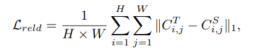

## [CRKD: Enhanced Camera-Radar Object Detection with Cross-modality Knowledge Distillation](https://arxiv.org/pdf/2403.19104)

* Jingjun Zhao, Jingyu Song, Katherine A. Skinner
* University of Michigan, Ann Arbor, MI USA

* CVPR 2024

* [Link to the code](https://github.com/Song-Jingyu/CRKD)

### Motivation and Problem Formulation

* What is the high-level problem?
    * 3D Object detection for autonomous driving operations
    * Perform high-accuracy object awareness using multimodal fusion of Camera and Radar
* Why is it important?
    * Radar is cheaper and more commercially available than Lidar, which makes it suitable for object awareness
* What are the challenges?
    * Radar data is inconsistent, sensors discrepancies in views and data returns
* What is missing from previous works?
    * Knowledge Distillation: Teacher-student framework. Want to consider using multi-modal fusions as teacher/student
    * Multi-modal fusion: leveraging attributes of multiple sensors. Camera-Radar has proven to be less efficient than Lidar-Camera fusion, propose using Lidar-Camera as a teacher model for Camera-Radar student.

### Method

* What are the major contributions?
    * Camera-Radar Knowledge Distillation (CRKD) from a LiDAR-Camera fusion teacher model in BEV feature space for object detection. Utilizing BEVFusion’s LiDAR-Camera fusion model as well as an extended Radar-Camera fusion
    * 4 Modules to handle sensor discrepancies during Knowledge Diffusion
        * Cross-stage Radar Distillation with learning-based calibration module that will incorporate inputs from the teacher model into the radar encoder
        * Mask-scaling feature KD to detect feature imitations on the BEV foreground while accounting for features in the less accurate transformations farther from the sensor
        * Relation KD to maintain relation consistency in scene-level geometry
        * Response KD with class-specific loss-weights to leverage CR’s ability to capture dynamic objects
        * The loss values generated by these four modules are summed to create an overall loss function
* What is the technical problem? What are the input and output of the problem?
    * Perform object detection inference using multi-modal data.
    * During training, utilize lidar, radar, and rgb camera data. During testing, utilize radar and rgb camera data. 
    * Project data onto BEV space, determine where objects are occupying 2d space
* Why this works?
    * Utilizing knowledge from a higher-performing model to impact training and produce more accurate feature maps on the camera-radar model
* Algorithm, architecture, solution
    * Cross-stage Radar Distillation
        * Reduce noise of radar measurements using a learned calibration module
        * Pass Radar feature map through 3 convolution layers, performing batch normalization, and ReLU activation to produce a calibrated feature map

    * Mask-Scaling Feature Distillation
        * Because of the range discrepancies from LiDAR and radar, only the foreground is used to distill information.
        * For the same reason, the boundary of the foreground can contribute as well due to radar’s ability to measure velocities.
        * Therefore, scale the foreground according to the number of objects in a specified range group [r1, r2] or objects moving at a velocity in a specified group [v1, v2]
        * Perform for both Camera-level feature map and fused feature map

    * Relation Distillation
        * Produce and compare affinity matrices for both fused feature maps to maintain a similar geometric relationship

    * Response Distillation
        * Combine Teacher predictions (soft labels) with ground truth as supervision
        * Modify RespD in a separate work by increasing weights in dynamic classes to leverage radar measurement
        * Lreg: regression loss, Lcls: classification loss

    * Added gated network to allow the model to generate single-modality feature maps to fuse the complementary modalities adaptively.

### Evaluations

* Where did they implement their method? On what platform?
    * 4x Nvidia A100
    * Teacher: [BEVFusion](https://arxiv.org/abs/2205.13542)-LC
    * Students: BEVFusion-CR and BEVFusion-CR* without adaptive gated network
* How they evaluate their method?
  * Dataset: nuScenes
  * Baselines
    * Camera-only: BEVFormer-S, BEVDet
    * Camera-Radar Fusion: RCM-FUsion, CenterFusion, CRAFT, RCBEV, BEVFusion
    * Knowledge Distillation to student camera:
        * UVTR (Lidar teacher)
        * BEVDistill (BEVFormer-S)
        * BEVSimDet
        * X3KD (Lidar-Camera Fusion teacher)
        * DistillBEV (BEVDet)
    * Knowledge Distillation to student Camera-Radar Fusion:
        * X3KD (Lidar-only Teacher)
  * Metrics: mean-Average-Precision mAP, NuScenes Detection Score NDS
* What are the key results?
    * CRKD generally receives high scores both in validation and testing

### Pros and Cons (Your thoughts)

* Pros: novel use of fusion-fusion knowledge distillation, inherently flexible architecture
* Cons: results don't seem convincing that fusion-fusion knowledge distillation outperforms SOTA for other tasks