## [Dual Prior Unfolding for Snapshot Compressive Imaging](https://openaccess.thecvf.com/content/CVPR2024/papers/Zhang_Dual_Prior_Unfolding_for_Snapshot_Compressive_Imaging_CVPR_2024_paper.pdf)

* Jiancheng Zhang, Haijin Zeng, Jiezhang Cao, Yongyong Chen, Denxiu Yu, Yin-Ping Zhao

* Northwestern Polytechnical University, IMEC-UGent, ETH Zurich, Harbin Institute of Technology (Shenzhen)

* CVPR 2024

* [Link to the code](https://github.com/ZhangJC-2k/DPU)

### Motivation and Problem Formulation

* What is the high-level problem?
    * Compression and Reconstruction of imaging data blocks like Hyperspectral Imaging (HSI)
* Why is it important?
    * Hyperspectral imaging efficiency and quality is increasing, need to develop a way to efficiently store it
* What are the challenges?
    * Compression is straightforward and established: bundle random maskings to generate measurement
    * Reconstruction using model-based or learning-based methods
* What is missing from previous works?
    * Want to leverage the effect of shift and compression degradation in the imaging process
* What are the key assumptions?
    * Compression step is set-in-stone. The task is to perfect reconstruction without altering compression
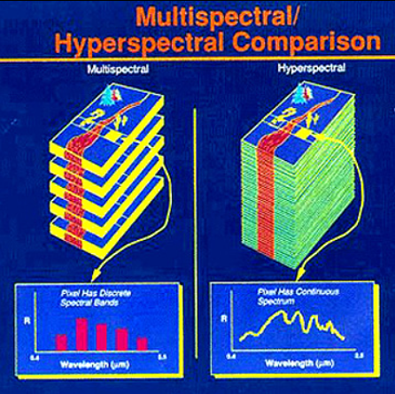

### Method

* What are the major contributions?
    * Dual Prior Unfolding Framework (DPF) reconstruction model utilizing multiple deep priors to improve iteration efficiency
    * Focused Attention (FA) mechanism as image prior to prioritize more pertinent features
    * Asymmetrical backbone for transformer architecture to decrease overhead and maintain hierarchical characteristics

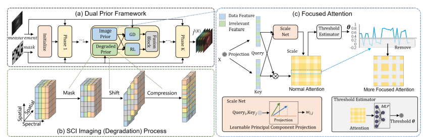

* What is the technical problem? What are the input and output of the problem?
    * The task is to train a learning-based reconstruction model for N-dimensional imaging data. The input is a 2-dimensional compressed image called a "measurement" and N bitmasks. The output is a reconstruction of the original N-dimensional image.
    * The goal is to perform more accurate reconstruction within fewer training iterations
* What they propose to solve the problem?
    * Leverage the idea of multiple degraded priors to enrich learning data to improve learning
* Why this works?
    * Better learning data allows the model to obtain comparable reconstruction accuracy to SOTA within a fewer number of iterations
* Algorithm, architecture, solution
    * Dual prior framework: obtains output by fusing outputs of gradient descent and residual learning calculations.
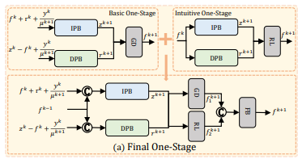
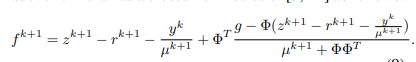
        * Residual learning: output = prediction - residual
        * Fusion Block:
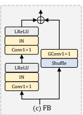
    * Degraded Prior Block: perform shift/compression on sample masks to obtain a mask measurement, perform reversal to obtain a degraded block of masks to apply to input data.
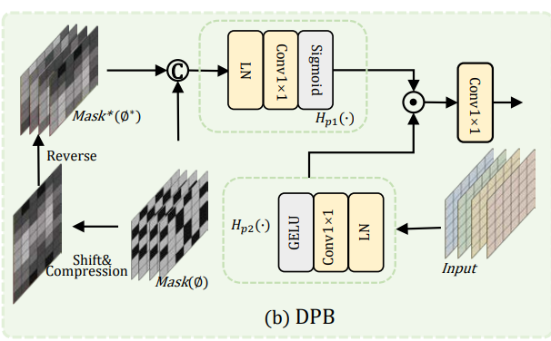
        * Compression
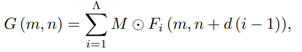
        * Reverse
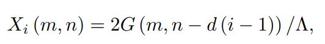
        * Proximal Mapping
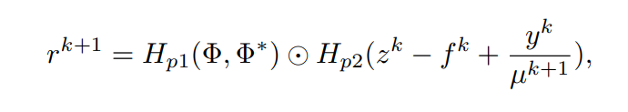
    * Asymmetric Backbone for Hierarchical Network
        * Utilizes Swin Transformer to capture non-spatial similarities in SCI reconstruction
        * Due to the high number of parameters required for Swin Transformer, instead use Asymmetric backbone
        * Left Side: Compares pixels in local windows
        * Right Side: Compares pixels in shifted windows
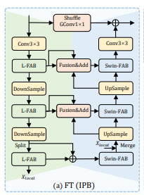
    * Focused Attention Block
        * Perform feature projection on a learnable principle component such that more impactful features get more attention
        * Project input tokens into 3 channels: Query Q, Key K, and Value V
        * Construct Q, K, and V from input tokens and learnable weights
        * Construct similarity matrix from linear heads of Q and K and scale according to scaling factors q and k
        * Perform sparse attention based on threshold filtering to eliminate unimportant features
        * Output sparse tokens

### Evaluations

* Where did they implement their method? On what platform?
    * PyTorch, RTX 3090GPU
* How they evaluate their method?
  * Dataset
    * Simulated Data: CAVE for training, KAIST for testing, 256x256
    * Real Data: CASSI system data, 660x714
  * Baselines
    * Reconstruction methods: HDNet, TSA-Net, BIRNAT
    * Deep unfolding methods: DGSMP, CAP_Net, DAUHST, RDLUF
    * Transformer methods: MST, CST
  * Metrics
    * PSNR: Peak Signal-to-noise Ratio (higher = better)
    * SSIM: Structural Similarity Index measure (higher = better)
* What are the key results?
    * DPU produces highest values in both metrics for all 10 KAIST scenes in 9 iterations compared to all baselines.
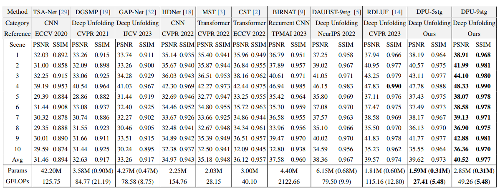

### Pros and Cons (Your thoughts)

* Pros: why you think this is a good paper?
    * In-depth descriptions, traceable architectures
* Cons: unrealistic assumptions, missing elements, missing experiments, etc.
    * Unclear on the rationale behind the degraded prior, why it provides "improved" training data