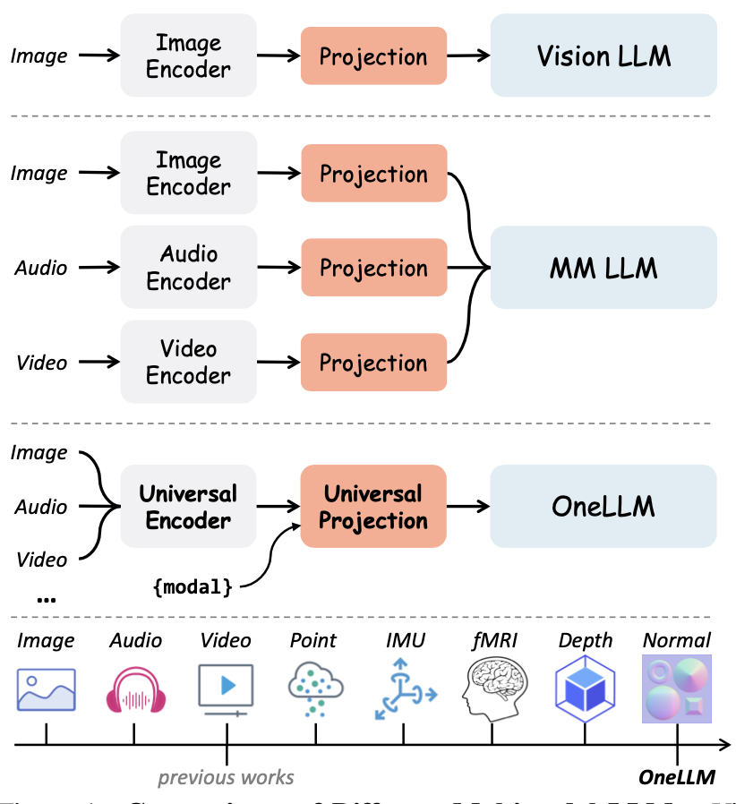
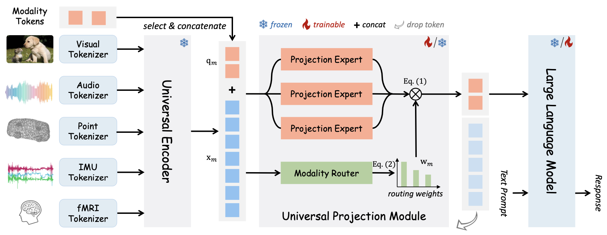
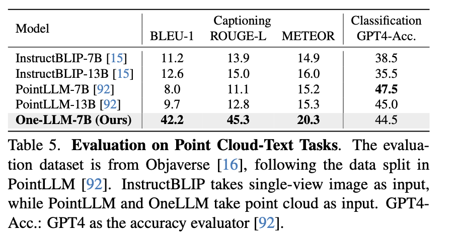
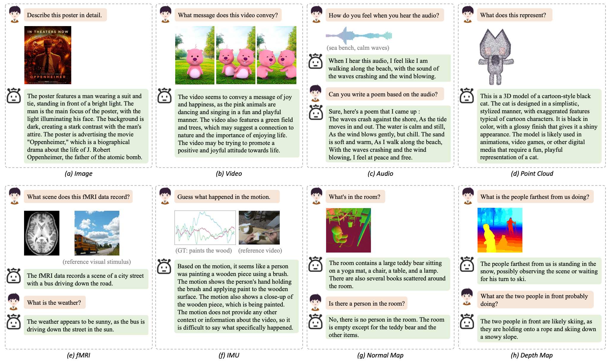
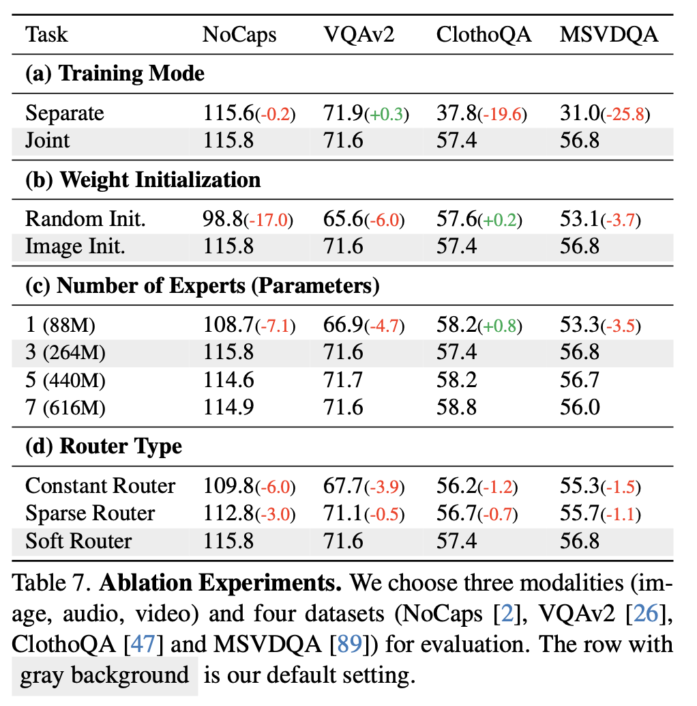

## [OneLLM: One Framework to Align All Modalities with Language](https://arxiv.org/abs/2312.03700)

* Jiaming Han, Kaixiong Gong, Yiyuan Zhang, Jiaqi Wang, Kaipeng Zhang, Dahua Lin, Yu Qiao, Peng Gao, Xiangyu Yue. MMLab, CUHK; Shanghai AI Lab

* CVPR'24

* https://github.com/csuhan/OneLLM

### Motivation and Problem Formulation

* What is the high-level problem?

  * Use multimodal LLM to solve various practical tasks including multimodal captioning, question answering and reasoning

* Definitely important and challenging…

* What is missing from previous works?

  * Vision LLM: pretrain + finetune
    * **Cons:** rely on modality-specific encoder and well-curated instruction-tuning datasets

  * Multimodal LLM: X-LLM [arXiv’23], etc
    * **Cons:** encoders differ in architecture and are hard to unify into a single framework

  

  

* Contribution of OneLLM

  * A unified framework architecture to align multimodal inputs with language using
    * a pretrained vision-language model (from CLIP)
    * A mixture of projection experts (trained during modality alignment)

  * OneLLM is the first MLLM that integrates 8 distinct modalities within a single model
    * Progressive multimodal alignment

  * They curate a large-scale multimodal instruction dataset for finetuning MLLM

### Method

* Model architecture of OneLLM
  
  * Lightweight modality tokenizers
    * 1D/2D conv layers

  * Universal encoder: frozen CLIP-ViT
    * **Inspiration:** Transferring pretrained Transformers to downstream modalities is 
      effective

  * Universal projection module
    * 3 projection experts for aligning between modalities, each is a Transformer
    * Dynamic modality router to control each expert’s contribution and increase the model capacity

* Progressive multimodal alignment
  * **Inspiration:** Training models directly on multimodal data can lead to biased representations between modalities due to the imbalance data
  * They propose to train an image-to-text model as init, and progressively add & train other modalities into LLM (continual learning)
    * In the training of later stages, they use memory replay (i.e., sample evenly from both previous trained data and current data)

  * Stages
    * Stage 1: image-text
    * Stage 2: (video, audio and point cloud)-text
    * Stage 3: (depth/normal map, IMU and fMRI)

* Unified multimodal instruction tuning
  * A carefully combined instruction tuning dataset including multiple modalities
  * Prompt design

### Evaluations

* Experimental setup
  * Model arch
    * Universal encoder is CLIP ViT Large pretrained on LAION
    * LLM: LLaMA2-7B

  * Training details
    * Alignment stage 1,2,3: 16 A100 GPUs for 200k iterations, bsz=5120, lr=5e-5
    * LLM finetuning: 8 GPUs for 1 epoch, bsz=512, lr=2e-5

  * Datasets, baselines, metrics depend on tasks

* Evaluation results
  * Major results
    * Image-text
    * Video-text
    * Audio-text
    * Audio-video-text
    * Point cloud-text
      
    * Depth/normal map-text
    * IMU-text and fMRI-text
    * **Takeaway:** OneLLM-7B beats SOTA LLMs even with more params

  * Qualitative results
    
  * Ablation studies
    * Training mode
      * Trained on the separate data of each modality vs. all data

    * Weight init
      * The impact of pretrained vision-language model

    * Number of experts
    * Router type
      

### Pros and Cons (Your thoughts)

* Pros: why you think this paper could get in?
  * The idea of having a unified encoder has its impact
  * Comprehensive evaluation
* Cons: unrealistic assumptions, missing elements, missing experiments, etc.
  * Why using continual learning, but not some ways to mitigate imbalance during offline training?
    * No ablation study on this
  * The design is inefficienct by adding two Transformer before LLM