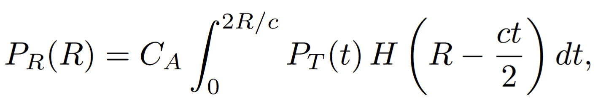

## [UniMix: Towards Domain Adaptive and Generalizable LiDAR Semantic Segmentation in Adverse Weather](https://arxiv.org/pdf/2404.05145)

* Haimei Zhao (The University of Sydney), Jing Zhang (The University of Sydney), Zhuo Chen (Tsinghua University), Shanshan Zhao (The University of Sydney) & Dacheng Tao (Nanyang Technological University)

* CVPR 2024

* [https://github.com/sunnyHelen/UniMix](https://github.com/sunnyHelen/UniMix)

### Motivation and Problem Formulation

* **Problem**: Traditional LiDAR Segmentation methods are tested on same domain and **clear weather**

* **Importance**: Robustness is crucial for safety and reliability in real applications (autonomous driving)

* **Challenges**:
   * Domain Discrepancies between datasets (source and target have different semantic distribution). P.e. layouts in different cities
   * Adverse Weather introduces spatial noise → shifts in the data distribution

* **Major Contributions**:
   * UniMix: universal method that enhances adaptability and generalizability of LSS models, in particular unseen adverse-weather scenes
      * Bridge Domain with weather simulation
      * Universal Mixing: Diverse intermediate point clouds

* **Previous Works**:
   * CoSMix: Domain Mixing so UDA generalization
   * LiDOG: Support sensor shift and resolutions for better DG
   * Kim at al. : Generalization method from diverse target and source scenes for better DG
   * **All lack the clear-to-adverse weather adaptation**

* **Assumptions**: In adverse weather conditions, the only thing that changes is the impulse response

**Unsupervised Domain Adaptation**: Transfer knowledge to address domain shift between source and unlabeled data → model adaptation clear to adverse weather target domain

**Domain Generalization**: Train model with only source domain data that can generalize to unseen domains in adverse weather conditions

### Method: UniMix

* **Bridge Domain**: Target domain with adverse weather simulation
   * LiDAR system can be represented using a linear model for the received signal power:

   

   * Where $P_R$ is received signal power and $P_T$ is transmitted signal power, $R$ is distance, $t$ is time, $c$ is speed of light, **$H$ is optical system’s impulse response** (It shows how quickly and accurately the system can detect objects)
   * In adverse weather (rain, fog and snowflakes), H is the parameter that is being affected.
   * For each scene in the source domain,a bridge domain is constructed by including the weather features.

   

* **Universal Mixing**: Combining (Mixing) 2 point clouds to create a single one, by dividing the points of the point cloud in regions, and using a binary mask to select.
   * 3 different ways to mix:
   
   
   
   * The Formula that represents the universal mixing is:

   

   where $S$ is Source, $T$ is Target and $M_s$, $M_t$ is the binary mask selecting the type of mixing.

* **Overall Algorithm**:

   

* **Universal Mixing**: Combining (Mixing) 2 point clouds to create a single one, by dividing the points of the point cloud in regions, and using a binary mask to select.
   * 3 different ways to mix:
   * The Formula that represents the universal mixing is:
   where $S$ is Source, $T$ is Target and $M_s$, $M_t$ is the binary mask selecting the type of mixing.

* **Overall Algorithm**:
   * First Stage:
      * Clear weather and bridge domain are the input for creating intermediate domain
      * Student network 1 is trained
      * Since the data for the target domain is inaccessible in this stage, the student model can be used on DG tasks
   * Second Stage for UDA tasks:
      * Don’t have original data with true labels 
      * Bridge domain and Target domain are the input for intermediate domain
      * Student network 2 is trained where the teacher creates pseudolabels and is used for UDA tasks
   * Test on fog, light fog, snow and rain

### Results for UDA
* **Dataset**:
   * SemanticKITTI → SemanticSTF (Adverse Weather with separated scene for each type)
   * SynLiDAR (Synthetic LiDAR semantic segmentation) → SemanticSTF
* **Baselines**: ADDA, Entropy Minimization, Self-training, CoSMix
* **Metric**: IoU per class and mIoU
* **Takeaway**:
   * Achieves best gain with both datasets
   * Adaptation from synthetic dataset is more difficult for all DA methods, which is attributed with a wider domain shift.

### Results for DG
* **Baselines**: Augmentation-based methods (Dropout, Noise Perturbation, PolarMix) and 2D DG Methods (MMD and PCL)
* **Takeaway**:
   * It hasn’t seen SemanticSTF for results
   * Achieves best gain with both datasets
   * Shows generalization results for each type of weather, where UniMix also achieves the best performance overall

### Pros and Cons

* Pros:
   * Novel problem formulation
   * Further robustness in the model :)

* Cons:
   * Missing explanation on how each type of weather is constructed for the bridge domain 
      * Is it the intensity of H?
      * How different are there?
   * Weird that two different models are created for each type of task instead of one that does well on both

