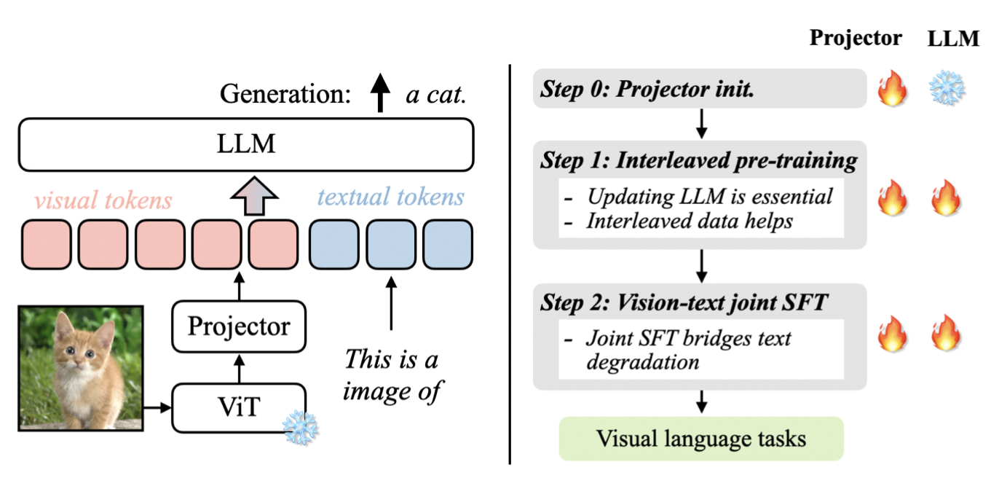
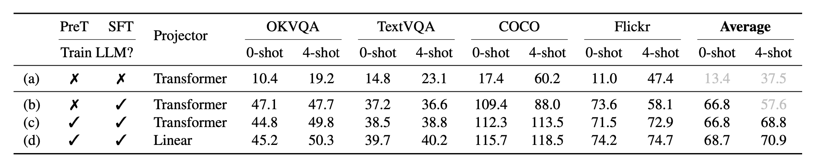
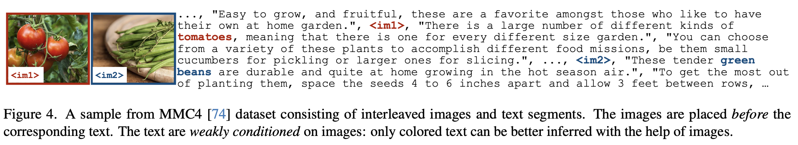
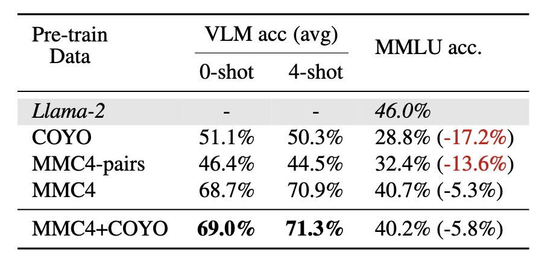
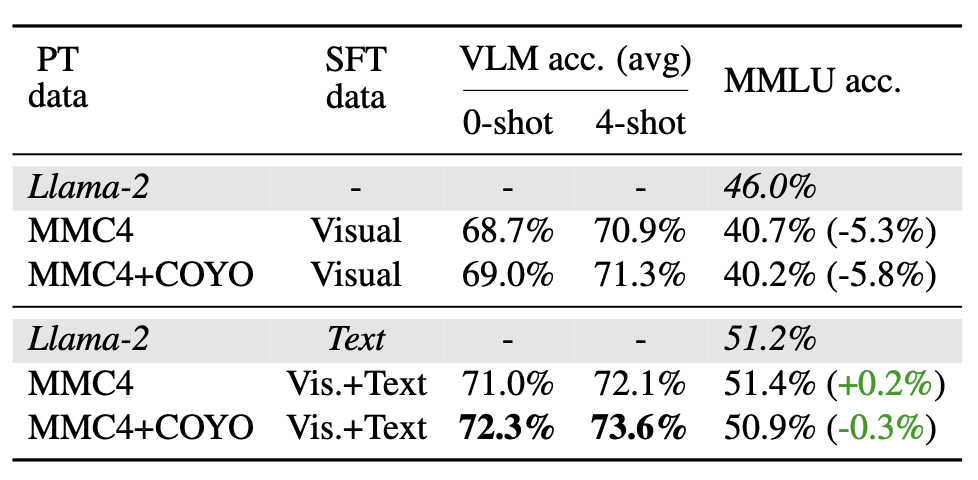
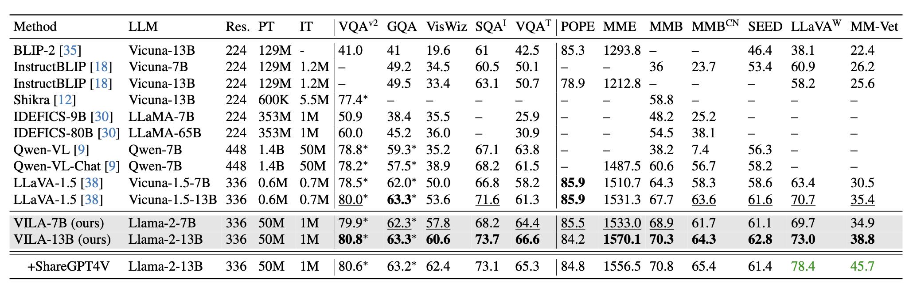

## [VILA: On Pre-training for Visual Language Models](https://arxiv.org/abs/2312.07533)

* Ji lin, Hongxu Yin, Wei Ping, Yao Lu, Pavlo Molchanov, Andrew Tao, Huizi Mao, Jan Kautz, Mohammad Shoeybi, Song Han

* CVPR'24

* https://github.com/NVlabs/VILA

### Motivation and Problem Formulation

* What is the high-level problem?
  * Visual language pretraining
  * What are **pretraining** and **finetuning**?
    

* Previous works - visual instruction finetuning
  * Supervised Finetuning (SFT)
  * Reinforcement learning from human 
    feedback (RLHF)

* A lot of works on visual instruction finetuning but lacks an in-depth study of the visual language pre-training process
* Key contributions
  * Explore different design options for enhanced visual language model pretraining
  * Give several findings

* Key assumptions
  * Focus on pretraining of autoregressive VLMs, including: a visual encoder Transformer, an LLM and a projector, due to its flexibility and popularity
  * Focus on SFT for finetuning

### Contributions - Lessons Learned

* Updating LLM is essential, not just the projector

  * Training only the projector during SFT leads to poor performance

  * Freezing the LLM during pretraining does not affect 0-shot performance, but degrades 
    in-context learning capabilities (few-shot)

  * When using a small-capacity projector, the accuracy is slightly better
    

* Interleaved Visual Language Corpus Helps Pretraining

  * Image-text pairs (image and captions) vs. interleaved image and text
    
  * Using image-text pairs (COYO) for pretraining can lead to catastrophic forgetting
  * Interleaved data structure matters, but not the text distribution (MMC4-pairs vs. MMC4)
    

* Recovering LLM Degradation with Joint SFT

  * How to bridge the gap of the 5% accuracy drop on text-only data?

  * **-> Add text-only data during SFT**

  * Blending in text-only instruction data can simultaneously 

    * (i) recover the degradation in text-only accuracy
    * (ii) improve the visual language accuracy

    

### Evaluations

* They build VILA with an enhanced pre-training recipe

  * Experimental Setup

    * Images: OpenAI CLIP-L, high resolution (336x336)
    * Larger LLMs (Llama-2 13B)
    * Pretraining data: both interleaved and image-text pair
    * SFT data: blended from LLaVA-1.5

  * Major quantitative results

    * VILA achieves consistent improvements over most datasets at different model sizes under a head-to-head setting (useing the same prompts and base LLM)

    

### Pros and Cons (Your thoughts)

* Pros: why you think this paper could get in?
  * Interesting paper to read
  * The findings are beneficial
* Cons: 
  * While they argue for pre-training, one of their findings is in the finetuning stage?