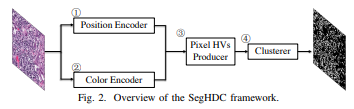
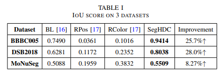
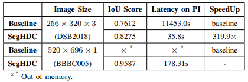
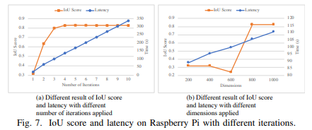

## [On-Device Unsupervised Image Segmentation](https://arxiv.org/abs/2303.12753)

* George Mason University: Junhuan Yang, Yi Sheng, Yuzhou Zhang, Weiwen Jiang, Lei Yang

* Design Automation Conference (DAC) 2023

### Motivation and Problem Formulation

* **Motivation**: Perform image segmentation on edge-devices
  * Lack of annotated data for supervised learning in real-world
  * Unsupervised learning requires deep architectures
  * Data privacy demands

* **Related works and challenge**
  * Neural networks were used for unsupervised learning, not suitable for edge devices

### Method

* **Proposed solution**  
  
  * SegHDC for image segmentation: HD linear encoding + KMeans
    * Position encoder: represent the relationship and difference of pixels, using Manhattan distance, inspired by randomly flipped elements in HVs (Encoding: uniform -> Manhattan -> Decay Manhattan -> Block decay Manhattan)
    * Color encoder: Manhattan Distance, XOR to associate 3 HVs for RGB
    * Pixel HV Producer: Use Hamming Distance
    * Clusterer: K-Means with cosine distance

### Evaluations

* **Evaluation Setup**
  * Dataset: BBBC005, DSB2018, MoNuSeg
  * Baseline: a CNN-based unsupervised algorithm
  * Meric: Intersection over Union (IoU)
  * Device: Raspberry PI 4 Model B with 4GB memory

* **Evaluation Result**
  * SegHDC is both more accurate and faster than baseline  
   
  * The encoding method is effective  
   
  * IoU score improves quickly for more iterations and more dimensions, before latency gets too large  
   

### Pros and Cons

* Pros: 
  * They’re the first attempt of applying HDC in image segmentation
  * Offers a method for encoding images for segmentation tasks
* Cons: unrealistic assumptions, missing elements, missing experiments, etc.
  * Suspicious result of beating NN in both speed and accuracy
  * No enough experiments in speed improvement

