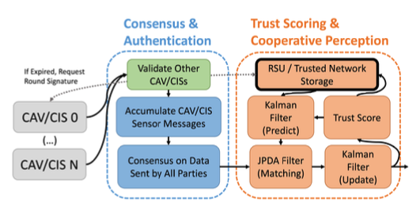
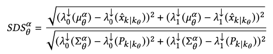
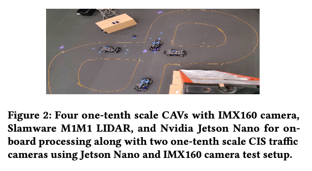
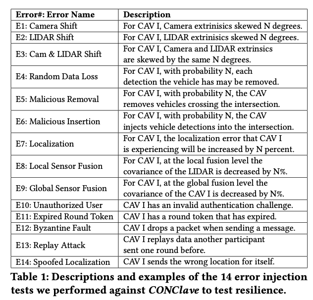
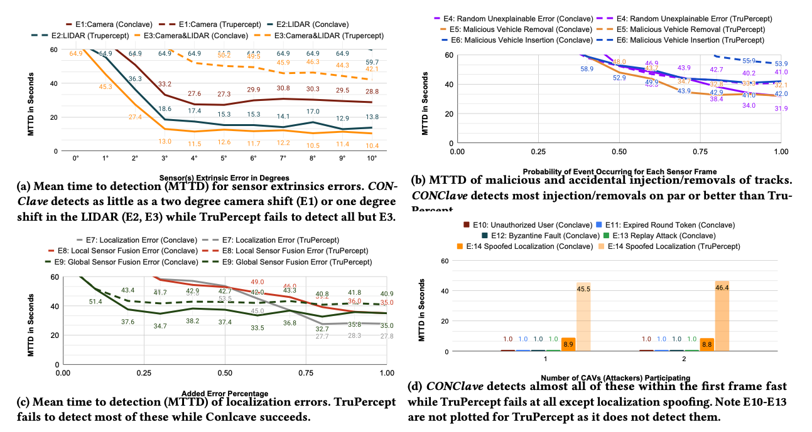

## [CONClave - Secure and Robust Cooperative Perception for CAVs Using Authenticated Consensus and Trust Scoring](https://arxiv.org/abs/2409.02863) [DAC’24] 

* Edward Andert, Francis Mendoza, Hans Walter Behrens, Aviral Shrivastava. ASU

* DAC'24

* Code not provided

### Motivation and Problem Formulation

* What is the high-level problem?
  * Security and reliability in Connected Autonomous Vehicles (CAV)
  * Specifically, prevent malicious and faulty vehicles

* Why is it important?
  * Attacks and faults can risk safety

* What is missing from previous works?
  * SOTA methods **treat authentication, consensus and trust scoring separately or in a subset of scenarios**
    * Guo et al [IEEE Access’20]: log events using blockchain, but completely ignores keeping out unauthorized participants
    * Mankodia et al [CCCI’21]: use specialized ML based trust scoring but no consensus
    * Bhattacharya et al [Comp. Comm’22]: authentication and consensus but limit to specific applications

### Method

* Concepts based on my understanding

  * **Authentication:** In distributed  communication, who has right, who does not

  * **Consensus:** Making decisions in distributed communication, can prevent faults

  * **Trust scoring:** When disagreement in sensor input happens, how to decide

* What are the major contributions?

  

  * A three party (government-manufacturer-vehicle) homomorphic hashing based authentication

    * Both government and manufacture generate a secret key, known only to themselves, and store on the vehicle

  * A single-shot consensus protocol that works in a dynamically changing vehicular networks

    * Share within a set area

    * Each participant sends out the accumulated set of sensing messages, received with valid authentication, and accumulated the same message from other participants

    * After receiving from every known participant, or the timeout is reached, each participant decide their vote according to the BOSCO algorithm

  * A perception trust scoring technique based on accuracy predictor

    * Closely coupled with Unscented Kalman Filter (UKF) based sensor fusion method

    * Sensing standard deviation score (SDS)

      * Inputs: tracking positions x, expected position and, P_{k|k} error by UKF

      * Intuition: standard deviation of the measured error returned by the global fusion

        

### Evaluations

* How they evaluate their method?

  

  * A test bed with 4 CAVs, with a front facing 160 degree FOV camera, and a 360 degree FOV single channel LiDAR, two mounted CISs with a 160 degree FOV camera

  * Ten, 10-min long tests, perform error injection with the 14 scenarios

    

  * **Metric:** Mean time to detection (MTTD) for faults

  * **Baseline:** Trupercept - SOTA trust scoring method

  * 1100 faults and malicious attacks were injected

* What are the key results?

  

  * CONClave detected 96.7% of the 300 sensor extrinsic faults injected, 83.5% of the 300 software faults injected, 67.3% of the 300 malicious injections and removals, and 100% of the 200 communication faults
    * Much higher than TruPercept
  * CONClave has a mean time to detection that was 1.83x faster on average and 6.23x faster in the best case compared to TruPercept, on the faults TruPercept could detect

### Pros and Cons (Your thoughts)

* Pros: why you think this is a good paper?
  * Real testbed is impressive
  * Interesting topic
* Cons: unrealistic assumptions, missing elements, missing experiments, etc.
  * Only small testbed and naive baselines