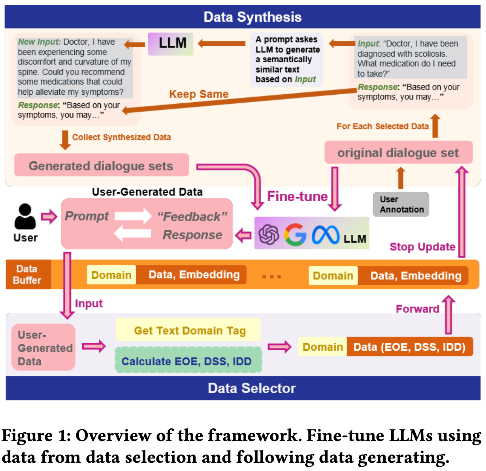

## [Enabling On-Device Large Language Model Personalization with Self-Supervised Data Selection and Synthesis](https://arxiv.org/abs/2311.12275)

* Ruiyang Qin, Jun Xia, Zhenge Jia, Meng Jiang, Ahmed Abbasi, Peipei Zhou, Jingtong Hu, Yiyu Shi

* DAC'24

* Code not provided

### Motivation & Problem Formulation

* What is the high-level problem?
  * LLM on-device personalization: After deploying LLM on edge devices, it is desirable for these devices to learn from user-generated conversation data to generate user-specific and personalized responses in real-time
* Why is it important?
  * General LLM fails to cater individual user’s need
  * Users do not want to share their data with the cloud -> why “on-device” personalization
* What are the challenges?
  * How to maintain representative data in the buffer with limited supervision
* Missing from previous works
  * LLM personalization via finetuning
  * **Cons:** randomly sample from the dataset, not streaming; resource intensive
* What are the key assumptions?
  * The edge devices have resource level similar to 1 A10, as used in their experiments

### Method

* What are the major contributions?

  * **(1) On-device LLM personalization framework**

    * Uses a small buffer to store representative user data

  * **(2) Quality metrics for data selection**

    * Replacement strategy for the elements in the bufferFor all the samples in the buffer, they will ask user for feedback

    * Three proposed quality metrics (w/o supervision)

      * Entropy of Embedding (EOE)

        * Intuition: the contribution of each token’s embedding to the overall entropy
          

      * Domain Specific Score (DSS)

        * Intuition: Measures the ratio of tokens in T belonging to every other domains

        

      * In-Domain Dissimilarity (IDD)

        * Intuition: how much value T brings to the domain it overlaps the most with, i.e., the dominant domain

          

    * For all three scores, the higher, the better

  * **(3) Data synthesis for labeled pairs**

    * Data augmentation
    * Use GPT to generate semantically similar question-answer pairs

### Evaluations

* Experimental setup
  * Dataset: 6 diverse datasets
    * ALPACA, DOLLY, MedDialog, Prosocial-Dialog, OPENORCA, Empathetic-Dialog

  * Model: pretrained Llama-3B, LoRA finetuning
  * Baselines: mostly data replacement strategies
    * Random replace
    * FIFO replace
    * K-center [2017]: selects the most representative data by performing k-center clustering in the feature space

  * Metric: Rouge-1
    * A qualitative score of the overlapping between the generated responses and the ground-truth responses

* What are the key results?
  * Their method surpasses all simple data replacement baselines
    
  * Ablation studies
    * Quality metrics: All three metrics are important
      
    * Augmentation: Generating more augmentation (data synthesis) can potentially improve the performance, but at the cost of longer training time
      

### Pros and Cons (Your thoughts)

* Pros: why you think this is a good paper?
  * Nice topic
  * Comprehensive experiments
* Cons: unrealistic assumptions, missing elements, missing experiments, etc.
  * Old baselines
  * How did they implement the user feedback/annotation part?