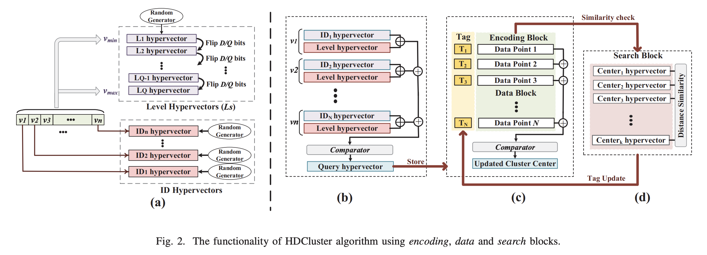
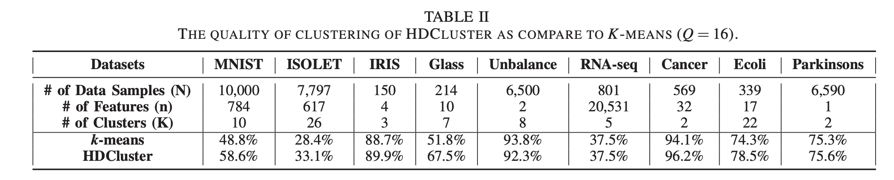
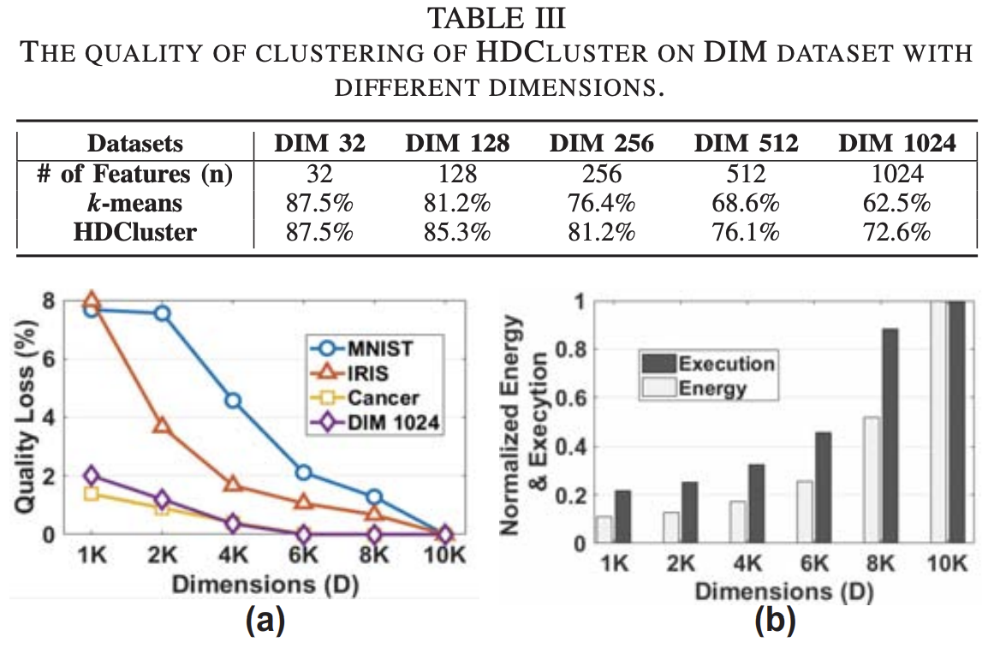
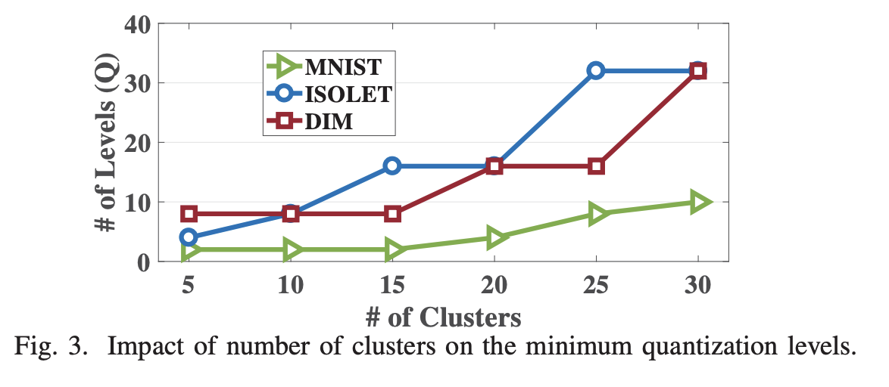

## [HDCluster: An Accurate Clustering Using Brain-Inspired High-Dimensional Computing](https://ieeexplore.ieee.org/document/8715147)

* Authors:
  * Mohsen Imani, Yeseong Kim, Thomas Worley, Saransh Gupta, Tajana Rosing - University of California San Diego
* DATE 2019

* Code not provided

### Motivation and Problem Formulation
* **Motivation**
  * Perform light-weight clustering tasks on end-node devices.
  * The large amount of data dominates the processing capability, due to significant data movement cost between processing unit and memory. 
  * Migrating to cloud incurs network congestion and security issues. 

* **Previous Work**
  * No attempts have been made to perform clustering using HD methods. 

### Method
* HDCluster: encoding -> clustering

* Encoding: Level-ID Encoding Method
  * Level hypervectors: indicates which level the datapoint is at in the overall range. Get range of vmin and vmax, quantize [vmin, vmax] into Q levels, random initialization of L0 ∈ {0,1}D, then randomly flip D/Q bits for each Li+1 from Li
  * ID hypervectors: indicates which feature we’re encoding. Random binary values.
  * For each feature of a datapoint: level XOR ID. Then add all elements together into an integer hypervector. Use majority function to switch back to binary hypervector. 
* Clustering: K-Means
  * Randomly initialize K centroids, compute distance similarity using Hamming Distance, update cluster centers

    
### Evaluations
* Programming Language: C++
* Dataset: 9 diverse datasets
* Baselines: k-means++

* Clustering accuracy is better than kmeans++
  

* Improvement depends on # of features (Table III)
  
* Larger dimension decreases loss (Figure a)
* Energy and runtime increases along with dimension (Figure b)

* Larger k requires more levels for accuracy

### Pros and Cons
* Pro
  * Innovative research in applying HD to Clustering
  * Concise explanation of the whole method. Easy to follow and understand.
  * Thorough experiment on various datasets. 

* Con
  * No enough previous works, therefore no state-of-the-art benchmarks.
  * No enough explanation on Execution&Energy definition

  

