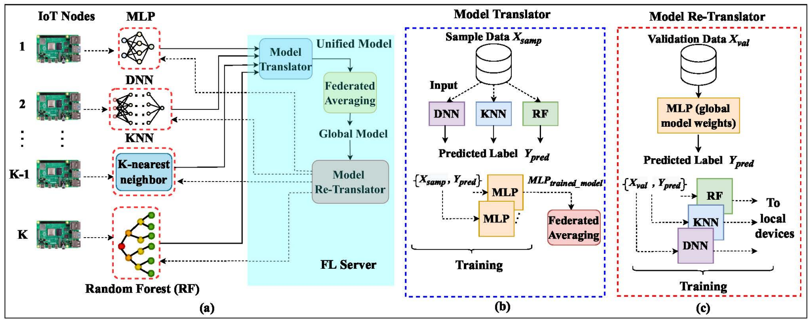
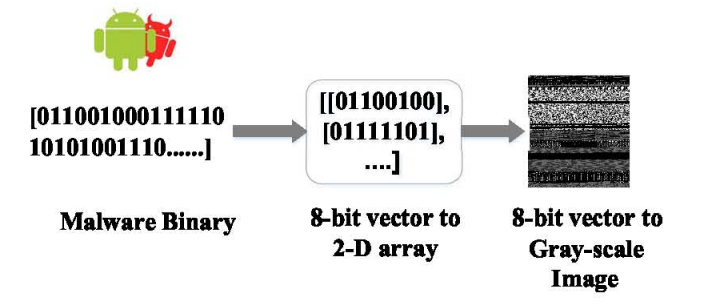
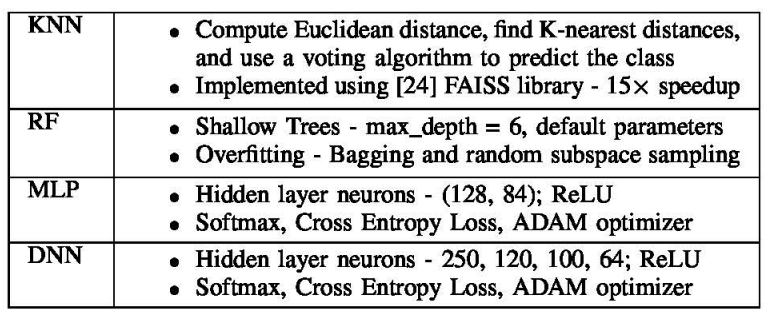
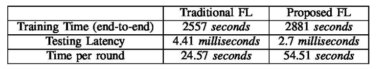
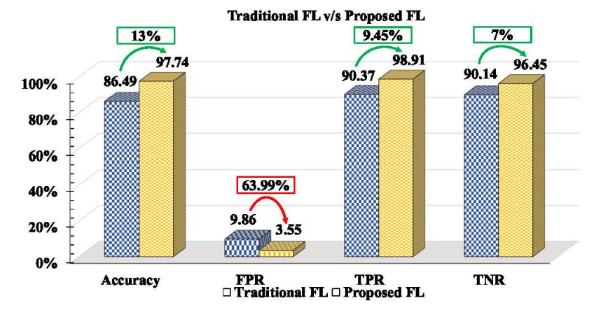

## [Federated Learning with Heterogeneous Models for On-device Malware Detection in loT Networks](https://ieeexplore.ieee.org/stamp/stamp.jsp?arnumber=10137288&casa_token=sjAq01TdK5wAAAAA:WtkYgZcGOMP7EG6OqYJpZW10p0shr9rBo3InArHVd7O9xu9ktrMhG35u4taPt-m7aD0w5cEStw&tag=1)

* Authors:
  * Sanket Shukla - George Mason University
  * Setareh Rafatirad - University of California Davis
  * Houman Homayoun - University of California Davis
  * Sai Manoj Pudukottai Dinakarrao - George Mason University

* DATE 2023

* Code not provided

### Motivation and Problem Formulation
* **Motivation**
  * A framework for collaborative training on IoT devices for malware detection is in great need due to the continuing growth of edge computing devices.

* **Previous Work**
  * Previous approches in malware detection uses an centralized approach where need collection of comprehensive dataset which may not be feasible and have high communication cost.
  * Most of FL work consider an homogeneous modal situation where all clients share the same model architecture and parameter spaces
    * Such model homogenerity is not suitable for FL on IoT devices as edge conputing ddevices have varing computation resources thus need different models.

### Problem definition
* This work Consider an FL case for collaborative malware detection on a network of IoT devices with different model architecture.
* Cloud has access to a public validation dataset.

### Method
* The main question is to solve the aggregation issue between client mdoels where client models might be different (DL models, MLP, KNN, decision tree, etc)
* Main idea is to use techniques in knowledge transfer and knowledge distillation which can work with all sorts of models.

* Clients first conduct local training based in local datasets.
* Mdoels are uploaded to CLoud
* FL server has 3 main components
  * Model Translated
    * Translate heterogeneous local models to a homogeneous models
  * FL aggregation
    * Translated local model can then be directly aggregated through FedAvg or other FL algs.
  * Model Re-translator
    * Through same knowledge transfer techniques to translate aggregated global model back to local client models.
  

    
### Evaluations
* Done on raspberryPi

* On VirusTotal dataset which as 60K sample of malwares
  * Six classed: backdoor, rootkit, trojan, virus, worm, and benign
  * Split into 75% training data and 25% test data. The 75% training data is split into three categories (on-device training data 60%, sample data 20%, and validation data 20%)

* Data preprocessing: Binary to image

* Clients and local models
  * With varing models
  * Global Model: MLP
  * Aggregation: FedAvg

* Results
  * Compare tio triditional FL: 1.63x faster, and malware detection performance is improved by 7% to 13% for resource-constrained loT devices.

### Pros and Cons
* Pro
  * Stright forward way of apply knowledge transfer in FL setting.

* Con
  * Purpose of sample dataset and validation dataset ?

  

