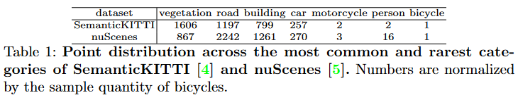
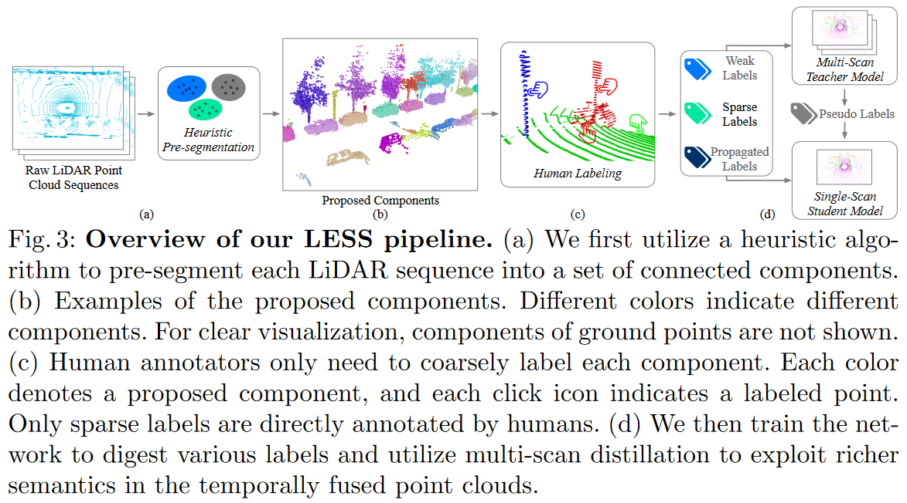
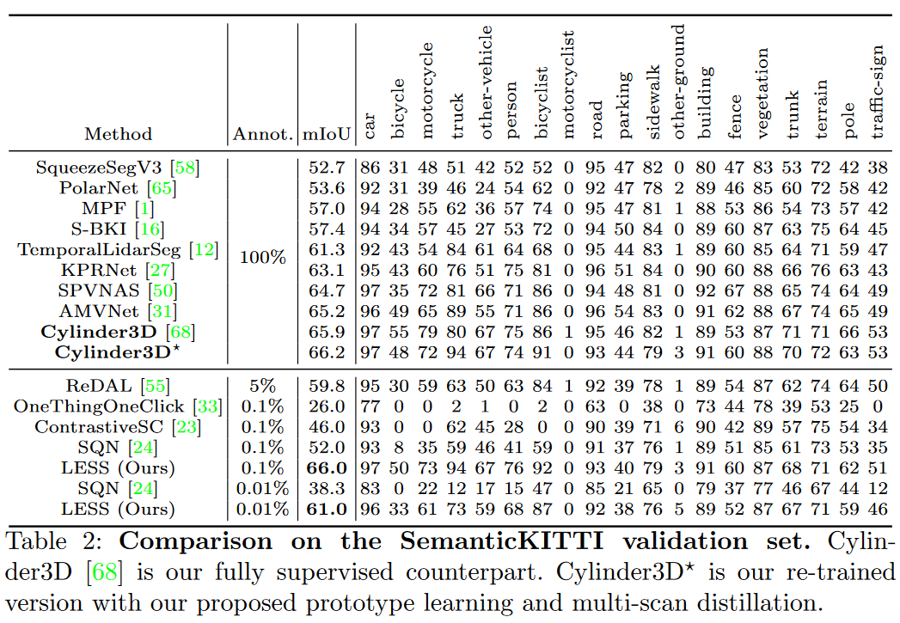
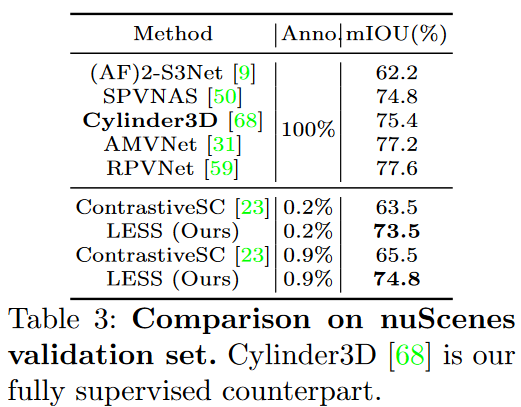

## [LESS: Label-Efficient Semantic Segmentation for LiDAR Point Clouds](https://arxiv.org/abs/2210.08064)

* Minghua Liu (UC San Diego), Yin Zhou (Waymo), Charles R. Qi (Waymo), Boqing Gong (Google), Hao Su (UC San Diego), Dragomir Anguelov (Waymo)

* ECCV 2022

* No code available

### Motivation and Problem Formulation

* **Problem**: Training deep models with conventional supervised methods require large datasets that are very costly to label.
* **Importance**: LiDAR segmentation is important in autonomous driving.
* **Challenges**: Unbalanced categories in objects. As shown in the image:
  
  
  
* **Major Contributions**:
   * In outdoor scenes distributions between objects, show that the unbalanced category is the problem.
   * First to propose label-efficient semantic segmentation pipeline for outdoor scenes with LiDAR point clouds.
   * Adapt beneficial components with a label-efficient LiDAR segmentation on-par with fully supervised counterpart
   * Evaluate the pipeline

* **Previous Works**:
   * Fully supervised LiDAR segmentation approaches require fully-labeled point clouds for training.
   * Label-efficient approaches focus on indoor scenes or 3D objects parts which are different in point cloud appearance and distribution to outdoor driving scenes = Lower mIoU.

* **Assumptions**: Objects are well separated (studied) + Multiple sequential scans (only supervised driving).

### Method

* **LESS**: Co-designs an efficient labeling process with semi/weakly supervised learning approach. It has 3 main areas:

  * *Pre-segmentation*: Subdivide the point cloud into a collection of components (1-few classes per component) by
    * Fusing overlapping scans by ego-poses (position of camera)
    * Detect ground
    * Construct connected components by making graph and adaptive threshold
    * Subdivide large components where each component is bounded by a fixed size
  * *Labeling*: Coarsely annotate the component proposal by labeling one point for each class in component. Which create 3 types of labels:
    * Sparse labels: Directly labeled by annotators (most accurate)
    * Weak labels: Classes that appear in each component (multicategory provide weak but dense supervision)
    * Propagated labels: For pure components (1 class) propagate the label to the entire component
  * *Network Training*:
    * Joint Loss: $L = L_{parse} + L_{propagated} + L_{weak}$  with inverse square root as category weights and cross-entropy loss.
    * Contrastive prototype learning: Learning distinctive class prototypes (specifically for teacher model) using moving average.
      * Create the class prototype with $P_c \leftarrow mP_c + (1-m) \frac{1}{n_c} \sum_{y_i = c} \text{stopgrad} (h(f(x_i)))$ where $P_c$ is the class prototype, $y_i$ is the label of $x_i$ (point being tested), $\text{stopgrad}$ is the stop gradient operation, h(x) is the linear projection head with vector normalization, and f(x_i) is the embedding for point $x_i$.
      * The loss function for the class prototype specifically for sparse and propagated levels and is defined by $L_{proto} = \frac{1}{n} {\sum_{i}}^{n} - w_{y_{i}}log\frac{\exp(h(f(x_i)) \cdot P_{y_{i}}/\tau)}{\sum_c \exp(h(f(x_i)) \cdot P_{c}/\tau)}$ where $w_{y_{i}}$ is the inverse sqr of the distribution of classes (to favor the underepresented classes) and $(f(x_i)) \cdot P_{y_{i}}$ represents the cosine similarity between projected embedding and prototype.
    * Multi-scan distalation:
      * Teacher model: Trained with past formulas and overlapped scans, expected to exploit richer semantics and perform better.
      * Student model: Same networks backbone + Trained from scratch + Single-scan input + Finetune it with $L_{dis}$ (match student model with teacher predictions). $L_{dis} = -\frac{T^{2}}{n} {\sum_{n}}^{i} \sum_{c} \frac{\exp(u_{ic}/T)}{\sum_{c'} \exp(u_{ic'}/T)} \log \left( \frac{\exp(v_{ic}/T)}{\sum_{c'} \exp(v_{ic'}/T)} \right)$

### Evaluations

* Dataset
   * SemanticKITII
      * 64-beam LiDAR sensor
      * 10Hz frquency
      * 43k scans
      * 19 classes
   * nuScene:
      * 32-beam LiDAR sensor
      * 20Hz but annotation is 2Hz
      * 40k scans
      * 16 classes
* Metric: mIoU + objects detected
* Baselines: SOA Algorithms seen in tables
* Key results:
   * Tab 2: Outperforms label-efficient methods + matches the performance of fully-supervised methods (boost given by underrepresented classes).
     
     
  
   * Tab 3: Outperforms CotrastiveSceneContext + highly competitive with fully-supervised counterpart with only 0.2% labels.

     

### Pros and Cons (Your thoughts)

* Pros:
   * Really nice results + new labeling approach.
* Cons:
   * Why not test on ScribbleKitti?
   * Specific for moving LiDAR scans, not adaptable to other types of datasets.
