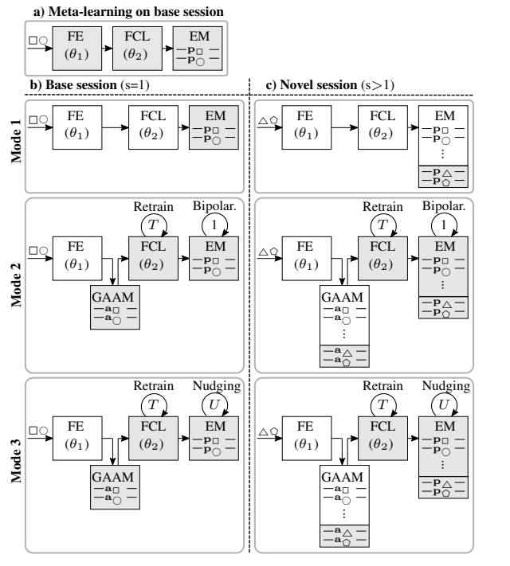
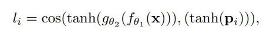
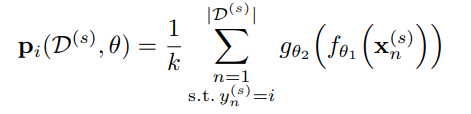

## [Constrained Few-shot Class-incremental Learning](https://arxiv.org/pdf/2203.16588.pdf)

* IBM, ETH Zürich

* CVPR 2022

* [Code](https://github.com/IBM/constrained-FSCIL)

### Motivation and Problem Formulation

* **Motivation**: Learning new classes from a continue stream of data is challenging, especially when sample for each class is limited (few shot) and memory size as well as computational constrains are imposed.
  * Try ro tackle class incremental lifelong learning problem.
* **Related works**
  * Hyperdimensional computing: Computation technique that uses large vector, information is represented holographicly across all dimensions. HD embedding also provides natural sparsity and t pseudo-orthogonality which are robust aganist forgetting.
  * Rehearsal and Pattern Replay: A method for perventing forgetting in lifelong learning, through storing either raw data encountered in the past of their representations, retrain the network on memorized data and new data to allevate forgetting.
  * FSCIL: Few-show class incremental learning, CIL with very few training samples through a number of incremental sessions.
* **Challenges**
  * Forgetting: Like the majority of lifelong learning problems, continually learning new classes in data stream without forgetting the old ones is the main challenge.
  * Resource constrain: As number of classes increases, computation cost stay constant while memory size sacles at most linearly.
### Method

* **Proposed solution**
  
  * Proposed framework contains three main components: a forzen feature extractor(FE), a fully connected layer(FCL) and a memory (EM)
    * FE: Prosess image input to some feature vector
    * FCL: Act as an HD encoder, maps feature vector to some hypervector.
    * EM: Stores prototypes of each class, class prototypes are stored as class hypervector.
  * Before training starts, all three components are first meta-learned on some base classes by solving various few-shot problem. FE are frozed after this step.
  * For each input, a support hypervector is produced by FCL.
  * Protoypes of ew classes are computed by summing all support hypervectors belonging to the class.
  * Classification task are done by a similarity check between FCL(FE(x)) and each class prototype.
    
    * cosine similarity is used as it is not influenced by prototype magnitude.
  * Proposed method allows three different update mode for FCL and EM, the purpose is to ensure the pseudo-orthogonality for class prototypes.

* **Update Mode**
  * Mode 1: Averaged Prototypes (Least computation)
    
    * Simply used averaged hypervector for each class as prototypes.
    * No retarining on FCL.
    * Not require GAAM (globally average activation memory)
  * Mode 2: Retraining on Bipolarized Prototypes (Median computation)
    
    * Insufficient inter-class separability issue arises as number fo calss increased.
    * Adjust the prototypes and the fully connected layer to increase prototype separability.
    * Start by bipolarize class prototypes.
    * Use bipolarize class prototypes and data on GAAM to retrain FCL so that output of FCL on GANN should matched bipolarize class prototypes.
  * Mode 3: Retraining on Nudged Prototypes (Most computation)
    * Objective1: Improve the inter-class separability by attaining a lower similarity between the pairs of nudged prototype vectors.
    * Objective2: Remain close to the initial averaged prototypes.
    * Two loss function are use one for each objective, otherwise similar to mode2.

### Evaluations

* **Evaluation Setup**
  * miniImageNet and CIAFAR100 are used in evaluation.
  * Resnet-12 are used as FE.
  * Hypervector has d=512.

* **Evaluation Result**
  
  * Proposed method sets the new state-of-the-art on both datasets.
  * For low class number, mode2 is more effective.

### Pros and Cons

* Pros:
  * Use HD sparsity and orthogonality to avoid forgetting.
  * Used very common image datasets.
  * Although memory size are not fixed, storing hypervectors are more memory efficient then other LL methods.
  * Provided different level of accuracy-resources tradeoff.

* Cons:
  * Although it is a aim for the method, no evaluation results on computation cost are provided.

* Some thoughts about future LL project
  * This should be used as an important baseline.
  * Class incremental + Domin incremental ?
