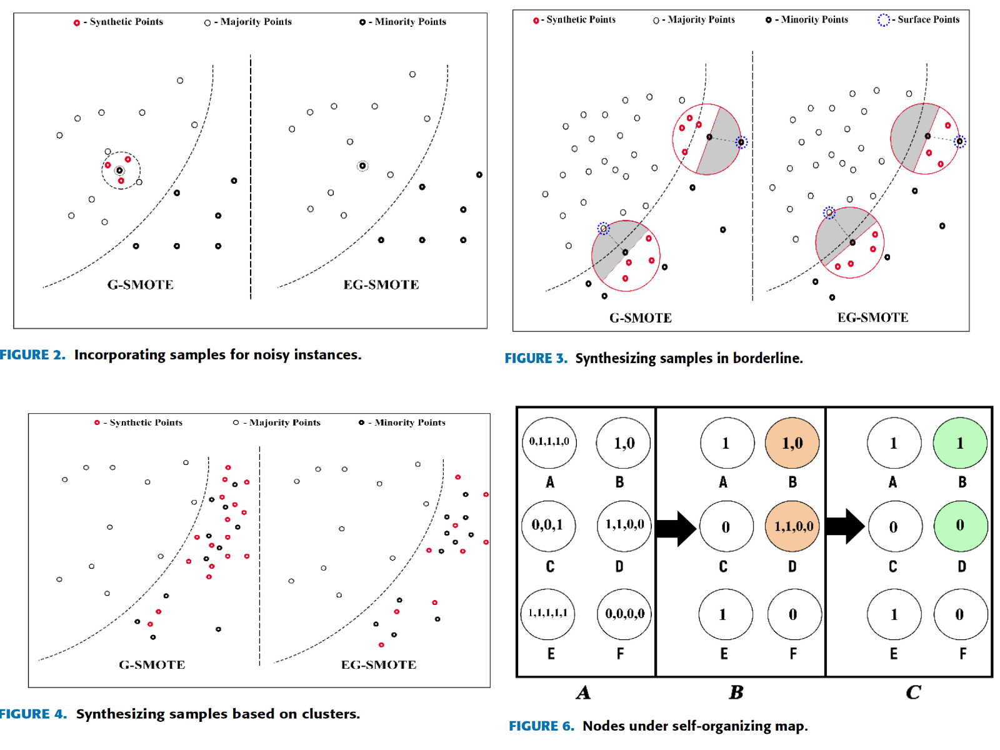
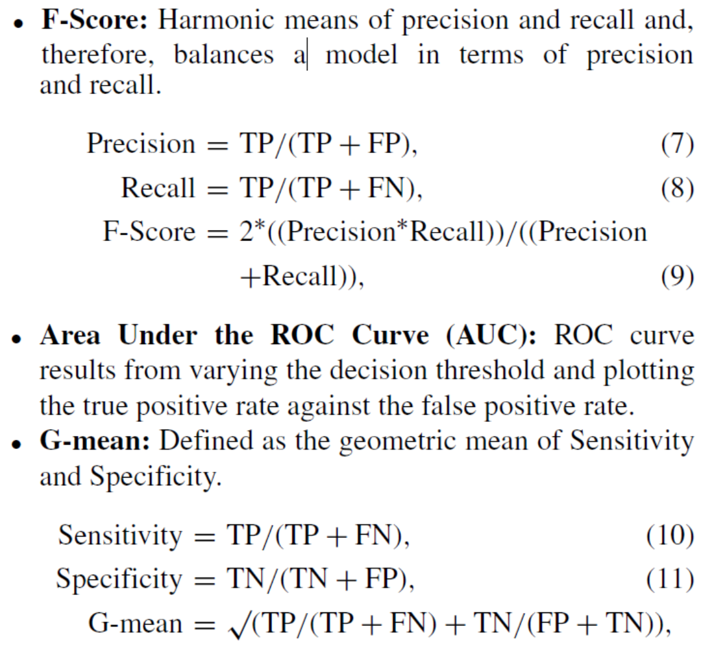
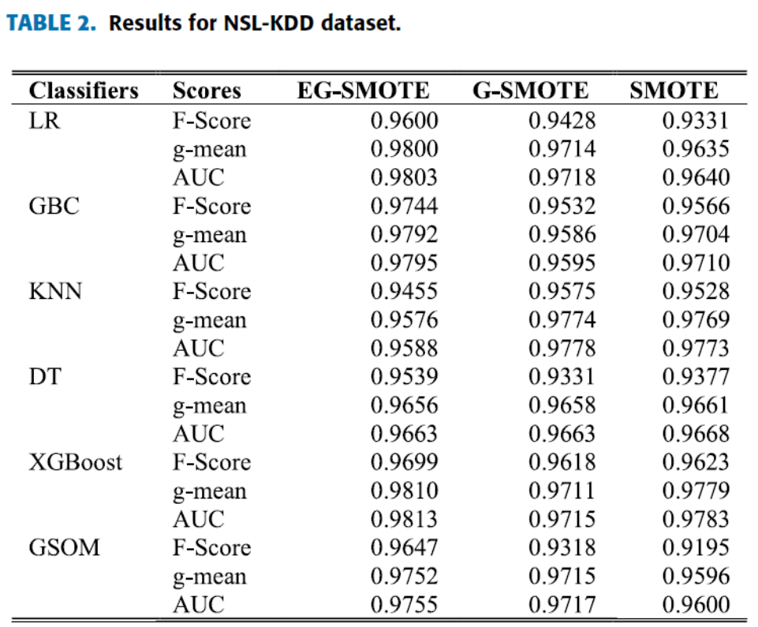

## Minority Resampling Boosted Unsupervised Learning With Hyperdimensional Computing for Threat Detection at the Edge of Internet of Things ([with link](https://ieeexplore.ieee.org/stamp/stamp.jsp?tp=&arnumber=9530655))

* VIVEK CHRISTOPHER, THARMASANTHIRAN AATHMAN, KAYATHIRI MAHENDRAKUMARAN, RASHMIKA NAWARATNE, DASWIN DE SILVA (IEEE), VISHAKA NANAYAKKARA, AND DAMMINDA ALAHAKOON (IEEE)

* IEEE ACCESS 2021

### Motivation and Problem Formulation

**Problem**
* Complexity of dynamic threat detection at the Edge for IoT devices
* Widespread adoption of IoT applications stresses the impact and vulnerability to cyber attacks.

**Challenges**
* Signature based detection requires frequent updates and can be circumvented with obfuscation techniques.
* Knowledge and Statistical based detection requires balanced and labeled data.

**Missing from Previous Work**
* Few Shot Learning (FSL) requires balanced data
* Granular Computing (GrC) needs to be combined with deep learning techniques
* Blockchain requires human intervention and is mainly good for preventing counterfeiting
* SMOTE creates larger and less specific decision limits

**Key Assumptions**
* Unlabeled data
* Unbalanced datasets

### Method

* Effective, efficient, and secure method for machine learning at the IoT Edge specifically for cybersecurity threat detection
* Novel EG-SMOTE algorithm that addresses limitations due to noisy, imbalanced or overfitted data.
* Machine learning method that integrates EG-SMOTE and GSOM to identify threats
* Algorithm 1 - Balances data, removes noise, and prevents overfitting
* Algorithm 2 - Clusters and labels data into Nodes
* Algorithm 3 - Classifies new data based on proximity to labeled Nodes 

### Evaluations

* Results contained details of experimentation comparing EG-SMOTE to SMOTE and GSMOTE across four datasets (KDD99, NSL-KDD, CICIDS2017, and BoT-IoT).  
* The classifiers used: Logistic Regressor(LR), Gradient Boosting Classier (GBC), K-Nearest Neighbours(KNN), Decision Tree (DT), XGBoost and GSOM.
 

### Pros and Cons (Your thoughts)

* Pros: why you think this is a good paper?
* Cons: unrealistic assumptions, missing elements, missing experiments, etc.
