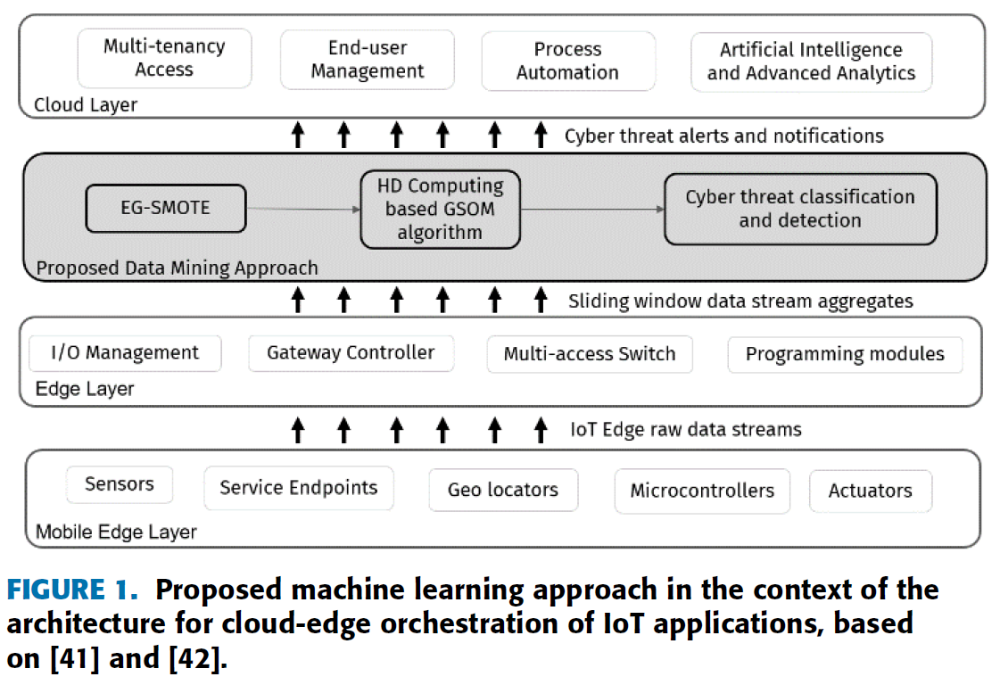

## Minority Resampling Boosted Unsupervised Learning With Hyperdimensional Computing for Threat Detection at the Edge of Internet of Things ([with link](https://ieeexplore.ieee.org/stamp/stamp.jsp?tp=&arnumber=9530655))

* VIVEK CHRISTOPHER, THARMASANTHIRAN AATHMAN, KAYATHIRI MAHENDRAKUMARAN, RASHMIKA NAWARATNE, DASWIN DE SILVA (IEEE), VISHAKA NANAYAKKARA, AND DAMMINDA ALAHAKOON (IEEE)

* IEEE ACCESS 2021

### Motivation and Problem Formulation

**Problem**
* Complexity of dynamic threat detection at the Edge for IoT devices
* Widespread adoption of IoT applications stresses the impact and vulnerability to cyber attacks.

* Unlabeled data
* Unbalanced datasets

**Challenges**
* Signature based detection requires frequent updates and can be circumvented with obfuscation techniques.
* Knowledge and Statistical based detection requires balanced and labeled data.
**Missing from Previous Work**

**Key Assumptions**
* Few Shot Learning (FSL) requires balanced data
* Granular Computing (GrC) needs to be combined with deep learning techniques
* Blockchain requires human intervention and is mainly good for preventing counterfeiting
* SMOTE creates larger and less specific decision limits

### Method

### Evaluations

* Where did they implement their method? On what platform?
* How they evaluate their method?
  * Dataset
  * Baselines
  * Metrics
* What are the key results?

### Pros and Cons (Your thoughts)

* Pros: why you think this is a good paper?
* Cons: unrealistic assumptions, missing elements, missing experiments, etc.
