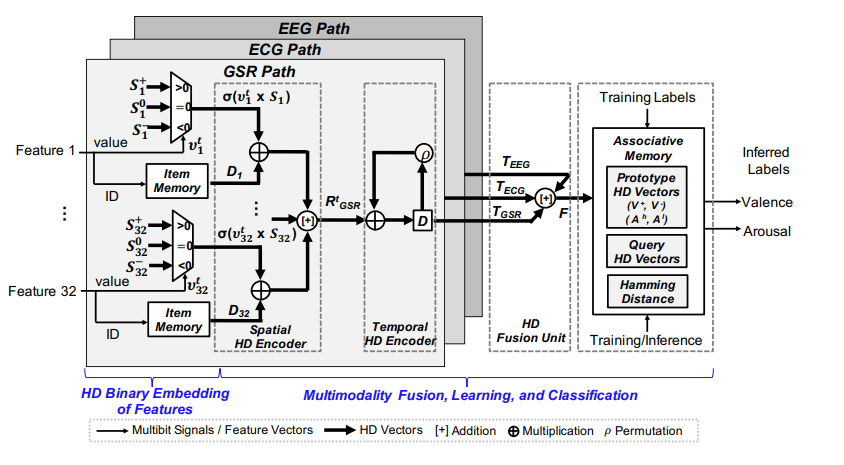
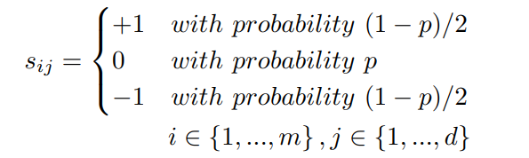
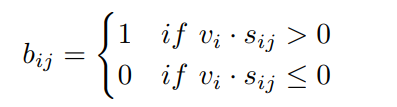
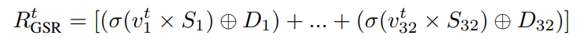
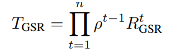
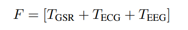
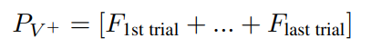
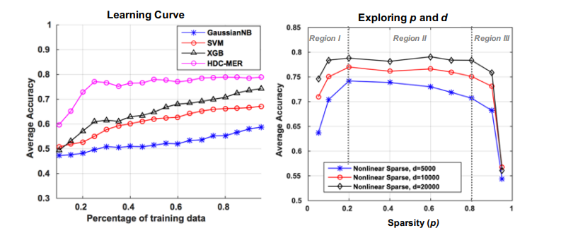

## [Hyperdimensional Computing-based Multimodality Emotion Recognition with Physiological Signals](https://ieeexplore.ieee.org/document/8771622)

* ETH Zurich, University of Bologna, National Taiwan University

* AICAS 2019

* [Code](https://github.com/enjui/HDC-MER)

### Motivation and Problem Formulation

* **Motivation**: Inference human emotion has many potential applications such as smart vehicle, edutional monitoring and healthcare system. Interpreting human emotions accurately and in a timely fashion is one of the most important topic in affective computing.

* **Related works**
  * Emotion Recognition with Biosignals: Interperts human emotion with involuntary biosignals like GSR ECG EEG. Biosignals carries infomation about underlying physiological condition. A common machine-learning-based emotion recognition consists of signal preprocessing, feature extraction, and classification. Input data are physiological signals, and output are the results of classification for valence and arousal
  * Hyperdimensional computing: Brain inspired computing model using vectors of very hihg dimensionality. Use well defined operations, HDC allows vector binding to combine ingormation or generate dissimilar vector with high probabilities of no infomation loss. HDC is also robust, energy efficient and massively parallel, make it suitable for biosignal processing. 
  * Multi-modal Learning: Past works has show that learning using data of multi-modality can help  boost accuracy and learning efficiency as long as all modalities reflects the same underlying activity. Biosignals is a valid form of multi-modality data.

* **Challenges**
  * Emotional inference model usually takes a lot of data to train.
  * Current State-of-Art mmethods like SVM, Bayes Classifier, XGB has high computational complexity which makes them unsuitable for wearable sensing IoT devices with limited computing capability.

### Method

* HDC-MER system consist of three major components:
  * Feature Embedding
  * Modality Fusion
  * HD Training

* **HD Embedding**
  
  * Represent Real valued Biosignal reading into binarized sparse hypervector.
  * S is predetermined encoding vector, m is number of features of certain modality, d denotes dimensionalityd of hypervector and p is sparisty factor.
    * Low p produce sparse binary hypervecors
      
  * B is embedded hypervecor for one modality, sign-function is used for binarization.
  * The value of one feature is mapped to a d-dimensional vector.

* **Modality Fusion**
  * 
    * D is a set of randomly generated predetermined hypervectors for each feature of each modality.
    * Spatial encoder combines all features of one modality by the above function.
  * 
    * Human emotion has its momentum, a temporal encoder is use to capture time-dependent emotional fluctuation.
    * Spatially encoded hypervector are then sent to temporal encoder.
    * By using permutation operation, the temporal encoder can generate n HD vector based on a sequence of n features, which produce d-bit temporal HD vector.
  * 
    * Finally, multi-modality data are fused together by a sum opeartion.

* **HD Learning**
  * 
    * Class prototype for emotion are produced by a sum of relavent trials with a majority function applied.
  * Emotion recogniztion are done with hamming distance.

### Evaluations

* **Evaluation Setup**
    * Binary emotion classification
    * Baseline including GaussianNB, SVM, XGB
    * AMIGOS dataset with 30s window with sliding over 15s each trail. [Link to dataset](http://www.eecs.qmul.ac.uk/mmv/datasets/amigos/)
    
* **Evaluation Result**
  * 
    * Proposed method sets the new state-of-the-art on used datasets.
    * Non-linear correlation between accuracy and p/d.
    * HDC-MER achieves optimal classification accuracy with 30% of randonly selected data whereas other methods requires 80%+ data.
    * Second figure shows both Low/high sparsity of hypervector after encoding can cause drop in accuracy.

### Pros and Cons

* Pros:
    * Interesting and comprehensive HD embedding (Both spatial and temporal)
    * Use HDC properties represent multi-modality information in single hypervector.
    * Effcient and IoT sensing device friendly design for fast and accurate emotion interperting.

* Cons:
    * No effiency evaluation.
    * How useful is binary emotion classification, what happens when multiple label is involved.
    * Baseline too simplistic, no compaison with CNN or LSTM.
