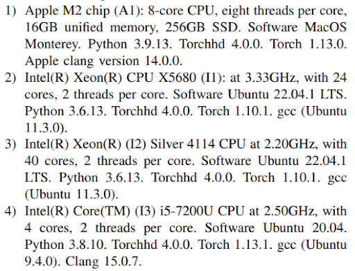
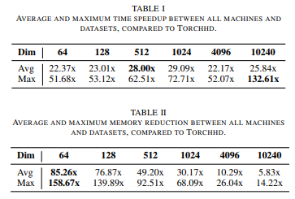
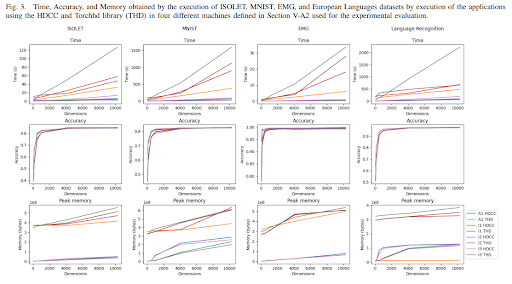

## [HDCC: A Hyperdimensional Computing compiler for classification on embedded systems and high-performance computing](https://arxiv.org/pdf/2304.12398.pdf)

* Pere Verges, Mike Heddes, Igor Nunes, Tony Givargis, Alexandru Nicolau

* Arvix

* https://anonymous.4open.science/r/hdcc-5F7C/

### Motivation & Problem Formulation
* What is the major contribution of the paper?
    * Implemented a compiler for generating the C code of HDC
* What is missing from previous works?
    * TorchHD -> python
    * OpenHD -> python and CUDA
    * HDtorch -> python and CUDA
* Features:
    * Does not depends on any libraries
    * It supports multithreading and single instruction multiple data (SIMD) instructions using C intrinsics
    * It is optimized for maximum performance and minimal memory usage

### Method

* Input file format

* Four datasets
    * EMG	
    * ISOLET
    * MNIST
    * Language Recognition

* Four PCs

* HDCC Diagram

### Result

* Over all speed up and memory reduction

* Pros: 
    * Faster and less memory use
    * Easy to use
* Cons: 
    * Why Anonymous GitHub?
