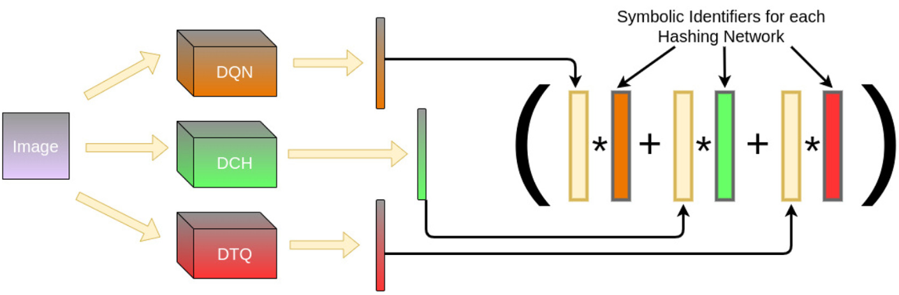
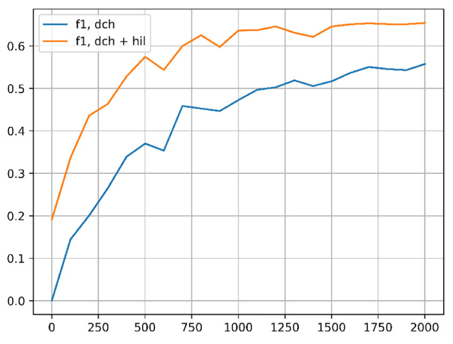

## [Symbolic Representation and Learning with Hyperdimensional Computing](https://pubmed.ncbi.nlm.nih.gov/33501231/)

* Anton Mitrokhin, Peter Sutor, Douglas Summers-Stay, Cornelia Fermüller, Yiannis Aloimonos 

* Frontiers Journal, 2020

* Link to [HIL code](https://github.com/ncos/pyhdc), [DeepHash](https://github.com/thulab/DeepHash)

### Motivation and Problem Formulation

* What is the high-level problem?
  * Combine ML systems and Vector Symbolic Architectures (VSA) for symbolic reasoning
  * They focus on (pre-trained) hashing techniques for images

* Can be combined with existing symbolic reasoning systems
  * E.g., knowledge graph, fuzzy logic system, VSA

* Why is it important?
  * First work to create meaningful hyperdimensional representations of real images

### Method

* Basic HD learning, implement Hyperdimensional Inference Layer (HIL)

* Consensus with multiple models

  * Similar to ensemble models, fuse the output of three different Hash models

  

  * [Deep Quantization Network (DQN, AAAI 2016)](http://yue-cao.me/doc/deep-quantization-networks-dqn-aaai16.pdf)
  * [Deep Cauchy Hashing Networks (DCH, CVPR 2018)](http://ise.thss.tsinghua.edu.cn/~mlong/doc/deep-cauchy-hashing-cvpr18.pdf)
  * [Deep Triplet Quantization Network (DTQ, ACMMM 2018)](https://arxiv.org/abs/1902.00153)

### Evaluations

* Implementation
  * The hashing networks are implemented with the [DeepHash](https://github.com/thulab/DeepHash) library
  * Use AlexNet pre-trained on ImageNet as feature extractor

* Datasets
  * CIFAR-10, NUSWIDE_81 (tagged Flicker images with 81 concepts for classification)
  * Both datasets are directly integrated in the DeepHash library

* Baselines: all three hashing networks w/o the HIL
* Key results: 
  
  * adding HIL to an existing Deep Hash Network enables better accuracy within fewer epochs and even improves the F1 score
  * **My confusion:** Is this hash network trained at all? In the previous section, the authors mentioned that only the HIL layer is trained. But here, for the f1 score with only the hash network, it seems the network is being trained and results in improved accuracy

### Pros and Cons

* Pros: An implementation that incorporates existing hashing techniques
* Cons: 
  * Confusing writing (are the hashing networks trained at all?)
  * Trivial novelty (HD training is not novel. The only novelty is the fusion of multiple hashing models)
  * Weak related works (What are the relations between symbolic reasoning and hashing? Why using hashing? Is there other methods?)