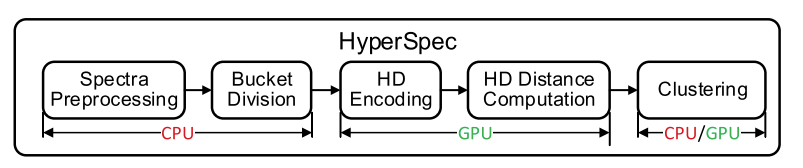
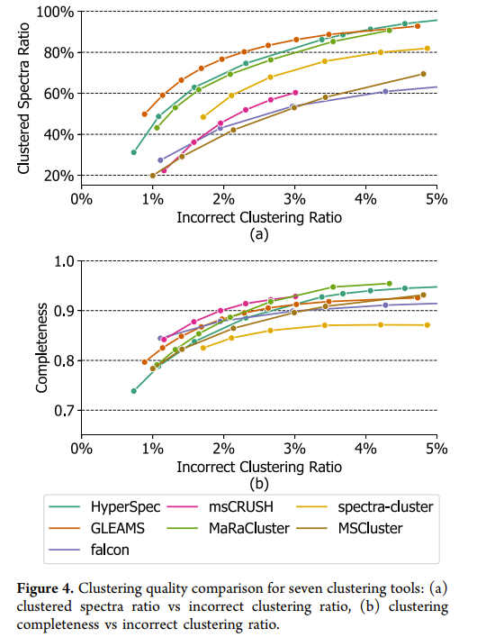
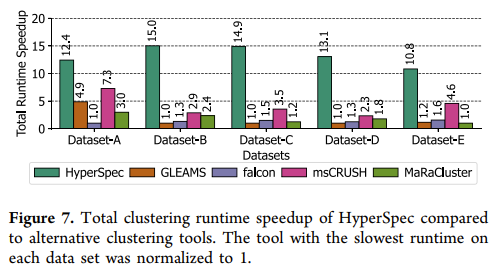
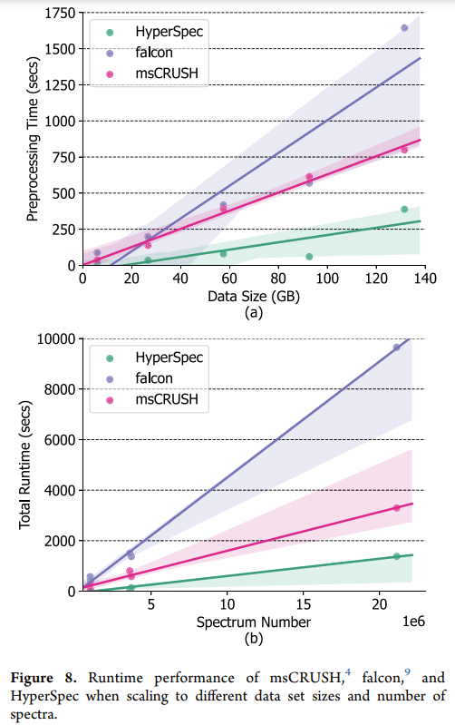

## [HyperSpec: Ultrafast Mass Spectra Clustering in Hyperdimensional Space](https://pubs.acs.org/doi/full/10.1021/acs.jproteome.2c00612)

* UCSD, Weihong Xu, Jaeyoung Kang, Wout Bittremieux, Niema Moshiri, and Tajana Rosing

* Journal of Proteome Research 2023

### Motivation and Problem Formulation

* **Motivation**: Improve Mass Spectrometry (MS) efficiency in spectral clustering.
  * NOTE: Here "Spectral Clustering" means clustering the spectrum, not the spectral clustering algorithm in CSE
  * MS is dominant analytical technique in protein composition analysis and proteome study.
  * Large datasets in MS data analysis => Use Spectral clustering to reduce search space.
* **Related works**
  * Hyperdimensional computing: Computation technique that uses large vector, information is represented holographicly across all dimensions. HD embedding also provides natural sparsity and t pseudo-orthogonality which are robust aganist forgetting.
  * Mass Spectrometry (MS): a dominant analytical technique in protein composition analysis and proteome study.
* **Challenges**
  * Previous works on improving quality has slow speed because they run on CPU only: MS-Cluster, spectra-cluster, MaRaCluster
  * Previous works on improving speed has low quality: msCRUSH, Falcon, ClusterSheep

### Method

* **Proposed solution**  
  
  * HyperSpec: a GPU-accelerated spectral clustering library using HDC.
    * Spectra Preprocessing is a bottleneck for the algorithm, because 1. speed of parsing data into numerical format is bounded; 2. processing parsed data is computation bounded; 3. limited storage I/O bandwidth.
    * Optimization:
      * Multiprocessing: read files in parallel and distribute computation to multiple CPUs
      * Spectrum data parser: use hybrid C++-Python program, to have both good speed and extension.
      * Parallelized Preprocessor: preprocessing is parallelized to multiple CPUs using Just-in-time (JIT) compilation by Numba
    * Bucket Division
      * Sort and divide spectra into buckets to reduce quadratic complexity 
      * Significantly reduces memory usage and runtime by only comparing spectra in the same bucket
    * HD Encoding
      * Two important properties: locality of the peak m/z and intensity values
    * HD Distance Computation
      * Hamming distance for similarity measurement
    * Clustering Algorithms
      * DBSCAN and Hierarchical clustering
      * Benefits: 1. these two algorithms have trade-offs between runtime and quality, so combining can give flexibility; 2. minimal efforts to tune hyperparameters; 3. fast implementations available

### Evaluations

* **Evaluation Setup**
  * Platform: 12-core CPU, 128G DDR4 memory, 2T SSD, NVIDIA RTX 3090 GPU
  * Dataset: five MS datasets
  * Benchmarks: six state-of-the-art spectral clustering libraries: GLEAMS, Falcon, msCRUSH, MaRaCluster, spectra-cluster, MS-Cluster
  * Metrics: Clustered spectra ratio, Incorrect clustering ratio, Completeness, Runtime

* **Evaluation Result**
  * Performance comparison with existing tools
    * HyperSpec exceeds most benchmarks in clustered spectra ratio (Figure 4a)
    * HyperSpec is comparable in completeness (Figure 4b)
    * HyperSpec mostly forms medium-size clusters  
   
  * Runtime
    * Total clustering time much faster than benchmarks
    * Excellent scalability and performance advantages  
   
   

### Pros and Cons

* Pros: 
  * Combines Clustering algorithm and HDC very well. 
  * Effective utilization of both CPU and GPU. 
  * Thorough experiments and metrics. 
* Cons: 
  * Not too innovative on the HDC perspective.
  * Confusing to use the term "spectral clustering" while it's not the spectral clustering algorithm in computer science.

