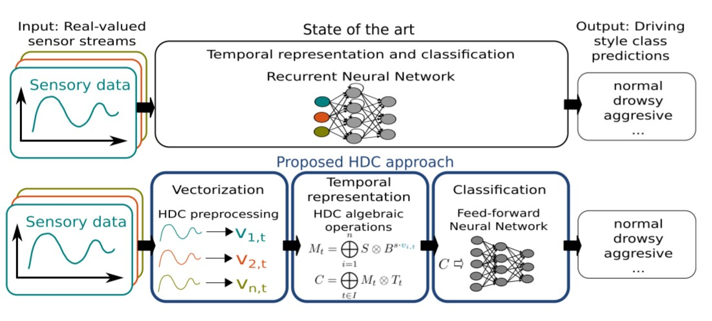
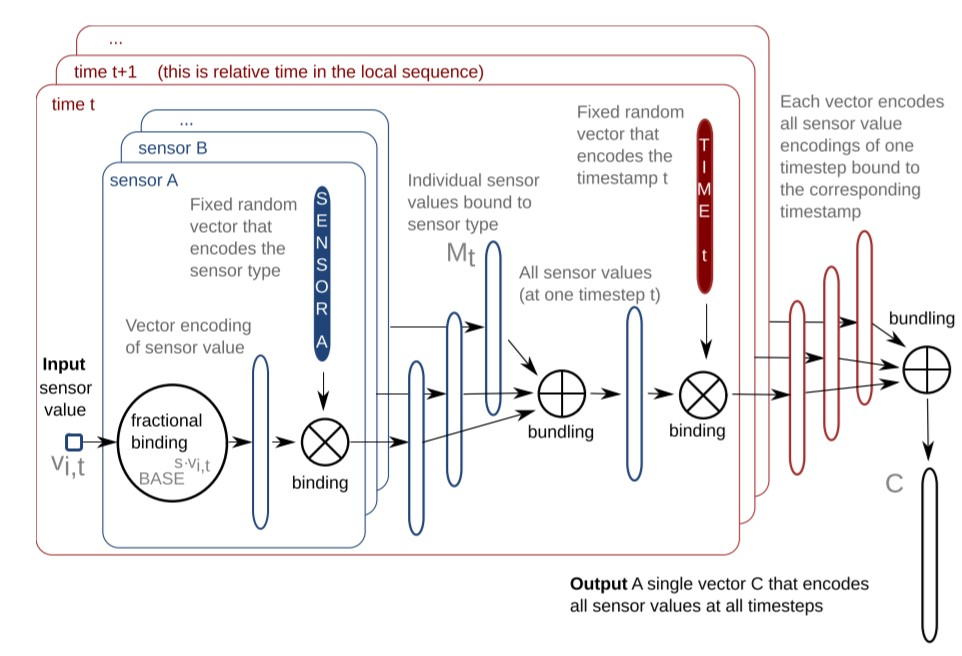
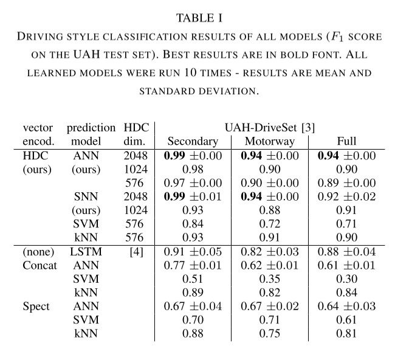
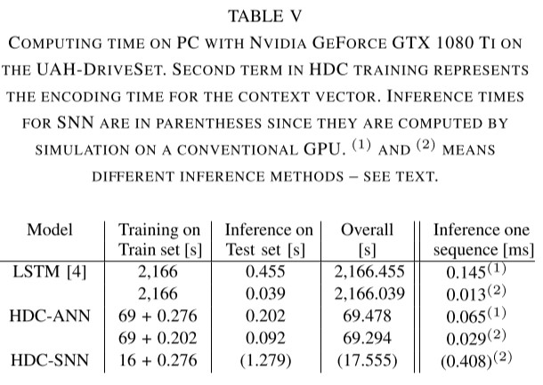

## [Multivariate Time Series Analysis for Driving Style Classification using Neural Networks and Hyperdimensional Computing](https://www.tu-chemnitz.de/etit/proaut/publications/schlegel_2021_IV.pdf)

* Kenny Schlegel, Florian Mirus, Peer Neubert and Peter Protzel

* Intelligen Vehicles Symposium (IV), 2021

* [Link to the code](https://github.com/TUC-ProAut/HDC_driving_style_classification)

### Motivation and Problem Formulation

* Driving style classification based on time series data -> current best model is LSTM.
* Advanced Driver Assistance Systems (ADAS) such as driver distraction or drowsiness detection to increase driving safety 
* Limited On-board Resources within the car
* Previous work
    * Vaitkus work = hand-crafted statistical feature to determine “Driving style classification using long-term accelerometer information” + KNN
    * Van Ly work = means and Support Vector Machine (SVM) to recognize importance of manoeuvres and recognize the driving style
    * Drive2Vec = abstract vector representation in an automotive context, make predictions about the vehicle’s state
    * LSTM = high learning effort compared to feed-forward ANNs.
* **Asumption**: Sensors in the car + Uniform sample rates 

### Method

* HDC for data representation in high-dimensional vectors and much simpler feed-forward neural networks. Advantages to this approach:
    * Instead of having a “black box” of RNN learning, they encode this temporal structure in hd vectors in a human comprehensible way while only relying on feed-forward neural networks for the classification task.
    * Similar and even slightly superior classification accuracy to LSTM while significantly reducing training time and the necessary amount of data.
    * HDC allow implementation in the substrate of Spiking Neural Networks (more energy-efficient) or other NN. And they divide the encoding and HDC side from the Classification network.
    
* Special case of HD: Holographic Reduced Representation in the Frequency Domain due to compatibility of FHRR vectors with fractional binding for systematically encoding scalar sensor values to vectors (complex vectors).
    * Bundling: store multiple input vectors in a set-like representation through element wise addition
    * Binding: store variable-value pairs through element-wise multiplication
    * Fractional Binding: Way to encode that can be presented in the next formula:
   
        $v^p := IDFT((DFT_j(v)^p)_{j = 0}^{D-1})$
        
        Where $IDFT$ = Inverse Descrete Fourirer Transform and $DFT$ is the Concrete Fourier Transform. And this equation can be simplified due to the use of complex-valued vectors in the FHRR to the following equation.
        
        $encoding(p) = c^{s \cdot p}$
        
        Where:
        * $p$ = scalar
        * $c$ = random complex value vector
        * $s$ = similarity curve scope. The larger the scaling, the less similar the neighboring scalar-encoded vector is to the output vector.
* Steps in the process are: 
    * Encode the input -> complex vector.
    * Bind with random vector of specific sensor -> $M_t$ (sensor $\otimes$ value).
    * Bundle all the $M_t$ of that time ($M_a \oplus M_b + ...$).
    * Bind with random vector of that time.
    * Bundle all of the times together.
    * Result = C
      
      Which can be seen in the next image:
      
      
      
      And the next formula:
      
      $C = \underset{t\in I}{\bigoplus}\left ( \overset{n}{\underset{i = 1}{\bigoplus}} \mathbf{SENSOR}_ i \otimes \mathbf{BASE}^{s\cdot v_{i,t}} \right )$ 
      
      Where $\mathbf{BASE}^{s\cdot v_{i,t}}$ is the encoding that was mentioned earlier and $\mathbf{BASE}$ is a random complex value vector.

### Evaluations

* Dataset: UAH-DriveSet dataset
    * 8 h driving scenes
    * Via a smarthphone with a monitoring applicatio & raw sensor valuer from GPS and IMU
    * Six diffrent drivers generate data for two types of roads: sencodary and motorway
    * Rolling windows with a size of 64 time-steps and 50% overlap
* Baseline:
    * LSTM (all the process)
    * Vector Encoding: Concatenate Input Sequences (all the sensors sequences are concatenated together) & Spectral Feature Vectors (discrete Fourier-transformation for each sequence and sensor-type -> final spectral feature vector)
    * Prediction Models: ANN, SNN, SVM &  kNN
* Metric: F1-Score
* Results
    * HDC has a slightly better F1 score + a much quicker response, as seen in the tables:

    
    
    

### Pros and Cons

* Pros: Quicker than what's being used now, and ability to upgrade to a SNN network if needed, which in this context might be very helpful.
* Cons: If the GPU is only dedicated to this specific classification task, then the LSTM model is twice as fast as the HDC. In other words depends on the hardware configuration if it actually is going to be faster or not. 

