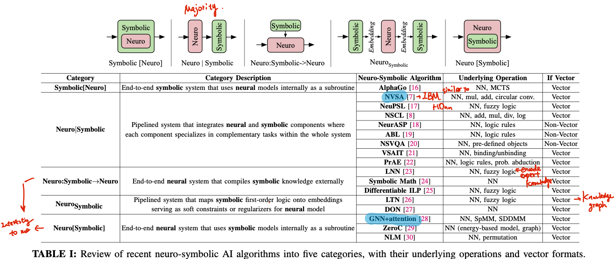
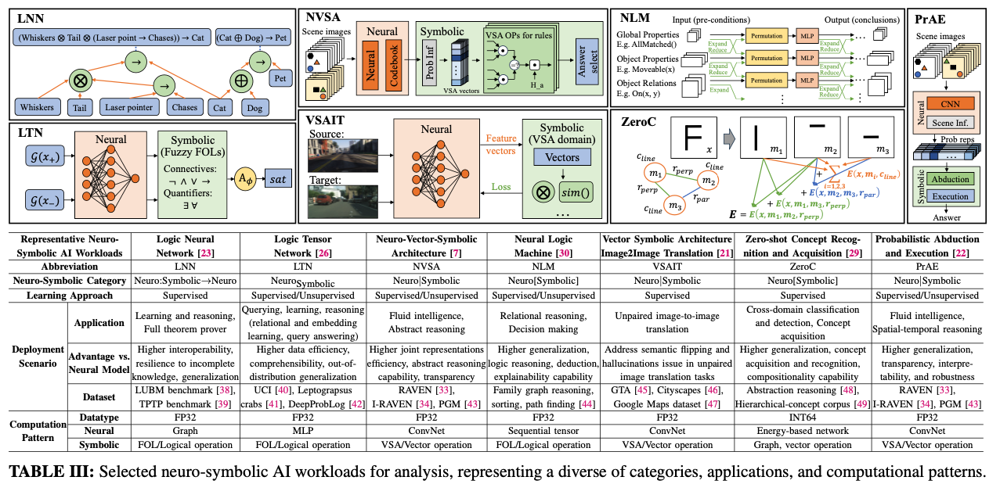
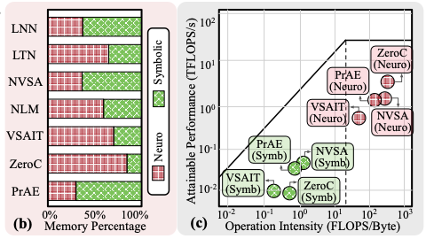

## [Towards Efficient Neuro-Symbolic AI: From Workload Characterization to Hardware Architecture](https://arxiv.org/abs/2409.13153) [TCASAI'24]

* Zishen Wan, Che-Kai Liu, Hanchen Yang, Ritik Raj, Chaojian Li, Haoran You, Yonggan Fu, Cheng Wan, Sixu Li, Youbin Kim, Ananda Samajdar, Yingyan (Celine) Lin, Mohamed Ibrahim, Jan M. Rabaey, Tushar Krishna, Arijit Raychowdhury. GT, UC Berkeley, IBM Research.

* TCASAI 2024

* Code not available

### Motivation and Problem Formulation

* What is the high-level problem?
  * Efficient system for neuro-symbolic AI

* Why is it important?
  * Widely applied in real world, including vision, language, collaborative human-AI interactions

* What are the challenges?
  * Current hardware roadmap mainly optimizes for matrix multiplication and convolution
  * Mismatch between neuro-symbolic AI and current hardware
    * Mainly due to higher memory intensity, greater kernel heterogeneity, and access pattern irregularities

* What is missing from previous works?
  * Did not have related work discussion
  * Claim as: “**One of the first works to characterize neuro-symbolic computing from both system and architectural perspectives**”

### Background

* Neuro-symbolic AI

  

### Method

* What are the major contributions?

  * Systematically categorize neuro-symbolic AI algorithms, and then experimentally profile their runtime, memory, computational operators, sparsity and system characteristics on CPU, GPUs and edge SoCs

  * They suggest cross-layer optimization solutions and present a hardware acceleration case study for VSA (HD)

  * They discuss the challenges and potential future directions of neuro-symbolic AI from both system and architectural perspectives

    

* Categorizing neuro-symbolic AI

  

* Profiling neuro-symbolic AI

  * **Models:** seven neuro-symbolic AI models with diverse applications, model architectures and computational patterns

    

  * **Hardware:** Intel Xeon Silver 4114 CPU and Nvidia RTX 2080 Ti GPUEdge SoCs - Xavier NSEdge SoCs - Jetson TX2

  * **Analyze in six operator categories:** Convolution, matrix multiplication (MatMul), vector/element-wise tensor operation, data transformation, data movement, and others

  * Latency Analysis

    * **Takeaway 1:** Symbolic operations are processed in-efficiently on CPU/GPUs -> bottleneck

    * **Takeaway 2:** The runtime ratio of neural vs symbolic remains stable when task complexity increases

      

  * Compute Operator Analysis

    * **Takeaway 3:** Neural components mainly consist of MatMul and Convs, while the symbolic components are dominated by vector/element-wise tensor and logical operations

      

  * Memory and System Analysis

    * **Takeaway 4:** Neural operations are compute-bounded, while symbolic operations are memory-bounded
      Neural weights and vector code books account for most storage, while symbolic requires large intermediate caching during computation-> model quantization/pruning and in-memory computing may help

      

  * Hardware Inefficiency Analysis

    * **Takeaway 5:** symbolic operations surfer from low ALU utilization, low L1 cache hit rates and high memory transactions, resulting in low efficiency-> Need better scheduling

      

  * Sparsity Analysis

    * **Takeaway 6:** Some neuro-symbolic AI demonstrate a high level of **unstructured** sparsity with variations under different task scenarios and attributes-> Need sparsity-aware design

      

* Case study: hardware accelerator of VSA (basically HDC)

  * Main design

    * Vector-symbolic kernel formulation

    * Hardware architecture and data flow

      * Three subsystems
        * Memory and codebook-generation subsystem (MCG)
        * Vector-symbolic operations subsystem (VOP)
        * Distance computation subsystem (DC)

    * Accelerator control methods

      

      

  * Experiment results

    * Experimental setup

      * **Implementation:** SystemVerilog

      * **Synthesize:** Synopsys Design Compiler using foundry 28nm library

      * **Energy measurement:** Synopsys PrimeTime PX

      * **GPU power:** nvidia-smi

        

        

    * **Results:** Better than GPU

      

* Future directions

  * Building ImageNet-like neuro-symbolic datasets
  * Unifying neuro-symbolic models
  * Developing efficient software frameworks
  * Benchmarking diverse neuro-symbolic workloads
  * Designing cognitive hardware architectures

### Pros and Cons (Your thoughts)

* Pros
  * Very useful summary of all neuro-symbolic AI models
  * Very comprehensive characterization and discussions
* Cons
  * No accuracy profiling and discussion
  * Lack of related work
  * Lack of discussion and comparison with other HDC accelerator
  * A little lack of connection between the lessons learned and the case study