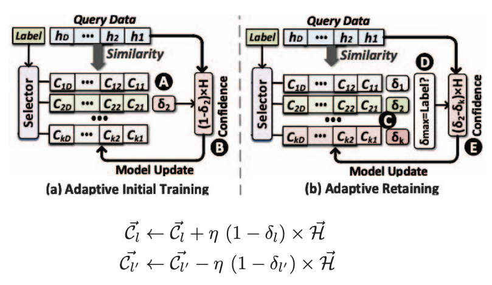
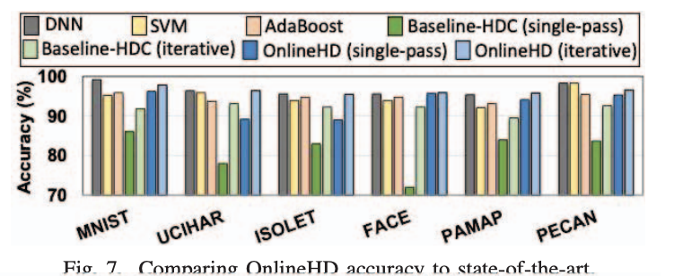
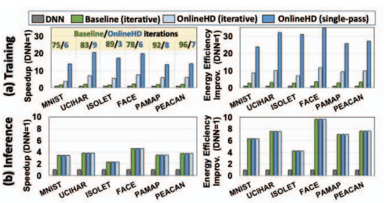

## [OnlineHD: Robust, Efficient, and Single-Pass Online Learning Using Hyperdimensional System](https://doi.org/10.23919/DATE51398.2021.9474107)

* Authors:
  * Alejandro Hernández-Cano,  Universidad Nacional Autónoma de México
  * Namiko Matsumoto, University of California San Diego
  * Eric Ping, University of California San Diego
  * Mohsen Imani, University of California Irvine

* DATE 2021

* [Code](https://github.com/BIASLab-UCI/onlinehd)

### Motivation and Problem Formulation

* **Motivation**
  * Hyperdimensional Computing is one of the ML algorithms best suited for embedded devices. HDC isn't as sensitive to noise (compared to other ML algorithms) and doesn't require floating point operations. It's highly parallelizable and supports single-pass learning.
* **Related works**  
  * Hyperdimensional Computing: "Brain-inspired learning approach for efficient and robust learning... Supports single-pass learning, where it generates a classication model by one-time looking at each training data point."
* **Challenges**
  * Single-pass HDC provides low accuracy (~70% accuracy for face recognition). Iterative HDC boosts accuracy but necessitates large off-chip memory, not ideal for embedded devices.
  
### Method

* **Proposed solution**
  
  * OnlineHD proposes a way to ahcieve a mathematically similar model to iterative HDC while only using single-pass learning.
  * Single-pass baseline HDC has poor accuracy because encoded data is naively added to their corresponding class hypervectors. If a piece of data is very similar to what we've already seen, it causes saturation in the model and accuracy decreases.
  * OnlineHD adds new data to the model depending on how much new information the data adds to the model. If a datapoint already exists in the model OnlineHD only adds a little (or none) of it; whereas a new datapoint will be added in its entirety.
  * This is done by weighting a datapoint by its disimilarity to its class hypervector. If a datapoint is more similar to an incorrect class hypervector, we also subtract the weighted sample hypervector from the incorrect class hypervector.
  * The algorithm to implement OnlineHD iteratively is similar to its single-pass version.
    
### Evaluations
 * Single-pass and iterative OnlineHD are 3.5x and 6.9x faster than baseline HDC, and overall 12% higher classification accuracy. Requires less training data than baseline HDC for better accuracy.
 
 * Comparable performance to other state-of-the-art ML algorithms in various datasets.
 
 * OnlineHD also had faster convergence and better energy efficiency than DNNs in some tets on various datasets.
 

### Pros and Cons

* Pros:
  * Good background and motivation explaining HDC and why it's important for embedded.
  * Algorithm is easy to implement and provides great opportunities for single-pass learning on embedded devices.

* Cons:
  * Some pros the paper lists aren't limited just to OnlineHD and also apply to baseline HDC. (They are a factor of using hypervectors generally)
  * I wish they would have explained how they scale binary hypervectors by a weight. (maybe more info in their Github repo)
