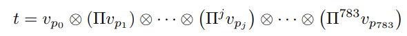
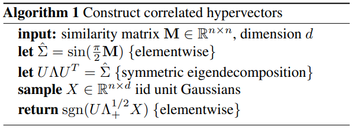
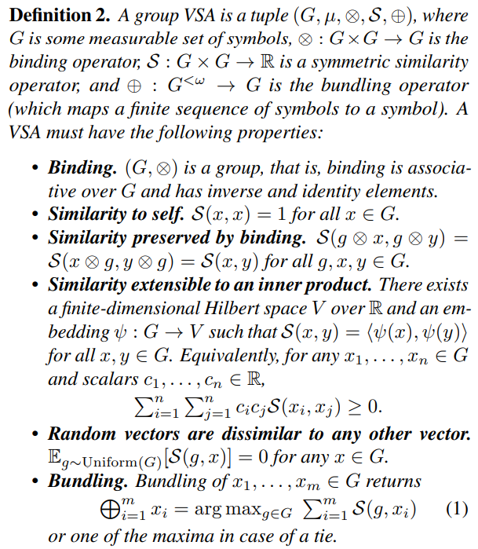
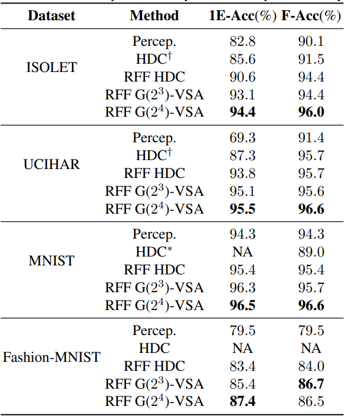
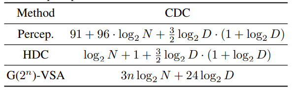
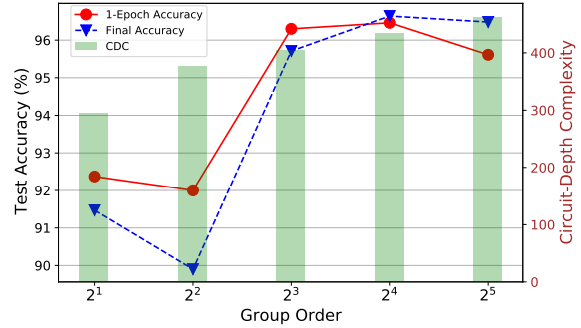

## [Understanding Hyperdimensional Computing for Parallel Single-Pass Learning](https://arxiv.org/abs/2202.04805)

* Cornell

* Preprint

* [Code](https://github.com/Cornell-RelaxML/Hyperdimensional-Computing)

### Motivation and Problem Formulation

* **Motivation**
  * Typical HDC use binary VSA and encoding hyperverctor that randomly drew from such hyper veector space. Such simplistic VSA structure and initialization method facilitztes fast computation however is lack in accuracy when compare to other machine learning methods.
  * Traditional HDC VSA is not expressive enough which restrict the performence of HDC system.
  * HDC system can be approved with more complex VSA such as infinite group VSA (Real numbered or compplex hypervector instead of Binary). However thoes increase the computational complexity greatly.
  
* **Related Works**
  * HDC: Computing paradigm that uses large vector. Learning is done with binding, bundling and permutation operations. Large vectors has properties such as orthogonlity and sparsity which is good for congnitive tasks.

* **Challenge**
  * Increase VSA expressitivity.
  * Maintaining hardware efficiency.

### Case Study: MNIST with triditional HDC system
* **MNIST**
  * Every pixel in MNIST is a value between 0-255 representing gray scale.
  * Sinle channel 28*28

* **Binary VSA**
  * Hypervector consist of only {-1,1}.
  * Bundling: Component-wise sum (Potentially binarising with threshold)
  * Binding: Component-wise XOR
  * Permutation: Component-wise rotate
  * Similarity: cosine / hamming

* **Encoder** \
  
  * 256 random embedding hypervector is selected.
  * To encode pixel position info, different number of permutation is used before binding.

* **Learning/Inference**
  * Class hypervectors are by class-wias sample bundling.
  * Similarity check between class-hypervecs for inference.

### Method
* **Method**
  * Authors augre that performance of HDC system is directly related with the expressivity of HDC system.
  * Two approch are proposed to increase the expressitivity of HDC system.
    * Use Random Fourier Features to generate encoding matrix.
    * Defined a set of conditions of VSA that is suitable to HDC applications, and proposed a more expressive finite group VSA.
  * Learning with SGD instead of bundling.

* **Randon Fourier Features** \
  
  * HDC system usually generate embedding hypervector with random sampling in the vector space, however such operation already limited number of similarity mlatrices HDC system can express.
  * To solve that RFF is used to generate embedding hypervectors.
  * Embedding hypervecs generate this way enable more expressive HDC system.

* **VSA Definition** \
  
  * A VSA can for used for HDC if the following condition is satisfied.
  * Proposed finite group VSA
    * Has a finite set of symbols
    * Somewhere between Binary VSA (Just 0s and 1s) and infinite group VSA (real number VSA)
    * Provided more expressivity and allow better performance.
    * Still maintaining the computational efficiency.

* **Learning with SGD instead of bundling**
  * Bundling can be used to learn a class representative is based on the assumption that the resulting bundling hypervector is similar to all the constitute sample hypervectors.
  * The assumption is not true, particularly when constituting hypervector are normal to each other.
  * Feed Forward Network(FFN) is used instead of bundling.
  * Take encoded hypervector as input and classification confidaence as output.

### Experiment

* **Experiment Setup**
  * Dataset used: ISOLET, UCIHAR, MNIST, Fashion-MNIST
  * Baselines: Multilayer Perceptron, Binary HDC.
  * Comparisons: BinaryHDC with RFF, Cyclic Finite VSA(|G|=8) with RFF, Cyclic Finite VSA(|G|=16) with RFF

* **Result** \
  
  * RFF already improves HDC significantly.
  * Finite group VSA further imporves the performance.
  * Single-Pass on data can still achieve good result enabling online learning.

* **Computional Complexity** \
  
  * Proposed VSA can still be efficient on hardware.

* **Empirical Analysis on |G|** \
  
  * 1-Epoch achieve good accuracy compare to multi-epoch.
  * CDC increase only sligfhtlt as |G| increases.

### Pros and Cons

* Pros:
  * Generalized a set of necessaries conditions for VSA in HDC, enabling future research on VSA.
  * Provided meaningful discussion on the relation between expressivity and performance.
  * Increase Performence without greatly increase computational complexity.

* Cons:
  * Why RFF is not well explained.
  * How would finite group VSA alone perform.
  * Finite Group VSA seem to only increase performance slightly, how useful is it.

