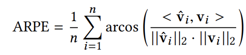

## [Integrating event-based dynamic vision sensors with sparse hyperdimensional computing: a low-power accelerator with online learning capability](https://www.research-collection.ethz.ch/handle/20.500.11850/425534)

* ETH Zürich

* ISLPED 2020

* [Code](https://github.com/iis-eth-zurich/hd_dvs)

### Motivation and Problem Formulation

* **Motivation**: Compared to the classical camera, the output of the neuromorphic dynamic vision sensors(DVSs) is not a sequence of images but a stream of asynchronous events, which include information of intensity changes
  * Its property of seeing sparse events in time rather than getting the full image pixels at a fixed frame rate allows it to capture motion better than the camera.
  * Features like high dynamic range, high temporal resolution, low latency and less redundant data from downstream processing.
  * These features make it become super useful in low-power applications such as robotics and self-driving cars.
* **Related works**
  * In current DVS, each pixel is treated as an independent circuit that outputs the light intensity changes at the time they occur. We treat these changes as many small events here. Based on the existing technique, these events can be processed by spiking neuromorphic processors.
* **Challenges**
  * There is not a method that shows how to combine DVS with other non-spiking machine learning approaches that favor efficient realization using digital and synchronous accelerators.
  
### Method

* **Proposed solution**
  
  * The team propose to embed features extracted from DVS events to binary HD vectors using novel randomized activation functions encoding. This sparse encoding simplifies learning and inference procedures, and therefore allows the model to be updated during inference without any additional memory requirement.
    * Input is a stream of sparse and asynchronous events, each being a tuple e(x,y,t, p) with spatial coordinates x and y, time of event t with a resolution in µs, and p the polarity of the intensity change.
  * In the beginning, asynchronous DVS events of a time window of 50 millisecond are used to compute the time image T, which has 346x260 elements.
  * After determining the local gradient images Gx and Gy, the feature vector f, containing the six global descriptors, is computed. The features are mapped to binary vectors, which can be efficiently represented by 255 32-bit values. 
  * Finally, the AM search, which provides a training and inference mode, stores prototypes in x and y direction. These prototypes represent different velocity levels. In inference, the query vector Q will be compare dto all prototypes in both directions. The velocity level with the corresponding highest overlapping prototype will be selected o be the estimated velocity.
    
### Evaluations
 * To show their method is valid, they assess the proposed methods on the MVSEC dataset with comparing the average relative pose error, which is the ARPE right here. The ARPE amounts to the average angular error between translational vectors while ignoring the scale.
 
 * This table shows the ARPE for different HD regression models, compared with commonly used regressions and multi-layer perceptron (MLP). The result shows most sparse binary encoding outperform the baseline dense encoding. RAFE+CDT is the most accurate binary methods among the HD regressions
 
 * Another results show the effect of online updates in both dense and sparse HD encodings. The base model is trained on 25% of the training set and then it is updated on the remaining 75% on the training set based on ground truth label which is oracle or self-generated label which is online. From the graph, we can see that the ARPE drops when doing updates, and sparse encodings consistently have lower ARPE than the dense encodings.
 

### Pros and Cons

* Pros:
  * Clear background introduction.
  * Nice case study

* Cons:
  * It does not contain much information about the previous works and what drawbacks they have.
  * The purpose of introducing this new method is not that clear and thier method introducation is not well-related to HDC.
