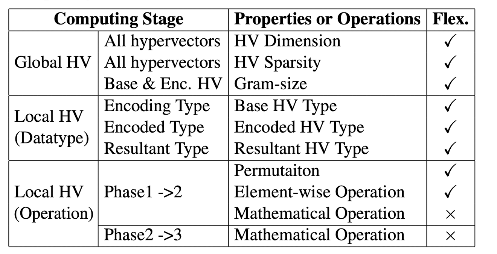
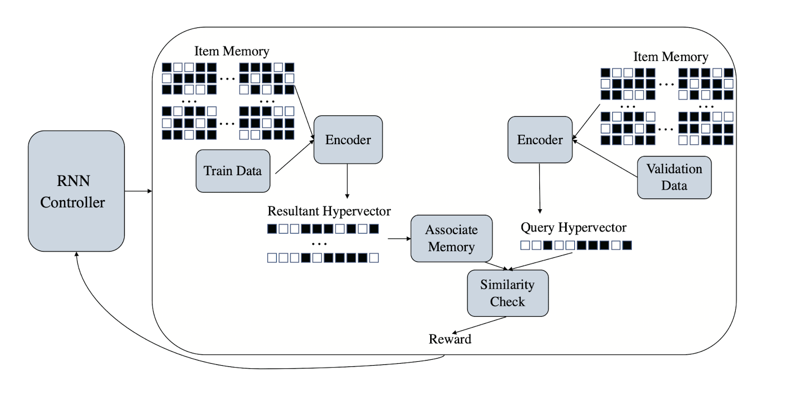
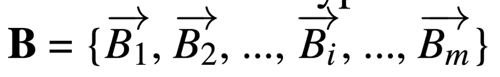
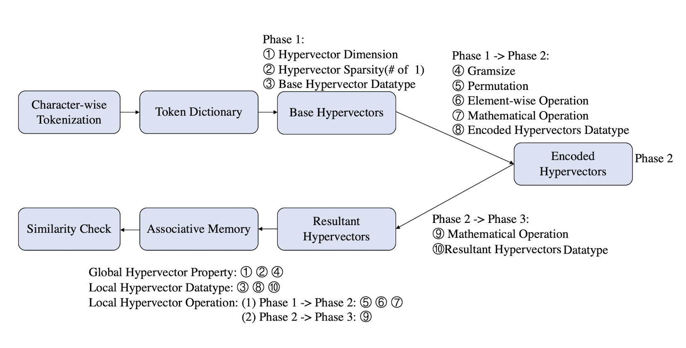
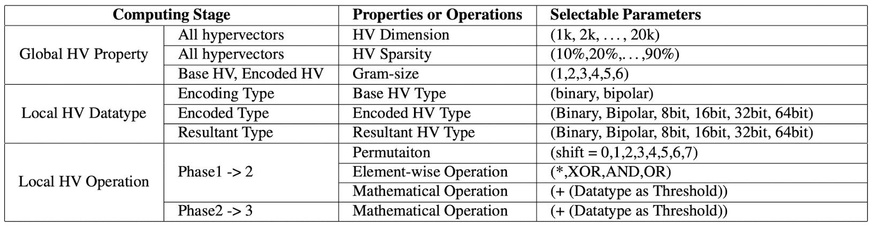
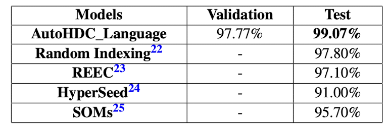
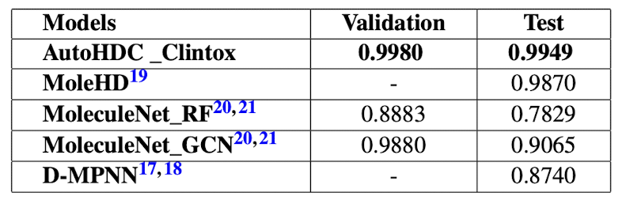
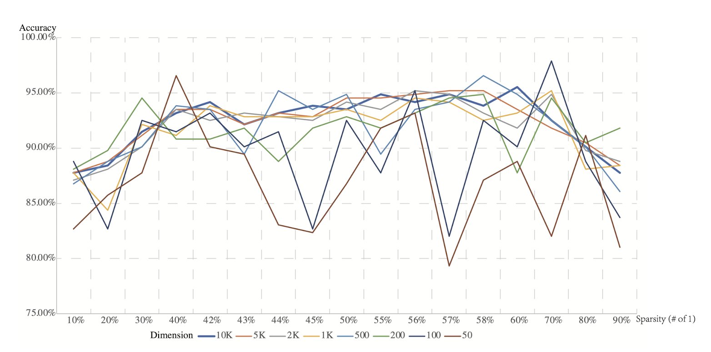

## [Automated Architecture Search for Brain-inspired Hyperdimensional](https://arxiv.org/pdf/2202.05827)

* Junhuan Yang, Yi Sheng, Sizhe Zhang, Ruixuan Wang, Kenneth Foreman, Mikell Paige, Xun Jiao, Weiwen Jiang, and Lei Yang

* University of New Mexico, George Mason University, Villanova University, George Mason University

* autoML, 2022

### Motivation and Problem Formulation

* What is the high-level problem?
  * HDC designs are usually application-specific; Hand-craft HDC have lower accuracy and efficiency than neural networks.
* Why is it important?
  * Enable efficient design of highly accurate HDC models.
* What are the challenges?
  * Many aspects of HDC are challenging to design manually and are usually unsuitable for most situations like the design of HVs.
* What is missing from previous works?
  * Automated architecture search for HDC.
* High-level goal?
  * Create the first automated architecture search for HDC.
* What are the key assumptions?
  * The input data are texts; search has no memory constraint.

### Method

* What are the major contributions?
  * Constructed the fundamental search space in the design of the HDC architecture (listed important parameters that would influence the HD performance).

    
  * Designed a reinforcement learning search loop(AutoHDC) to automatically search for the best HDC architecture for a given application.
  * Carried out case studies on drug discovery tasks and language processing tasks.
* What is the technical problem? What are the input and output of the problem?
  * It's hard to define a search space for HDC architecture.
  * Input is the search space and problem; output is the best model under the current metric and search space.
* What do they propose to solve the problem?
  * They propose a search space for HDC and Auto HDC, the first neural architecture search algorithm for HDC.
* Why does this work?
  * Automated architecture search is based on empirical outcome, so it is almost guaranteed to provide the best result under the given HD structure.
* Algorithm, architecture, solution
  * Auto HDC
    * Recurrent Neural Network as controller; HDC as executor to produce a reward for a searched structure
       
    * Preprocessing: Convert each unique input text into numerical tokens and produce base hypervectors
       
  * Search Space
     * List it out possible parameters in the HDC process.

       
       
       * 2 Sparisty: # of 1s
       * 4 Gram size: number of continues characters as a sub-unit to be operated by element-wise operation
       * 5 Permutation: the i-th element’s hypervector will rotate (N-i)*j elements instead of (N-i) elements
       * 6 Element-wise Operation: Multiplication, Xor, And, Or
       * 7 Mathematical Operation: add a threshold or not
       * 8 Encoded Hypervectors Dataype: binary, bipolar, int8, int16, int32, int64
         

### Evaluations
  * Dataset
    * Clintox - toxic or not for drugs
    * Worschatz Corpora; Europarl Parallel Corpus - classification on 21 European languages
  * Baseline
    * Clintox: D-MPNN, MoleHD(algorithm), and 2 methods, Random Forest, and Graph Convolutional Networks
    * Language processing tasks: Random Indexing(dimension reduction techniques), Robust and Energy-Efficient Classifier, HyperSeed(clustering algorithm), and SOMs(neural network)
  * Metric
    * Clintox: Receiver Operating Characteristics(ROC) Curves (x-axis: false-positive rate, y-axis: true positive rate), ROC Area-under-curve score
    * Language processing tasks: accuracy
  * Key Results
    * Higher accuracy on models created by AutoHDC

      

      
      
    * Sparsity of 75% and dimension 100 HDC model on Clintox achieves the best accuracy

      

      
### Pros and Cons (Your thoughts)
* Pros
  * A holistic collection of HD parameters under the basic HDC
  * Good results on their experiments
* Cons
  * Not actually automatic; need to hand craft the result that gets feed back to the RNN
  * Only on texts; not applicable for sounds or images
  * Not based on more advanced hd models such as Online HD; might fail on complicated tasks

    

