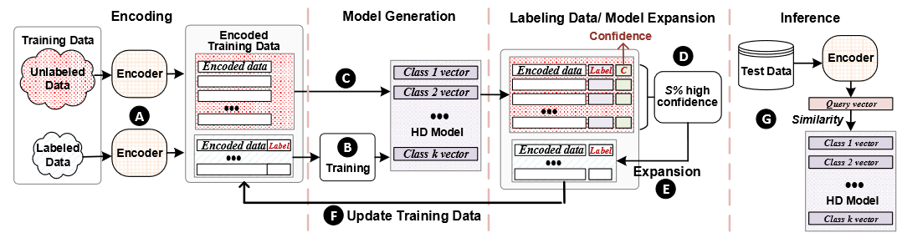
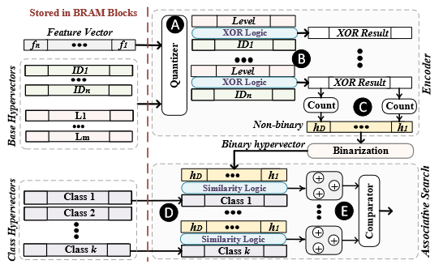
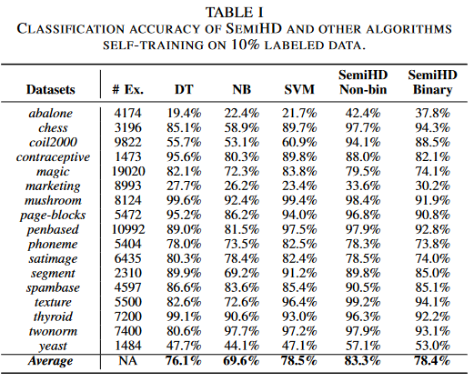
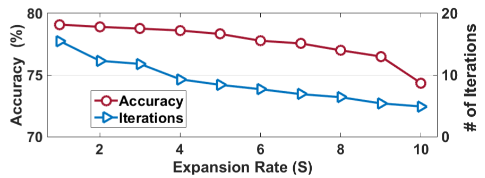
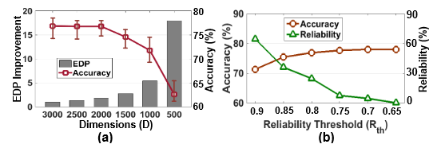
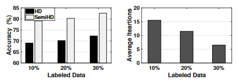
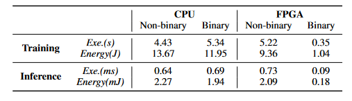

## [SemiHD: Semi-Supervised Learning Using Hyperdimensional Computing](https://ieeexplore.ieee.org/document/8942165)

* Mohsen Imani (CSE Department, University of California San Diego), Samuel Bosch (Integrated Systems Laboratory, EPFL, Lausanne, Switzerland), Mojan Javaheripi (ECE Department, University of California San Diego), Bita Rouhani (ECE Department, University of California San Diego), Xinyu Wu (CSE Department, University of California San Diego), Farinaz Koushanfar (CSE Department, University of California San Diego), and Tajana Rosing (CSE & ECE Department, University of California San Diego).

* ICCAD 2019

* Code is not provided

### Motivation and Problem Formulation

* **High level problem**: IoT generates large amount of data which poses computational problems in resource-constrained environments.
* **Importance**: Need for machine learning algorithms to be able to train proper models using small amounts of labeled data (because in practice this is what really happens), especifically in resource-constrained embedded devices.
* **Challenges**: 
   * Majority of the sensor data is unlabeled 
   * Self-training can lead to weak classifiers as errors at the beginning can be reinforced in each iteration
* **Previous Works**:
   * DNN require significant computational resources and memory
   * Conventional supervised learning algorithms like self training, generative models, S3VMs, graph-based algorithms and multi-view methods require large volume of data to train and still fail to obtain desired prediction accuracy
   * HD is computationally efficient to train, fast learning (in regards to the classification with less labeled data) intuitive (is a human-interpretable alternative to deep learning) and inherites robustness to hardware noise but cannot provide high classification accuracy when label data size is small.
* **Assumptions**: No explicit assumption but assumes no errors in the labeled data

### Method

* **SemiHD**: semi-supervised HD computing algorithm with self-training in hd space with small number of labeled data, which includes advances such as:
   * Classification is by encoding to hd and generating (training) a model based on the available data, then iteratively add more labeled data to the model by classifying unlabeled data with the highest confidence.
     * **Encoding**: D = 10000, using level hvs binded with feature index hvs
     * **Training**: Element-wise addition
     * **Predict Label of Unlabeled Data**: Check cosine similarity with all class hvs
     * **Determine Prediction Confidence**: Difference between 2 highest matches
     * **Expand Label Data**: Select S% of highest confidence to label data (S% part of the generated parameters controlled by the user) to leverage accuracy and execution time
     * **Convergence Condition**: Continue until accuracy does not change more than 0.1%
     * **Inference**: Through similarity with all the classes
      
     
     
   * Users can trade-of accuracy VS efficiency and reliability where accuracy depends on dimensionality and confidence threshold (S) during training.
      * **Dimensionality**: Large dimensionality increases classification accuracy, but saturates when vector size is larger than required and more computation is needed. Assuming all data points are orthogonal, they made the next formula to calculate the optimal number of dimensions:
      
        $argmax_{i=1:k} \\{\\#\ labeled\ data_i \\} < D / 2K$ where $K$ = # of classes
        
        Not all points have the same distribution so i takes into account distribution of data points
      * **Expansion rate** (S): Is % of highest confidence results that are moved to labeled data for retraining
         * Large S means fewer iterations but more changes to the model
      * **Reliability**: What if none of the classes correspond to the input data? To be assigned a class, then a the highest similarity > R_th.
         * Higher reliability loses accuracy because points may be incorrectly classified as out of scope
         * Normal HD: Rth = 0, normally they select 0.8
         
      
    
    * Efficient FPGA implementation: FPGA can be programmed to support SemiHD operations with high efficiency using lockup table and DSP resources
      * Quantize feature vector F
      * XOR logic to encode
      * Counter blocks to get single hv
      * XOR array to compute the similarity (counts bits that differ)
      * Tree-based adders (type of adder circuit perform arithmetic operations on binary numbers) to get scalar confidence 
      * Use dot product if the models are non-binary

      

### Evaluations

* **Dataset**: A lot, can be seen in the image bellow.
* **Baselines**: Decision Tree, Naive Bayes, SVM     
* **Metric**: Accuracy (# of data points that are correctly classified) and efficiency (Execution and Energy)
* **Results**:
   * SemiHD with non-binarized model can provide higher classification accuracy compared to baselines
   * SemiHD with binarized model provides comparable accuracy
   
     
   
   * Increasing S from 5% degrades accuracy but accelerates training by reducing required iterations

     
     
   * Achieves maximum accuracy for D > 1500 but D < 1500 brings higher efficiency 
      * EDP = Efficiency: energy the total energy consumption of cores and delay is the amount of time for executing application
   * Reliability confidence is a trade-of between accuracy and reliability where small confidence brings high classification accuracy but is less able to detect out of scope data
      * R_th = 0.8 provides highest accuracy in identifying out of scope data
      
     
      
   * SemiHD achieves higher accuracy with higher labeled data but more iterations are needed, compared wih HD (not mentioned if retraining is done).
   
     
   
   * CPU: Not designed to work with long sized binary vectors so it has a lower efficiency during classification when using long binary vectors but high when non-binary
   * FPGA: (D = 500) 7.11x faster and 12.6x energy efficient as compared to best CPU implementations
     
     

### Pros and Cons (Your thoughts)

* Pros: 
   * Very well written and explainable
   * Novelty as the first semi-supervised algorithm in HD
   * Variety of datasets
* Cons: 
   * Missing some equations of how to calculate support accuracy, specifically in efficiency calculations (S and R_th)
   * Despite using variety of datasets, chosen dataset are questionable.
      * Results are not reproducible
   * The results (especifically in accuracy) both on SVM and HD compared with SVM are really low.
      * The difference in accuracy between HD and SemiHD is not getting smaller over time, which is also suspicious.

