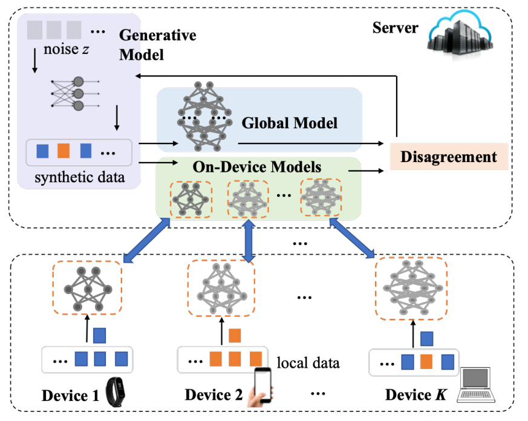
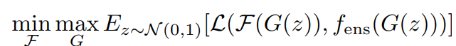
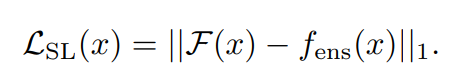
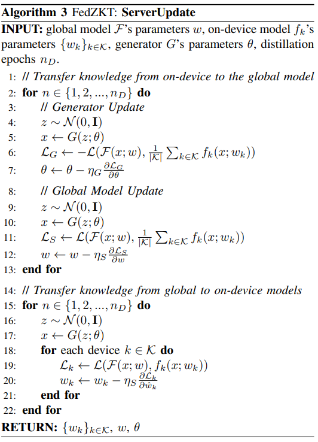
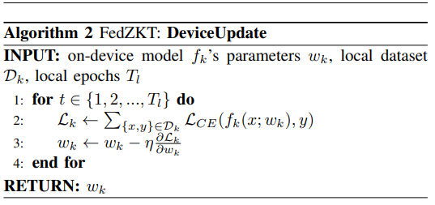
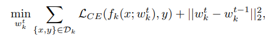
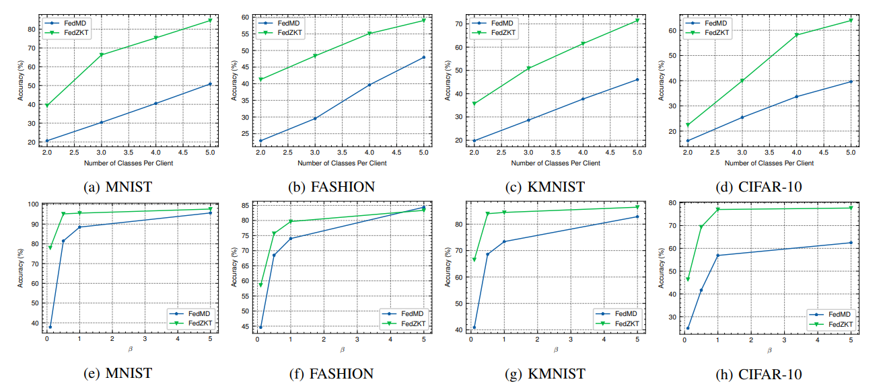

## [FedZKT: Zero-Shot Knowledge Transfer towards Resource-Constrained Federated Learning with Heterogeneous On-Device Models](https://arxiv.org/pdf/2109.03775.pdf)

* Michigan Technological University, University of Florida

* ICDCS 2022

* Code Not Provided

### Motivation and Problem Formulation

* **Motivation**: Federated Learning system often involve deploying on heterogeneous IoT or edge devices as client. Heterogenity embodies in different computing capability, memory size and network condition. For that reason, use homogeneous neural network design on heterogeneous clients often cause suboptimal performance due to strugglers. Allowing different client uses proper model design can help facilitates better FL system.
* **Related works**
  * Heterogeneous Federated Learning: FL in a heterogeneous setting, often result in struggler that damage the system performance, past works on this topic including better client selection and reduce model model complexity but still under  the learning paradigm of FedAvg with homogeneous on-device models.
  * Federated Distillation: Major approch for federated learning on heterogeneous models, use knowledge distillation to transfer client specific knowledge to global model. Currently most promosed works in the field is data-dependent which is not always available.
* **Past Works**
  * FedGen: Use generative model on clients to augment local knowledge for data-free distillation, add additional computation on client.
* **Problem Formulation**
  * This work considered a supervised FL learning task on heterogeneous clients of different model architecture. Utalizing knowledge distillation on local models on server side to achieve federated knowledge transfer and add no additional computation on clients and no additional communication cost.
* **Challenges**
  * Maintain resource friendly on client devices.
  * Working with different client model architecture.

### Method
* **SystemFlow** \

  * Client first chose proper model base on device properties and network condition.
  * Local training is done with locally stored data, local model weights are uploaded to server.
  * Server use disagreement between global model and local model ensemble to train a Generative model.
  * Use the same disagreement and trained generative model to train global model.
  * Use GAN and trained global model to distill knowledge back into local models thus complete a cycle of FL training.
  

* **Objective Functions / Loss Functions** \

  * F: Global model parameters, minimize disagreement between global model and local model ensemble.
  * G: Generative model parameters, maximize loss.

  * Loss function for measuring the disagreement, l1 norm is used for more stable gradient in FL setting.

* **Server / Client Update**  \

  * Randomly sampled Gaussian Noise are used to generate client data.
  * Disagreement as Loss is computed and GAN parameter is updated first, result in trained data generative model.
  * Use trained generator to train global model
  * For each local model, global model knowledge is distill back into local models of different type.  \

  * Deal with non-iid data on client is another goal \

  * Local update on local data uses l2 regularization.

### Evaluation
* **Setup**
  * Proposed FL system is tested on MNIST KMNIST FMNIST and CIFAR datasets.
  * For heterogeneous models, ShuffleNetV2 MobiNetV2 and other LeNet-like designed are used.
  * Baseline: FedMD, FedMD also allows model heterogenerity on clients but require piror knowledge of data or pretrained GAN model.

* **Results**  \

  * Non-iid setting
  * First row: quantity-based imbalance
  * Second row: distribution based imbalance
  * As expected, FedZKT out performs baseline within the resource constrains.

### Pros and Cons

* Pros:
  * Tackles heterogeneous client model problem allowing more flexible FL system on a wider range of devices.
  * Add no additional compution on clients.

* Cons:
  * Generative model training does not make sense to me, why would maximizing loss between F and local model ensemble train GAN
  * Server will need to handle significantly more computations.

