## [Random Feature Attention](https://openreview.net/pdf?id=QtTKTdVrFBB)

*  University of Washington, Allen Institute for Artificial Intelligence, Hebrew University of Jerusalem, The University of Hong Kong

* ICLR 2021

* Code Not Provided

### Motivation
Transformar is the SOTA model architectures in many machine learning taks today. At its core is a pair-wise attention computation that captures the interactions of inputs.
 - Attention computation for softmax attention in transformer architectures requies quadratic complexity with respect to sequence length.
 - Scale badly when dealing with ling sequences.
 - Especially computationally expensive when auto-regressive decoding is required. (i.e. machine translation)

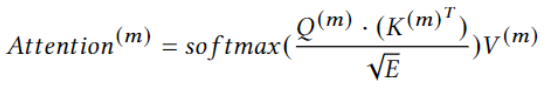

### Previous works
There is a entire line of works focus on reducing the complexity of attention mechanism.
- Sparse attention: Limit attention receptive field for faster softmax attention computation.
- Compressed Context: Truncate or reduce input sequence length to speedup attention computation.
RFA neither use sparse attention nor reduce the input length, instead it uses random features to approximate kernel value for linear time attention computation with degrades model performance.

### Kernel method and Random Fourier Feature
- A family of pattern learning algs that uses linear classifier for nonlinear learning problems, usually with some nonlinear basis to project nonlinearly seperatable data into higher dimensional spaces where it becomes linearly seperatable.
- Kernel enables learning nonlinear projection at higher dimension without comput projected representation expilicitly. More efficient learning.
- Random Fourier Features:
  - Approximating shift invariant kernels with random features.
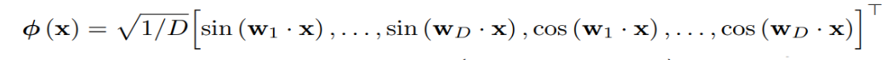
  - Basis function for shift-invarient kernel value approximation.
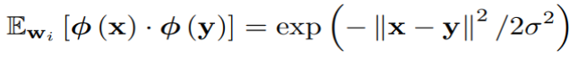
  - If we design out basis function in above way, the kernel value can be approximated with inner product in new feature space.
  - RFA use this fact to approximate the attention value
  - Assumptions

    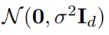
  - Projection vectors are drawn form above distribution.

### Random Feature Attention (RFF)

- Suppose querry length of m and we have n key vectors, the complexity for one attention matrix is O(mn).
- Consider the following fact:
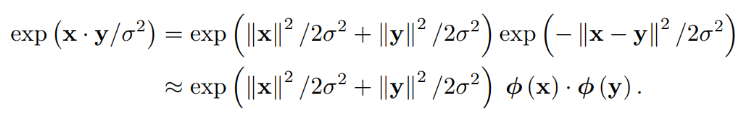
- Use RFF to approximate the exp term, we can replace it with a inner product after apply nonlinear basis.
- Approximate Attention:
  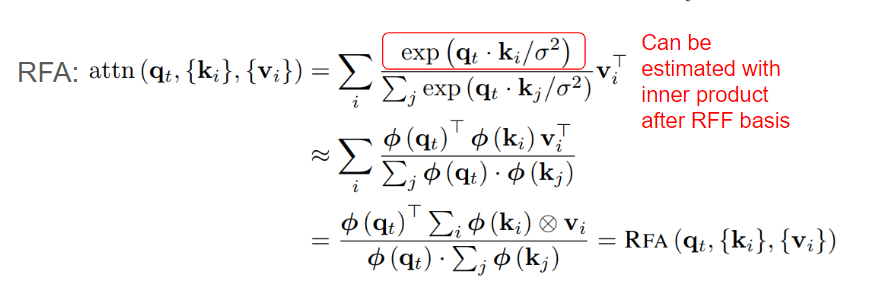
- In this case, the attention computation can be reduced to linear complexity with respect to sequence leangth.
  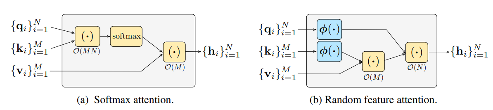

### RFF Gated Varient
- For transformer that requires auto-regressive decoding, the attention computation can also be kernelized and approximated with RFF.
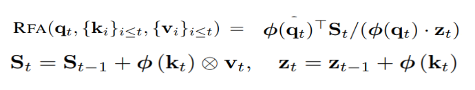.
- Allow much faster decoding througput.
- Attention has no recency bias.
- For certain task the notion of distance and locality is important.
- Gating mechanism in RFA can be easily implemented.
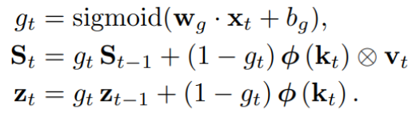

  

### Experiment
- Main evaluation questions:
  - Does approximation degrades performance.
  - Efficiency and scalability in various tasks and to long sequences.
- Baselines and datasets
  - Language Modeling: WikiText-103 
    - Baselines: Softmax transformer
  - Machine Translation: WMT14 EN-DE and EN-FR, IWSLT14 DE-EN 
    - Baselines: Transformer
  - Long text classification: ListOps, IMDB review, AAN dataset 
    - Baselines:  Long Range Arena benchmark

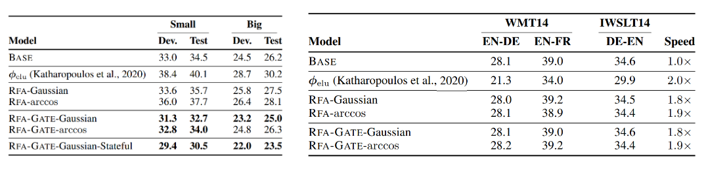
- Result for language modeling and Machine Translation
  - Comparable / better performance to baseline transformer
  - 2x speed up for autoregressive decoding

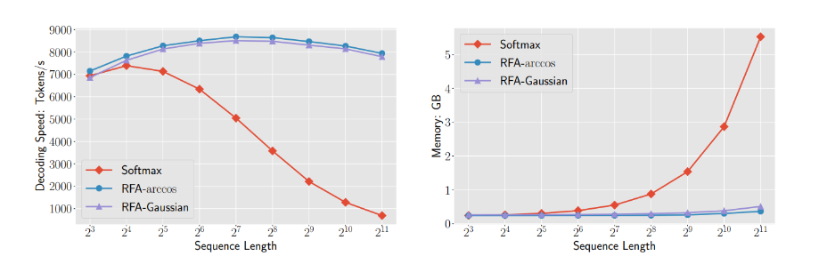
- Efficiency scales very well when dealing with long sequences

### Pro / Con
- Pro:
  - Interesting application of kernels 
    - SVM: kernel replace “lifting”
  - RFF, RFA: “lifting” replace kernel 
    - Generalized method work on any transformer architecture

- Con:
  - Biggest advantage: accelerate autoregressive decoding (2x speed)
    - Little acceleration for attention if given enough parallelization. I.e. ViT 
  - Norm-1 assumption: norming word embedding ? 
    - Gated RFA: Argument about gating mechanism is confusing to me.

