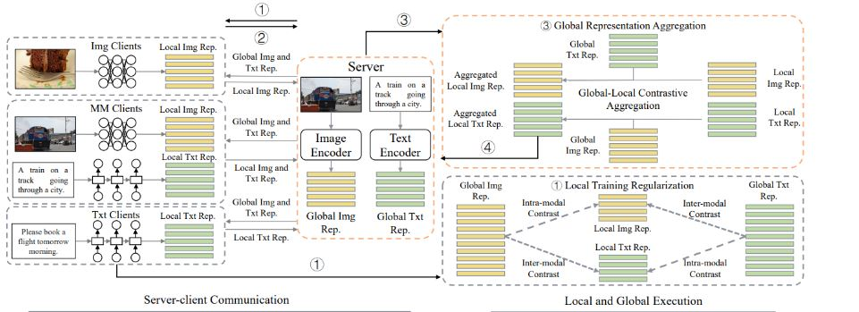
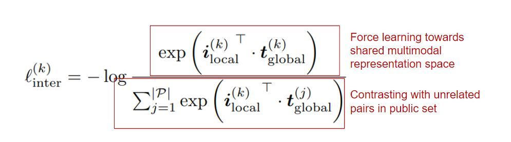
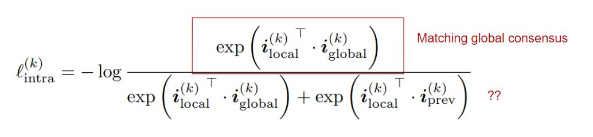
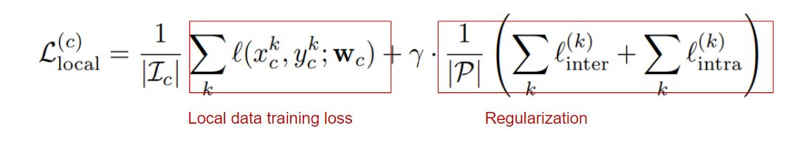
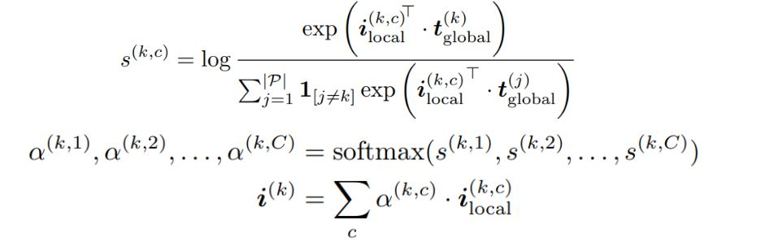
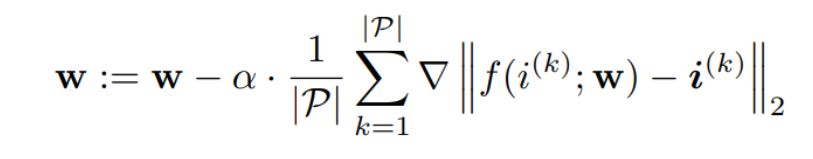
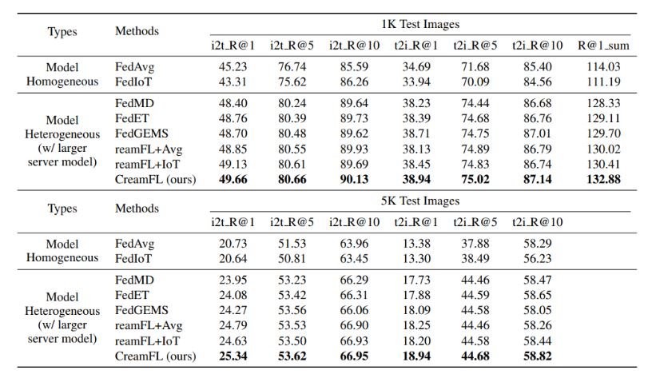
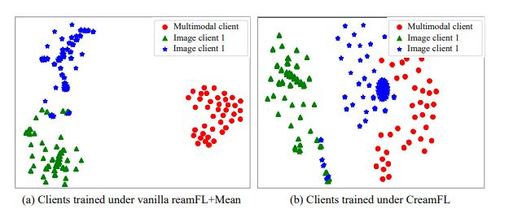

## [Multimodal Federated Learning via Contrastive Representation Ensemble](https://openreview.net/forum?id=Hnk1WRMAYqg)

*  Tsinghua Univerdity, Carnegie Mellon University, Shanghai Artificial Intelligence Laboratory

* ICLR 2023

* Code Not Provided

### Motivation
- Federated Learning over data of different modality is understudied
  - Most of works in FL assumes homogeneous modality (i.e. single modality across all clients)
  - Triditional FL failed to use rich representation form multimodal data
- Challenge stem from system heterogenerity
  - Data heterogenerity - client can have data of different modality
  - Task heterogenerity - cLient may be trained on different tasks based on on-board available modality
  - Model heterogenerity - Different edge devices have different computing capability, thus may employ diffrent model.

### Previous works
- Most past work on FL focus on uni-modal FLwhich falied to leverage multimodal representation
- Past Knowledge distillation based method in FL only apply for centralized model without consider personalization.
- FedGKT: No client selection, hard to reach global consesus on model.
- Often assume homogeneous tasks across clients and exchange model weights directly.

### Method
- Proposed method have little assumptions of FL setting.
  - No constrain on task, modality, model architecture.
  - Assuming both server and client has access to an public mul dataset.
- Core idea: Contrastive representation ensemble to avoid interference from task gap and modality gap.
- No model weights are exchanged, only representation on public data.

- Global representation guided loacl training
- Overvew
  - Server send multimodal representation to local clients to guide local updates.
  - Local inter-modal contrast

    - Modality Gap: uni-modal clients are unaware of existence of other modalities.
    - Train / Aggregate directly led to model drift.
    - Lead to unimodal/multimodal client produce different representation for the same modality.
    - Goal: Complementing missing-modality information.
    - How: global representation guild local training.
  - Local intra-modal contrast

    - Task gap: Model trained with different task (image classification/ image-text retrieval) have different optimization target.
    - Lead to client with different task produce different representation for the same modality.
    - Goal: Regularize local representations towards their global consensus, even when task is different.
    - How: Global representation as anchor point in learning representation.
  - Guided local training using global information
    - Avoid local updates that may interfere with learned global information.

    - By matching global representation
      - Introduce suitable similarity between local models
      - Clients w/ heterogeneous modality will not interfere
      - Clients w/ heterogeneous task will not interfere
      - Learning conforming composite loss = Learning multimodal knowledge that can apply together.
  - Contrastive aggregation
    - Aggregate locally generated representation on public data

    - Aggregating representation for knowledge distillation
    - Intuition: Local rep close to its pair in server rep and far from other pairs better captures the semantic information and cross-modal interaction of data.
    - Weighted sum of client rep of public data.
  - Global model update 

    - By knowledge distillation
    - Match aggregated representation.
    - Learn a representation where different class of data are better separated.

### Evaluation
- Three types of clients (taxt, image, text-image)
- Dataset
  - Multimodal - MS-COCO (Text-image pair)
  - Nuimodal - Flicker30K(text) CIfar(Image)
  - Public: 50000 sample form MS-COCO
- Baseline
  - FedAvg FedIoT FedMD FedET FedGEMS

- Result

  - Achieve effective multimodal learning over heterogeneous clients.
  - Effective multimodal ensemble via local contrastive learning.

  - Proposed model shows less model drift.

### Pro / Con
- Pro:
  - Very very interesting idea with little assumption.
  - Achieve FL knowledge transfer by server knowledge distillation with representation.

- Con:
  - Effects of quality/quantity of public dataset
    - Depend on size, might be more comm cost
  - Scalability
    - What if system have more modalities, would composite loss function increase O(n!)
    - An extension: more sophisticated way of contrasting contrasting pairs is needed.
  - Argument for task gap isn’t entirely convincing for me.
  - Need to re-read result section for more details.

