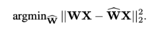
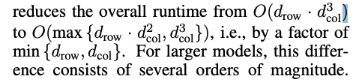

## [GPTQ: Accurate Post-Training Quantization for Generative Pre-trained Transformers](https://arxiv.org/pdf/2210.17323)

* Authors and Affiliation
Author: Elias Frantar, Saleh Ashboos, Torsten Hoefler, Dan Alistrah
Affliation: IST Austria and ETH Zurich 

* Conference and year
ICLR 2023
* Link to the code (if any)
https://github.com/IST-DASLab/gptq 
### Motivation and Problem Formulation

* What is the high-level problem?
    - For complex model tasks, the major obstacle is the computational and storage cost
    - Even the simpler tasks of inference a pre-trained model is highly challenging as the FP16 storage exceeds the highest end single GPU, and therefore needs to performed with more complex and expensive setups, such as multi-gpu deployments

* Why is it important?
    - It is important because without compression or quantization, it is very resource intensive to run

* What are the challenges?
    - Pre-training methods:
        - Model retraining is required: expensive
    - Post-training methods:
        - Compress the model in one shot: hard to scale to billions of parameters as the methods gets highly accurate

* What is missing from previous works?
    - Post training quantization such as AdaRound, BitSplit, BRECQ and OBQ all have good results with models up to 100 million parameters in a few GPU hours, scaling them to networks orders of magnitude larger is challenging
    - Large-model quantization
        - RTN: round to the nearing number method, Can get to 8 bits minimum. Fail to preserve accuracy at a high rate
        - Activation outliers also breaks quantization in a few dimensions in LLM.int8(), they propose to use solve this issue by just keeping it on a high precision 

* What are the key assumptions?
    - Layer-Wise Quantization
        
    - Optimal Brain Quantization, Greedy
        

### Method

* What are the major contributions?
    - New post training method: GPTQ
    - Efficient to execute on models with hundreds of billions of parameters in at most a few hours
    - Precise enough to compress such models to 3 or 4 bit per parameter without significant loss of accuracy
    - Provide robust result in the extreme quantization regime, (2 bits per component), and even in ternary values

* What they propose to solve the problem?
    - Step 1: Arbitrary Order Insight
The original OBQ method quantizes rows of W independently, in a specific order defined by the corresponding errors. 
    - Step 2: Lazy Batch-Updates
Problem to solve: Memory access dominates computation -> batch updates 
    - Step 3: Cholesky Reformulation (Kernel) + dampening 
    Problem to solve: When the matrix H^−1_F becomes indefinite, which we notice can cause the algorithm to aggressively update the remaining weights in incorrect directions, resulting in an arbitrarily-bad quantization of the corresponding layer.

* Algorithm, architecture, solution & Why this works?
    - Step 1 reason: Most likely, this is because the slightly lower number of quantized weights with large individual error is balanced out by those weights being quantized towards the end of the process, when only few other unquantized weights that can be adjusted for compensation remain
    - By contrast, they quantize the weights of all rows in the same order, and showed empirically that this typically yields results with a final squared error that is similar to the original solutions
    

    - Step 2 reason: batch updates work because the i th column is only affected by updates performed on this very column, and so updates to later columns are irrelevant at this point in the process
    - Only once a block has been fully processed, we perform global updates of the entire H^−1 and W matrices using the multi-weight versions of Equations (2) and (3) given below, with Q denoting a set of indices, and H−1 −Q denoting the inverse matrix with the corresponding rows and columns removed: 

    
    - step 3: Cholesky kernels reason: 
Precompute all of these rows using a more numerically-stable method without any significant increase in memory consumption.
For small models: dampening 
Choosing 1% of avg of weights on the diagonal
For large models: Cholesky  + dampening 

  

### Evaluations

* Where did they implement their method? On what platform?
* How they evaluate their method?
    - Setup: NVIDIA A100 GPU with 80 GB of memory;
        - Calibration data contains 128 random 2048 tokens segments from the C4 dataset, i.e., excerpts from randomly crawled websites, generic text, no task-specific data so it’s zero shot
        - Load 1 transformer block, consisting of 6 layers, at a time into GPU memory and then accumulate the layer-Hessians and perform quantization
    - Datasets: small models such as the entire BLOOM and OPT families; larger models such as Bloom-176B and OPT-175B
    - Baselines: RTN (round to the nearest quantized value). Its runtime also scales well as to networks with many billions of parameters, as it simply performs direct rounding 
    - Metrics: perplexity and runtime 

* What are the key results?

### Pros and Cons (Your thoughts)

* Pros: why you think this is a good paper?
    - Clear concise structure in paper
    - Cool revolutionary post training work

* Cons: unrealistic assumptions, missing elements, missing experiments, etc.
    - Focuses on generative tasks, and does not consider activation quantization, mixed precision is hard on a hardware level
    - Hard to make sense of the math 

