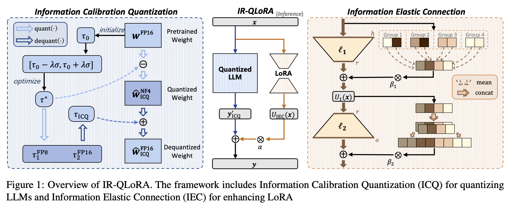
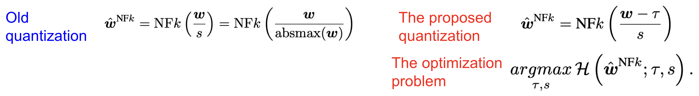
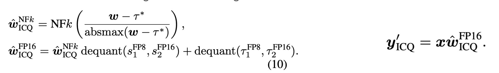
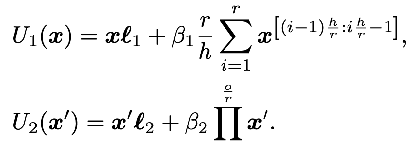
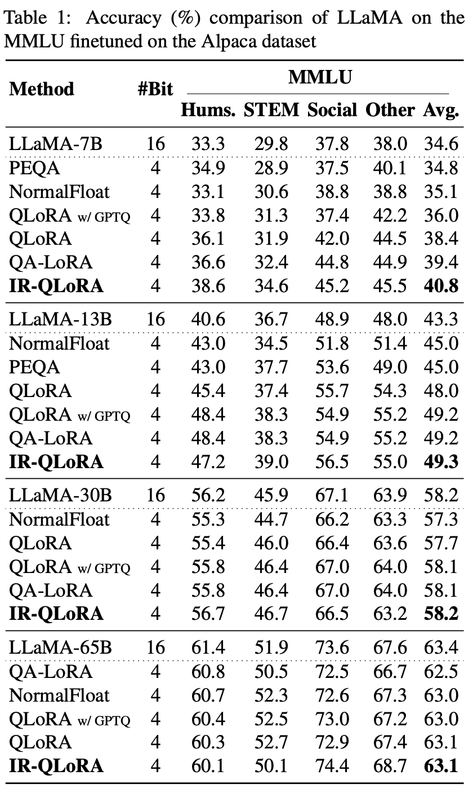

## [Accurate LoRA-Finetuning Quantization of LLMs via Information Retention](https://arxiv.org/abs/2402.05445) [ICML 2024]

* Haotong Qin, Xudong Ma, Xingyu Zheng, Xiaoyang Li, Yang Zhang, Shouda Liu, Jie Luo, Xianglong Liu, Michele Magno

* ICML 2024

* https://github.com/htqin/ir-qlora

### Motivation and Problem Formulation

* What is the high-level problem?
  * LoRA-finetuning Quantization
  * Two phases: 1) quantization, 2) LoRA finetuning

* Why is it important?
  * Resource- and time-saving compared to finetuning the whole LLM and quantizing it

* What is missing from previous works?
  * Existing works has significant accuracy loss because LLM quantization is significant and cannot be recovered by LoRA
    * E.g., QLoRA [2023], QA-LoRA [2023]

  * Especially with ultra-low bit-width (<=3bit) or large model scales (>= 30B)

### Method

* What are the major contributions?

  * IR-QLoRA: two specific contributions on the quantization and LoRA part

  * **Key intuition:** how to retain information loss

    

* Contribution 1: Information Calibration Quantization

  * **Motivation:** information loss after quantizing the weight is usually neglected

  * **Problem formulation:**They formulate the problem as maximizing the entropy

  * They introduce a new parameter \tau, and optimize \tau for the maximum entropy

    

  * They use grid search (try a fixed set of values) and find the optimal \tau

  * Quantize the weights in LLM using the new form with \tau

    

* Contribution 2: Information Elastic Connection

  * Limitation of LoRA finetuning

    * Information representation limitation: l_2 can only access the representation after l_1, not the raw representation

  * Proposed IEC

    * Construct a parameter-free connection for LoRA, facilitate information utilization derived from quantized LLM 

    

### Evaluations

* Experimental setup

  * Base models: LLaMA 2 families (7B, 13B, 30B and 65B), focusing on 2,3,4 bits quantization
  * Dataset
    * Massively Multitask Language Understanding (MMLU)
    * CommonQA, PIQA

  * Baselines
    * Q-LoRA, Q-LoRA with GPTQ, QA-LoRA, PEQA

  * Metric
    * Accuracy
    * Efficiency: # of params, finetuning time

* Main results

  * “IR-QLoRA outperforms existing methods with convincing margins on LLaMA and LLaMA2 series models under different bit-widths, especially at ultra-low bit-widths (2-3 bit).”

  * “For example, the average accuracy of 2-bit IR-QLoRA in the LLaMA family is 0.5% higher than SOTA LoRA-finetuning quantization methods.”

    

* Efficiency results

  * IR-QLoRA requires only a tiny 0.31% additional time consumption for LLaMA-13B. 

### Pros and Cons (Your thoughts)

* Pros: why you think this paper could get in?
  * Important problem: LoRA-finetuning quantization
  * Comprehensive ablation studies, especially on more datasets and more bitwidths
* Cons: 
  * The LoRA-finetuning quantization is different from QLoRA
    * Q-LoRA: quantized gradients during LoRA
    * Why not finetuning the quantized LLM in this case?
  * Few number of baselines and model families