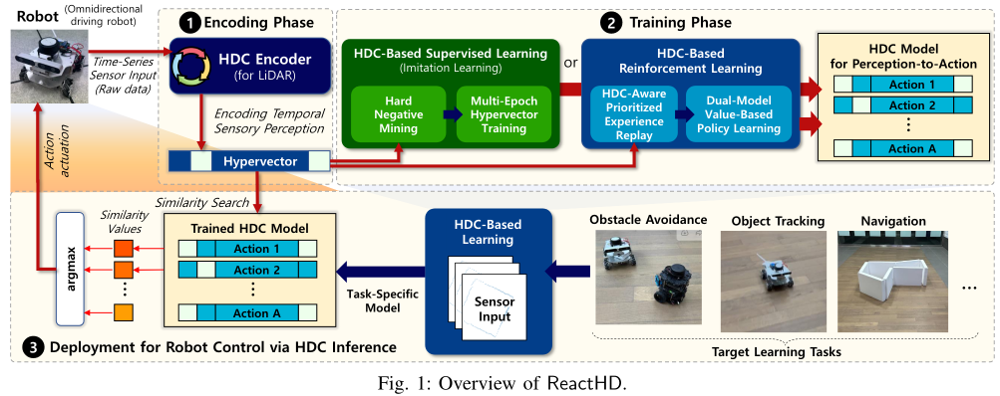

## [Brain-Inspired Hyperdimensional Computing in the Wild: Lightweight Symbolic Learning for Sensorimotor Controls of Wheeled Robots](https://ieeexplore.ieee.org/document/10610176) [ICRA’24]

* Hyukjun Kwon, Kangwon Kim, Junyoung Lee, Hyunsei Lee, Jiseung Kim, Jinhyung Kim, Taehyung Kim, Yongnyeon Kim, Yang Ni, Mohsen Imani, Ilhong Suh, Yeseong Kim

* ICRA 2024

* Code is not provided

### Motivation and Problem Formulation

* What is the high-level problem?
  * Sensorimotor controls of wheeled robots
    * Potential tasks: obstacle avoidance, object tracking, navigation

  * Why is it important?
    * Fundamentals of robotics control

  * What are the challenges?
    * In-the-wild vs. controlled environments
    * Accuracy gap in HDC-based methods
    * RL vs. supervised learning

  * What is missing from previous works?
    * Existing HDC-based RL solutions are limited to simulated environments

  * What are the key assumptions?
    * Input: LiDAR sensors

### Method

* What are the major contributions?

  * ReactHD: an advanced HDC-based learning framework for robotic tasks

    * Circular HDC encoding

    * HDC-IL: imitation learning, or

    * HDC-RL: reinforcement learning

  * First work that deploys an HDC-based solution in the wild on RPi 4

    

* Problem formulation

  * Input: 720 features from LiDAR sensor
  * Output: 8 control actions and 1 stop action
  * **Intuition:** to train the action HVs, so that the most “appropriate” action HVs are the most similar to the sensor HV

* Circular HDC encoding

  * Similar to the ID-level/spatiotemporal encoding

  * Adjacent base HVs are more similar

  * Permutation for integrating time 

    

    

* HDC-based Imitation Learning

  

  * Integrate re-training

    * Existing HDC-based robot control methods only used single-pass training

  * Hard-negative mining

    * **Motivation:** imbalance training data, most of the time the action is “stop”

    * **Solution:** Add weights to training samples, indicating the “difficulty” to classify correctly

      

* HDC-based Reinforcement Learning

  

  * Based on Q-Learning, a model-free, off-policy, value-based RL algorithm

  * **Goal:** train the action HVs so that, the predicted Q-value is obtained through dot-product similarity between action HVs and state HVs

    

    

  * Difference from existing HDC-based RL [1]

    * Importance-aware sampling for updating the experience replay bufferIncrease sampling efficiency in real-world RL

### Evaluations

* Experimental setup

  * Real world and simulated environments
    * **Real world:** a Wheeltec Mecanum Omnidirectional driving robot with RPi 4
      * RPLidar A1 Lidar sensor, 720 features
      * Time window = 7 consecutive measures

    * **In-house simulation:** obstacle-rich environments with synthetic data
      * Did not give further details

  * Evaluated tasks
    * **Obstacle avoidance:** maintain 50cm from a moving obstacle
    * **Object tracking:** track the closest person
    * **Navigation:** making a circle around the obstacle, or navigate from a start point to an end point
  * Baselines
    * **Base HDC:** traditional ID-level encoding + single-pass training
    * **DNN:** three fully-connected layers each with 512 neurals

  * Metrics
    * Accuracy, negative-aware accuracy
    * Speedup, energy efficiency

* Major results

  * “Comparable accuracy with SOTA DNN while improving the performance (?) and energy consumption efficiency by 14.2x and 15.3x”

    * Note: this is training improvements

    

  * A simple ablation study

    * Impact of circular encoding
    * Impact of negative-aware sampling

### Pros and Cons (Your thoughts)

* Pros: why you think this is a good paper?
  * In-the-wild deployments
* Cons: 
  * Missing some of the latest RL works, such as [2,3]
  * A lot of designs are not new
  * Inappropriate wording in some places
  * Is accuracy an appropriate metric for evaluating object avoidance/tracking/navigation?

[1] Ni, Yang, et al. "Efficient off-policy reinforcement learning via brain-inspired computing." *Proceedings of the Great Lakes Symposium on VLSI 2023*

[2] Chen, Hanning, et al. "Darl: Distributed reconfigurable accelerator for hyperdimensional reinforcement learning." *Proceedings of the 41st IEEE/ACM International Conference on Computer-Aided Design*. 2022.

[3] Ni, Yang, et al. "Efficient Exploration in Edge-Friendly Hyperdimensional Reinforcement Learning." *Proceedings of the Great Lakes Symposium on VLSI 2024*. 2024.