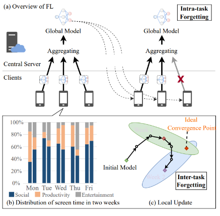
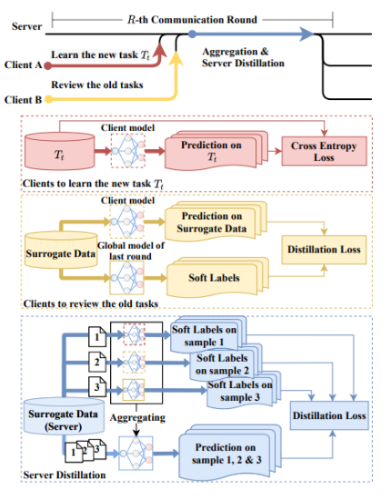
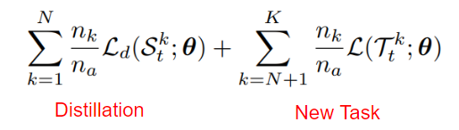
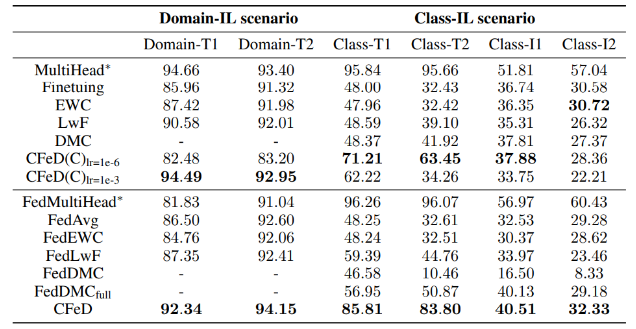

## [Continual Federated Learning Based on Knowledge Distillation](https://www.ijcai.org/proceedings/2022/0303.pdf)

* Zhejiang University

* IJCAI 2022

* [Code](https://github.com/lianziqt/CFeD)

### Motivation and Problem Formulation
* **Motivation**: Continual Learning is a useful learning seeting for many applications, CL itself has been studied extensively but CL in Federated Learning setting, which is non-tival problem, have not.This paper attempt to solve a FCL problem with knowledge distillation techniques.

* **Related works**
  * Federated Llearning: Distributed learning paradigm where the goal is to learn a comperhensive global model without sharing client data direaly. Main challenges are data heterogenity and various cost related to federated training and communication.
  * Continual Learning: Learning from stream of data where task boundary and data distribution is non-stationary.

* Challenges
  * Doing Cl in Federated setting.
  * Comprehensive model for all tasks seen so far.

### Method
* **Forgetting in FCL** \
  
  * Main challenge of CL is forgetting.
    * As new tasks is learned, knowledge regarding past tasks are overwritten thus forgetten.
  * Different form conventional CL problem. In FCL, forgetting can happens in two ways:
    * Inter-task Forgetting: CL prohibites revisite past data, so a new tasks coming, DNN parameters for old tasks are overwritten.
    * Intra-task Forgetting: Durinf the training of same tasks, if different subset of clients are picked in different round, knowledge on the non-overlapping part of the clients is subject to forgetting.
  * The main aim is to achieve FCL by avoid aforementioned types of forgettings.

* **Proposed solution**  \
  
  * Main idea: knowledage distillation: distill knowledge from previous generation of models to current generation of models.
  * Assumptions and preliminaries:
    * Each client include serrver has access to a surrogate dataset for knowledge distill.
    * Such surrogate dataset can even be unrelated to the tasks model try to learn.
    * If surrogate dataset is complex enough, it can transfer the model behavior through knowledge distillation.
  * Distillation Loss:
    * The goal of distillation is to transfer model behavior across different model generations so that past knowledge is perservedd.
  * Inter-task issue:
    * Clients selected at each round are divided into reviewers and learners.
      * Learner: Init new model and only learns current task.
      * Reviewer: Distill knowledge of all pervious tasks to current model architecture.
    * At aggregation time, both knowledge of new tasks and previous tasks are perserved.
  * Intra-task issue:
    * Another level of distillation on server for global model.
  * Objective \
  
    * Total loss are composed with distillation loss and new task loss.
    * The goal is to learn a parameter set minimizes both the distillation loss (Perserve past task knowledge), and new task loss(Learn new tasks).

### Evaluations

* **Evaluation Setup and Results** \
  
  * THUCNews, SogouCS, Sina2019, NLPIR Weibo Corpus, Cifar10/100, Caltech256
  * Domin Incremental(Unclear, need to check code), Class incremental stream
  * Achieved good results

### Pros and Cons

* Pros:
  * Distill model behavior using unrelated surrogate dataset is an interesting idea.

* Cons:
  * Client selection is random.
  * Validity of using unrelated surrogate dataset.
  * Very basic baseline.

