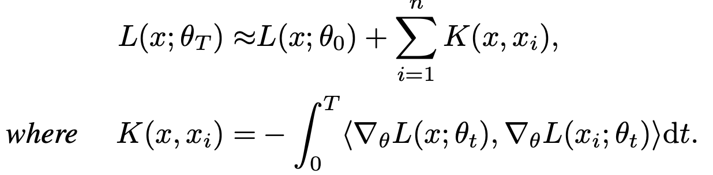
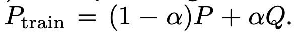
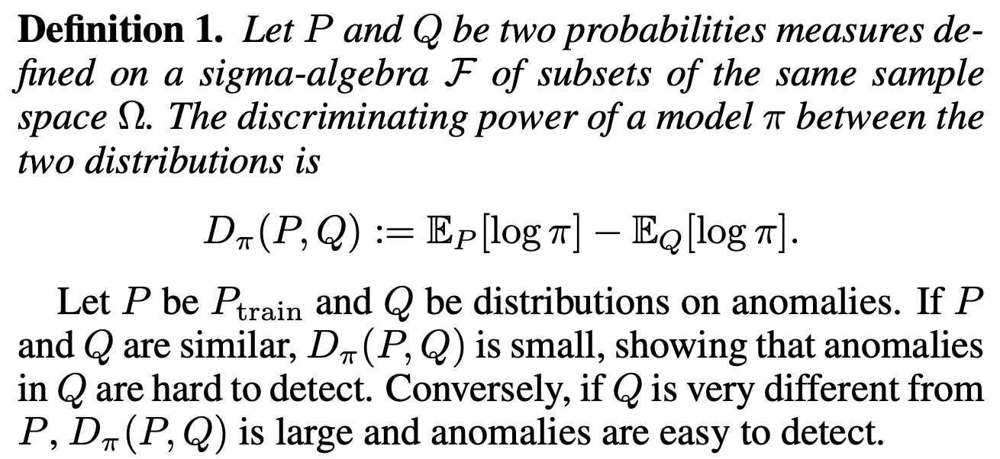
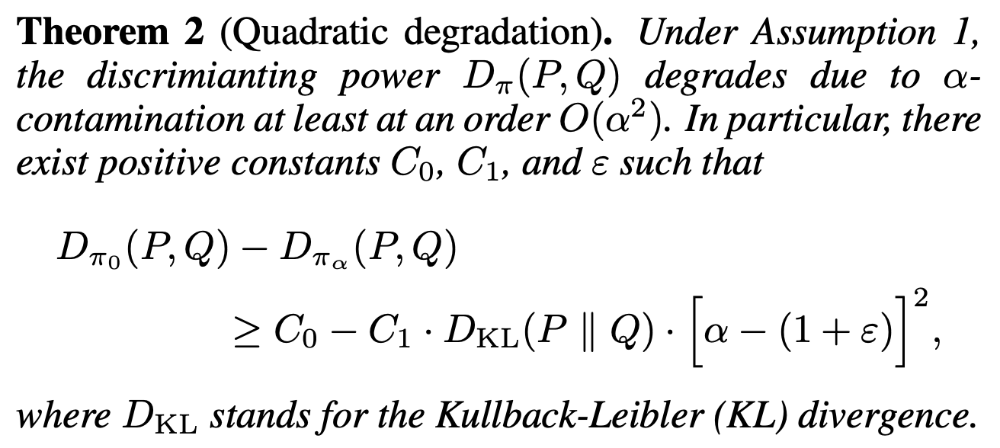
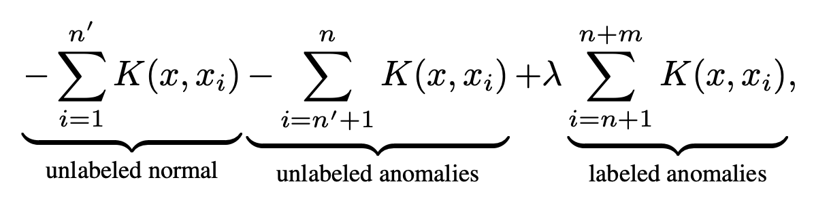
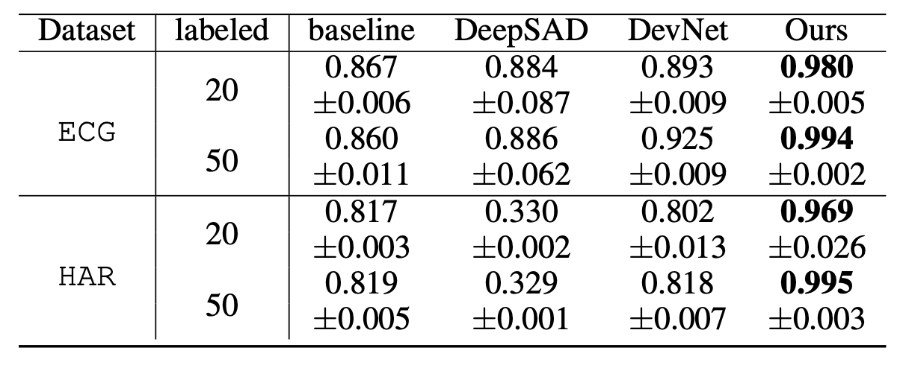

## [Understanding the Mitigating Data Contamination in Deep Anomaly Detection: A Kernel-based Approach](https://www.ijcai.org/proceedings/2022/322)

* Shuang Wu, Jingyu Zhao, Guangjian Tian, Huawei Noah's Ark Lab, The University of Hong Kong

* IJCAI 2022

* Code not provided

### Motivation and Problem Formulation

* What is the high-level problem?
  * Data contamination causes performance degradation in anomaly detection

* Previous works
  * Classic methods: one-class SVM, local outlier factor, ensemble method
  * Deep learning-based methods: AE, SVDD, GAN
  * Missing in previous works:
    * Under data contamination, constructing a large-scale training dataset is costly. In this paper, instead of constructing a large clean dataset, they propose to use additional labeled contaminated data to improve detection

### Method

* Theoretically, they develop a kernel-based framework to demonstrate the effects of training data in deep anomaly detection
  * A kernel perspective for anomaly detection: A deep detector detects anomaly by using K() to compare the input with the whole training dataset
    
  * They derive an information-theoretic bound of performance degradation w.r.t. contamination ratio
    * Definition of data contamination:
      * P is the distribution of "good data" and Q is the distribution of "contaminated data"
      * This is also the major limitation of the paper (see the cons)
        

    * The detection performance is defined as the discriminating power of a model \pi between the two distributions
      
    * Theorem: **The detection performance monotonically decreases at a quadratic rate w.r.t. The contamination ratio \alpha**
      

* Instead of manually cleaning the contaminated memory, they inject additional kernel components to increase L on anomalous inputs
  
  * **Assumption**: additional labeled anomalies
  * But actually this also brings the key novelty of the paper: A ton of works have studied unsupervised anomaly detection. But this paper approaches from the different angle - how to maximize the usage of a few labeied anomalies (which does not take a lot of effort to label)

### Evaluations

* Datasets: 
  * Synthetic data, ECG, HAR, MNIST, FashionMNIST
    * Use a subset of classes as “normal” data and the rest as “anomaly” - This is a major drawback of the paper (see Cons)

* Baselines: All semi-supervised anomaly detection approaches under data contamination
  * Ramp loss baseline, DevNet (2019), Deep SAD (2020)
  * Difference from baselines: they are not specifically designed to produce large losses for labeled anomalies (not a big difference…)
* Metrics: area under the precision-recall curve (AUPRC)
  * Other metrics like precision rate, recall rate, F1 score and receiver operating characteristic (ROC) are not used because they are less informative than AUPRC for anomaly detection
* Results: 
  * Best AUPRC on all datasets
    
  * Sensitivity analysis on # of labeled anomalies and 
    hyperparameter \lambda

### Pros and Cons (Your thoughts)

* Pros: nicely written, nice theoretical views
* Cons: 
  * The theory needs to work under a very strong assumption: the injected contaminated training data and the evaluating data must come from the same distribution Q. But in reality, anomaly detection is more like out-of-distribution data detection, where the distribution of anomaly data is hard to contrain
  * This leads to a very weird data setting: they use a subset of classes as "normal" and the rest as "anomaly". The authors should consider use the anomaly detection datasets which should not be hard to find.