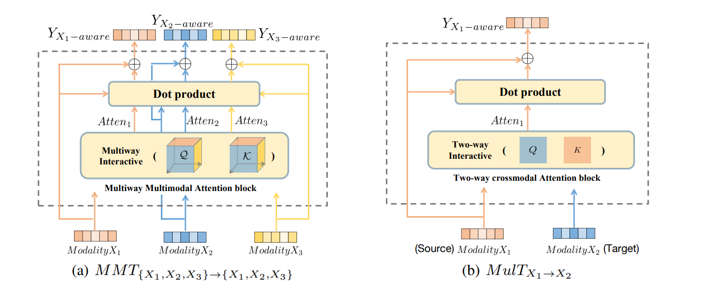
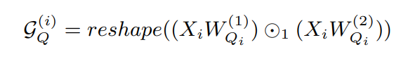

## [MMT: Multi-Way Multi-Modal Transformer for Multimodal Learning](https://www.ijcai.org/proceedings/2022/0480.pdf)

* Hangzhou Dianzi University, RIKEN Center for Advanced Intelligence Project, Netease Fuxi AI Lab

* IJCAI 2022

* Code Not Provided

### Motivation and Problem Formulation
* **Motivation**: The heart of multimodal learning is to exploiting the efficient modal fusion to create knowledge-rich representation by  fusion representations among multiple modalities.
* **Related works**
  * Non-attention based methods: RNNs with different multistage fusion methodhas been used to multimodal sequence data. However thoes methods failed to retrive long-range temporal dependencies.
  * Attention Based Method: Able to solve long-range dependencies issues but current methods s fail to exploit all the potential and comprehensive multimodal interactions, due to the fixed interactive direction and restricted number of involved modalities(2 modality per attention block).
* Challenges
  * Exploiting both intra-modality and inter-modality information.
  * Expandable, able to work on any number of modality.

### Method
* **Main Idea**

  * Above figure shows a comparison of proposed attention method(Right) and past attention mathod(MulT).
  * MulT is only able to create attention aware representation between two modality per block. As number of modality M increases, it would require M^2 attention block to fully capture all possible interactive paths.
  * MMT uses tensor representation with set of well defined temnsor operation can handle multiple modality at once to perduce representation with all possible interactive paths in a signle block.

* **Proposed solution**

  * Like typical transformer network, the process starts with encoding multiple modality sequence data. In the case of MMT the following formula is used: \
  
  * Then tensor ring decompsition is used to reduce how rank Q and K into low rank matrices to greatly reduce the computation cost.
  * Hadamard product is performed between querry and key to analyze similarity between Q and K.
    * At this stage, since Q and T are from same modality, their Hadamard product QK can be seen as self-attention matrix.
  * Self-attention is then averaged through temporal dimension.
  * Use different QK tensor multiply by weight averaged Self-attention metrix from other modalites to generate corss-attention matrix.
  * Lastly linearize the modality aware attention tensors as output. \
  
    * i-th modality aware output are combined from self attention and attention from other modalities with respect i.
  * Overall, all possible modality interactive paths can be captured, resulting rich representations for each modality by simultaneously paying attention to all the potential multiway interaction.

* **Hierarchical Design**

  * Subsequently, a hierarchical architecture can be implemented where lower level MMT blocks can be used to capture low order modality correlation and higher level MMT to capture high order correlation.

### Evaluations

* **Evaluation Setup**
  * CMU-MOSI and POM are used in evaluation.

* **Evaluation Result**
    \
  
  * Proposed method sets the new state-of-the-art on both datasets.

* **Evaluation on number of layers**
  
  * More layer does not necessarily tranlate to better performance.

### Pros and Cons

* Pros:
  * Work on any number of modality.
  * Single attention block design (MulT requires 4 block for 2-way modality)
  * Could work in FL setting.

* Cons:
  * How is this transformer.

