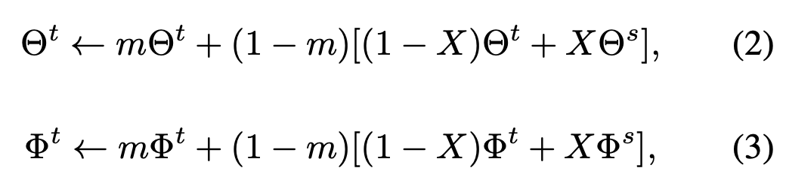
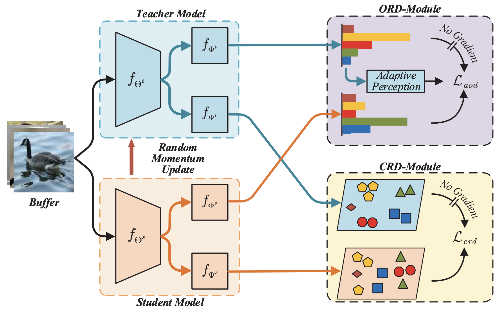

## [Learning from Students: Online Contrastive Distillation Network for General Continual Learning](https://www.ijcai.org/proceedings/2022/0446.pdf)

* Jin Li, Zhong Ji, Gang Wang, Qiang Wang, Feng Gao. Tianjin University, CETC Key Laboratory of Aerospace Information Applications

* IJCAI 2022

* https://github.com/lijincm/OCD-Net.

### Motivation and Problem Formulation

* What is the high-level problem?
  * **General Continual Learning (GCL):** supervised continual learning on non-stationary data without task boundaries and the memory size is bounded
  * Previous works
    * Sample strategy-based: select vital samples for experience replay
    * Knowledge transfer-based: use knowledge distillation to transfer the learned knowledge (teacher & student model) 
    * Missing in previous works:
      * Response bias towards current-step classes (as a result of imbalance streams)
      * Preserve the learned knowledge robustly within limited memory size (actually not addressed)

### Method

* What is the technical problem? What are the input and output of the problem?
  * Non-stationary data streams without task boundaries. But it seems within one task, the order of data samples is iid?

* They propose Online Contrastive Distillation Network (OCD-Net) with two modules:
  * Online Response Distillation Module (ORD-Module) -> similar to [BYOL](https://arxiv.org/abs/2006.07733)
  * Let the student model learn from the teacher model, which is momentumly updated as follows. It is interesting to use a Bernoulli distributed X, which avoids adjusting the particularly sensitive momentum coefficient m
  * To help the teacher model better accumulate new knowledge, the value of momentum coefficient m is designed to increase gradually in the early stage

* Contrastive Relation Distillation Module (CRD-Module) -> similar to [CO2L](https://arxiv.org/abs/2106.14413)
  * Include the constrast between student's and teacher's representations, and the contrast between two views of the student model
  * The form of the contrastive loss is the typical temperature-based form
* Adaptive perception to fix attention on distilling the high-quality response
* Use reservoir sampling to update the memory

### 

### Evaluations

* Datasets: MNIST, CIFAR-10, CIFAR-100
  * Task-based classification
  * Distinct & smooth task transition

* Baselines: ER, GSS, A-GEM, DER, DER++, CER, GeoDL, CO2L
* Metrics: accuracy
* Results: OCD-Net outperforms the second-best approaches by 4.65%, 6.30% and 8.30%

### Pros and Cons (Your thoughts)

* Pros: nicely written
* Cons: Limited novelty: all key components are not new in the field