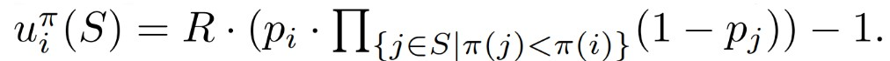
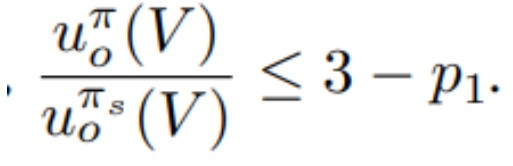

## [Picking the Right Winner: Why Tie-Breaking in Crowdsourcing Contests Matters](https://www.ijcai.org/proceedings/2022/0044.pdf)

* Coral Haggiag , Sigal Oren and Ella Segev at Ben-Gurion University of the Negev

* IJCAI 2022

* Code not Provided

### Motivation and Problem Formulation

* The tie-breaking rule may induce a different equilibria
* Affect the players’ behaviour, reward, utility of the organizer
* Previous Work
  * Optimal design of crowdsourcing contests
    * Model for submissions quality as a function of the effort invested
  * Implementing optimal outcomes in social computing: a game-theoretic approach
    * Deterministic approach, type of player p_i = quality of its submission
  * Designing contests between heterogeneous contestants: An experimental study of tie-breaks and bid-caps in all-pay auctions / On optimal favoritism in all-pay contests
    * Tie-breaking in favor of weak players increases their effort
  * Assumptions
    * Deterministic
    * Utility of player: 
    
    * Nash equilibrium in the players

### Method

List of things the authors have proved:
* First proposition

* Formula that shows the propostion that "Breaking ties in favor of strong players guarantees ⅓ utility over any other rule":
* 
* Formula for minimum reward given probaboility of success of last player

### Results

* Mathematical proof for each observation
* Breaking ties in favor of strong players guarantees ⅓ utility over any other rule
* Breaking ties in favor of weak players guarantees minimal reward
* Future: Random tie-breaking rules

### Pros and Cons (Your thoughts)

* Pros: Adding mathematical backup to get real utility
* Cons: randomness, everything is known a priori
