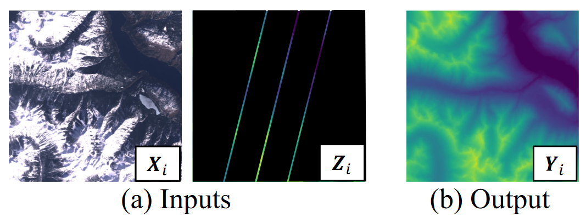
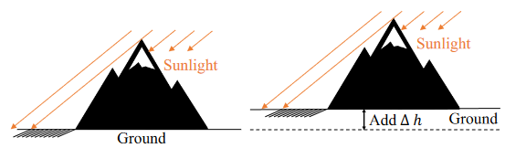
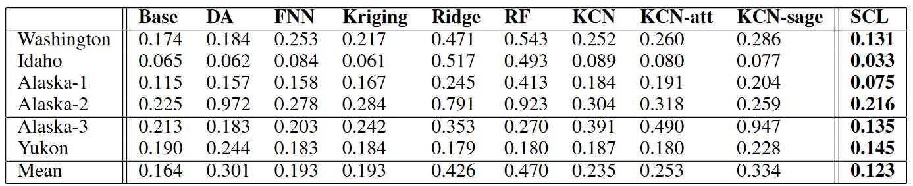
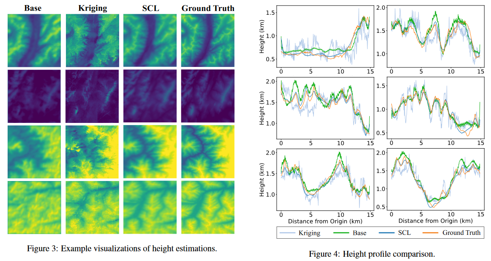

## [Confidence-based Self-Corrective Learning: An Application in Height Estimation Using Satellite LiDAR and Imagery](https://www.ijcai.org/proceedings/2023/0671.pdf)

* Zhili Li (University of Maryland), Yiqun Xie (University of Maryland), Xiaowei Jia (University of Pittsburgh)

* IJCAI 2023

* No code available

### Motivation and Problem Formulation

* **Problem**:
   * ICESat-2 takes height scans but are only available in very narrow scan lines
   * **Objective**: Fill the gaps in height scans as seen in the following pictures

     
     
* **Importance**:
   * Climate shifts brings transformation in environment like in the Artic → Need for study through satellite remote sensing
* **Challenges**:
   * Few scan available per image @ timestamp + height observations are only few lines → difficult for traditional interpolation methods due to spatial constraints
   * Pixels in satellite image present characteristics irrelevant to height variations like colors of the soil, shadows, vegetation, etc.
   * Images only reflect height variations, base height is still uncertain
* **Major Contributions**: Four main parts of their solution.
   * Confidence-based pseudo interpolation framework using the higher-confidence predictions in adjacent areas
   * Dynamic refinement allowing adaptive self-correction
   * Integrate inverse-confidence-based ridge regression for limited observation
   * Base-height augmentation to reduce overfitting and increase usability
* **Previous Works**:
   * Pixel-level prediction with imagery:
      * Stereo matching: 2 stereo images → reconstruct 3D information
         * Stereo images are unavailable in most satellite platforms
         * Non-urban areas don't have high-contrast corresponding points
      * Deep semantic segmentation networks: Single-image-based height prediction good for urban areas
         * Rely on high-resolution aerial images
         * No capacity to integrate additional information
  * Traditional interpolation: Spatial interpolation to estimate unknown values using distance-weighted aggregation
     * Kriging: Traditional interpolation nonparametric model based on gaussian process using known labels
        * Traditional Kriging cannot model complex non-linear relationships
        * Relies on the availability of nearby observations
  * Deep-learning-based interpolation:
     * Krigin + deep neural networks (like Graph Neural Networks) to capture non-linear relationships
        * Computationally expensive
        * Intended for data with smaller # of points (not millions of pixels per image)
* **Assumptions**:
   * Images are clear from other types of noise like clouds
   * Points in image follow a normal distribution, which might not be actually true in some areas 

### Method: Spatial Self-Corrective Learning

* **Spatial Correction with Confidence-Based Pseudo-Interpolation**
   * “ignore-and-interpolate” correction strategy to reduce the impact of irrelevant spectral variations: “ignore” prediction and re-fill their values by doing interpolation of nearby predictions
   * Network $F$ is conformed by:
      * $F_H$ = sub-branches (group of layers in $F$) that predicts preliminary heights ($\hat{Y}_i$) with trainable weigths $\theta_H$
      * $F_C$ = sub-branches that predicts the confidence scores ($\hat{C}_i$) with trainable weigths $\theta_C$
      * Correction layer to update the height values and final output is $\hat{Y}_i^{*}$
   * MLE to update the parameters of $F_H$ and $F_C$
   * Assuming predictions follow normal distribution → $p(\hat{y}_j | x_j) = \frac{1}{\sqrt{2\pi}F_c(x_j, \theta_C)} \cdot \exp(-\frac{(y_j - F_H(x_j, \theta_H))^2}{2 \cdot (1/F_C(x_j, \theta_C))^2})$
      * This means that errors on the pixel with lower confidences will be scaled down which makes sense because it's very unlikely to have big difference in height between adjacent point
   * Pseudo-Interpolation
      * Confidence based interpolation instead of spatial distances
      * All values are known but with different levels of confidence $\hat{C}_i$
      * Uses local neighborhoods around each pixel → new values are weighted 

* **Recurrent Interpolation for Self-Adaptive Refinement**
   * After each pseudo-interpolation, the confidence values are changed for each pixel
   * Refeed $\hat{Y}_i^{*}$ with ${X}_i$ (original satelite image pixel) to $F_H$ and $F_C$
   * Starts with ${Z}_i$ (line height map) then reiterate until convergence

* **Truth-Based Correction with Narrow-Footprint Heights**
   *  Added inverse-confidence-based regression layer $F_R$  to replace last layer of height-prediction $F_H$
   *  Trained parameter from direct least-square to adapt quickly based on confidence and actual height of the known pixels only

* **Height Augmentation**
   * Randomly increase or decrease the ground-truth height
   * To decrease overfitting + encourages to focus on predicting variations, because very similar satellite images might have completely different heights due to the distance to the ground like seen in the image

### Evaluations

* Dataset
   * Height
      * Shuttle Radar Topography Mission (SRTM) → large areas (get 6 lines)
         * Washington and Idaho → mountainous
      * Interferometric Synthetic Aperture Radar (IFSAR) - large areas
         * Arctic (2 locations) → baren and snowy
      * ICESat-2 satellites (use 2 out of 6 for testing)
         * Alaska and Yukon → bare landscape
   * Spectral images (images that are temporally aligned)
      * Landsat-7 → 30m resolution

* Baselines: Pixel-level prediction (Fully Connected Neural Network, Ridge Regression, Random Forest), Deep semantic segmentation (U-Net, U-Net+Domain adaptation), Krigin, Deep-learning-based interpolation (Krigin + Convolutional Network _KCN_ , KCN with graph attention , KCN with Graph Sage)

* Metric: symetric mean absolute error porcentage (sMAPE)

* Implementation:
   * Combined SRTM and IFSAR for training / testing
   * In ICESat-2 used 4 out of 6 lines pero tile for training

* Key results:
   * SCL outperform baseline methods for all scenarios
   * Domain adaptation methods did not improved because different landscapes may have different height variation patterns
   * Pixel-wise prediction affected by spectral variations
   * Krigin performed better because than pixel-wise methods because exploits height values in neighborhood
   * Krigin + CN is limited by spatially constrained distribution.

   

   * Graphical results bellow, where SCN is closer to the actual height scan than other methods

   

### Pros and Cons

* Pros:
   * Really easy to follow through
   * Specific to the application → really well motivated
   * Ablation studies
   * Novelty to better utilize the newer technology

* Cons:
   * Further studies of noisy images
   * Complexity analysis, because reiteration over all the pixels seems costly as well
   * Contributions are just the section of the same model
   * Missing explanation on how to combine predictions when resolution is more granular than 30 m.

