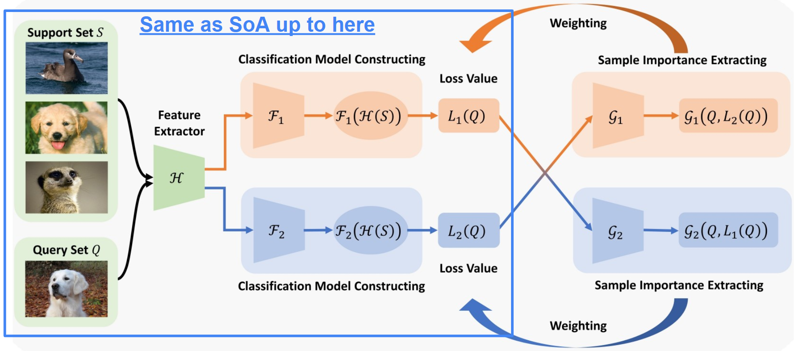
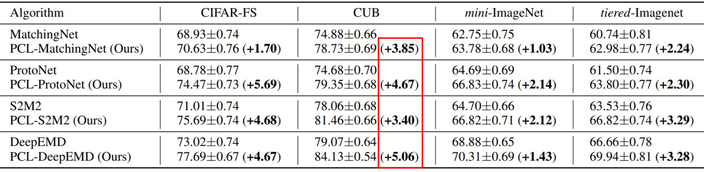
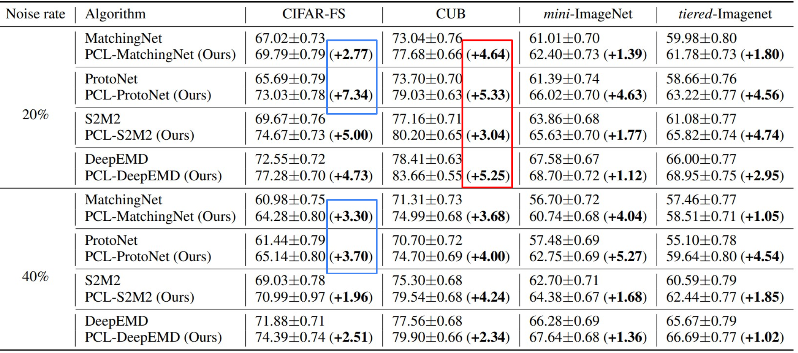

## [Learning to Learn from Corrupted Data for Few-Shot Learning](https://www.ijcai.org/proceedings/2023/0381.pdf)

* Yuexuan An, Xingyu Zhao, Hui Xue1 (CHINA)

* IJCAI'23

* https://github.com/anyuexuan/PCL

### Motivation and Problem Formulation

* Targeting few-shot learning with noise input/labels
* Noisy inputs are a real-case scenario in practial applications
* Learning from (limited) noisy data is even harder 
* Nobody ever investigated noise effects in few-shot learning

### Method

* Rely on previous works for feature extraction and classification
* They add a sample importance module that evaluates the weight of individual input samples
* The key part is the use of the loss from model M1 to drive the input weight estimation for model M2, and vice versa
  
* Why this works is not clear from the paper
* The underlying osservation behind this proposal comes from peer coding, a method where a couple of programmer collaboratively work on the same code simultaneously to produce higher-quality code.

### Evaluations

* Experiments on Tesla GPU and high-performance CPUs
* They evaluate on:
  * CIFAR-FS, CUB, mini-ImageNet, tiered-ImageNet
  * Baselines: MatchingNet, ProtoNet, S2M2, DeepEMD
  * Accuracy
* 1-5% higher accuracy than baselines, but no additional benefits in case of errors (higher accuracy in presence of noise is mainly due to initial error-free accuracy)

### Pros and Cons (Your thoughts)

* Pros: not a good paper
* Cons: Badly written, not clear explanations of their method, not clear why this would work, the higher robustness claims are false