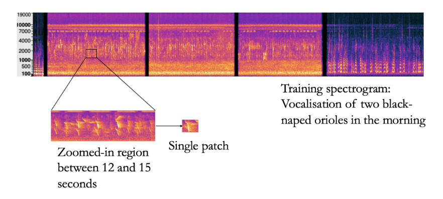

## [Interactive Machine Learning Solutions for Acoustic Monitoring of Animal Wildlife in Biosphere Reserves](https://www.ijcai.org/proceedings/2023/0711.pdf)

* A long author list covering Germany, Brazil, Portugal, South Africa

* IJCAI 2023

* No code

### Motivation & Problem Formulation

* What is the high-level problem? Why is it important?
  * The protection of biodiversity is a primary goal of biosphere reserves
  * Passive Acoustic Monitoring (PAM) uses audio recording devices to capture sounds and vocalisations in the environments, has emerged as a poplar method. 
    * PAM introduces minimal invasion compared to traditional animal tracking sensors

* What are the challenges?
  * The adoption of PAM is slow, because of the lack of techniques in managing and analyzing (annotating) large audio data

* What is the major contribution of the paper?
  * This is more like a proposal rather than a technical paper
  * They propose a co-development of interactive machine learning tools for semi-automated wildlife assessment
  * Detailed deployment plan and data management plan

### Previous Works

* Early annotation tools require domain experts to listen to each audio file, annotating events by selecting time segments on the graphical representation of the sound
  * E.g., Audacity, Label-Studio
* DetEdit: simultaneous detection of bouts of events through a signal processing pipeline
  * **Cons**: run on a proprietary platform, and has only been evaluated on odontocete echolocation click datasets
* Scikit-maad: a tool for large scale PAM data analysis by spectrogram segmentation and clustering
  * **Cons:** command line tool with no GUI
* Fully automated detection software, with supervised learning methods
  * **Cons:** non-interpretable and community specific; Experts who are responsible for important decisions are often hesitant to rely solely on hands-off methods
* In contrast, they propose an interactive ML tool for domain experts

### Method

* What they propose to solve the problem?
  * Intelligent user interfaces (IUI) that integrates interpretable ML models with interactive interfaces
    * They propose a template for raising the impact of existing tools by making them interactive
      
    * They propose methods for data annotation by hand-designing interpretable features
      * Select features and set a threshold

    * They harness explainable methods to extract strong labels from existing weakly annotated collections
    * They propose forms of interacting with DNNs in their own inner space
      

### Lessons I have learned

* While environmental monitoring is not a new topic, there is still a gap between real deployment and data analysis
* In these applications, semi-supervised ML is desired