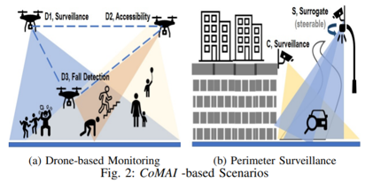
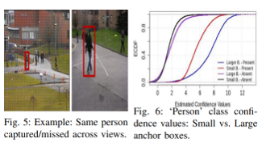
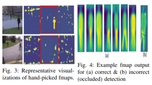
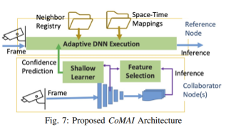
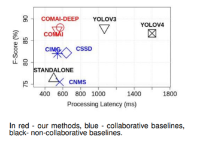

## [ComAI: Enabling Lightweight, Collaborative Intelligence by Retrofitting Vision DNNs](https://ieeexplore.ieee.org/stamp/stamp.jsp?tp=&arnumber=9796769)

* Kasthuri Jayarajah, Dhanuja Wanniarachchige, Tarek Abdelzaher, Archan Misra

* INFOCOM 2022

* Code not provided

### Motivation and Problem Formulation

* What is the high-level problem?
  * Is it possible to improve the inference accuracy of off-the-shelf vision DNN models, in a model-agnostic fashion, without requiring custom, deployment-specific model retraining or increasing their computational overhead?

* Use cases
  * multiple perspectives and multiple devices on the same area
  

* Previous works
  * Requires higher bandwidth and requires same DNN model

* Contributions
  * Establish the Basis for Beneficial Collaboration
  * Develop Lightweight Collaborative Inferencing
  * Demonstrate ComAI’s Performance Benefits

### Methods organized by contributions

* Establish the Basis for Beneficial Collaboration

  * Answer the question: why is the beneficial collaboration idea needed?

  * Two important observations

    * Important observation1: farther away/occluded objects might be missed from one perspective, but could be captured from another perspective (Fig 5)
    

    * Another important observation that leads to their solution: feature maps even in the early convolutional layers give a lot of information on the classification (Fig 3)
    

* Develop Lightweight Collaborative Inferencing

  * High level idea: train a shallow learner from some of the feature maps of conv layers of other perspectives, transform them into the perspective of target DNN and add the transformed information as bias to the output result

  * Feature selector: 
    * Frame f passed into DNN at layer i and filter j, and we have result F(f,i,j)
    * Binarize  F(f,i,j), and compare it with binarized ground truth
    * If above a threshold, select  F(f,i,j)

  * Shallow learner:
    * Given a set of selected  F(f,i,j), choose top k
    * Compute features for each anchor box as histograms + attributes
    * Use binary classification to determine the anchor box
  
  * Adaptive DNN:
    * Compute DNN till softmax layer and get confidence value (CV) for each box
    * Transform CV from shallow learner into perspective of current DNN, and add it to the CV of current DNN if the sum is greater than than a threshold

### Evaluations

* Datasets: PETS, WILDTRACK
* Baselines:
  * **Standalone:** non-collaborative
  * **CIMG:** exchange raw image
  * **CSSD:** share results as image
  * **CNMS:** share results as bounding box
  * **ComAI-Deep:** run the entire DNN and share results as CV
  * **ComAI-SURROGATE:** special case when DNN is at central server

* Results
  * Main result: 10%-15% improvement on F-score exchanging 10%-14% latency compared to Standalone
    

### Pros and Cons (Your thoughts)

* Pros:
  * It’s a clever idea
  * There is a nice motivation section (called illustrative scenarios)

* Cons:
  * Writing is messy, especially the evaluation section
  * Their first contribution, I thought it’s common sense
