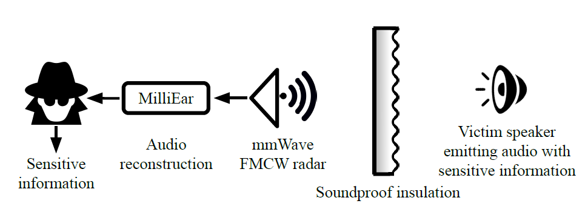

## [Milliear: Millimeter-wave Acoustic Eavesdropping with Unconstrained Vocabulary]([https://ieeexplore.ieee.org/document/9796940])

* Pengfei Hu (Shandong University),Yifan Ma (Shandong University), Panneer Selvam Santhalingam (George Mason University),Parth H Pathak (George Mason University),Xiuzhen Cheng (Shandong University)

* INFOCOM 2022

* Code not provided

### Motivation and Problem Formulation

* What is the high-level problem?
  * How to exploit the vulnerability of audio emitted by speakers to beter protect against security risks.

* What are the challenges?
  * Noise
    * Ambient noise needs to be separated out from the desired audio.
  * Unconstrained Audio
    * Words that weren't part of the pre-training set must be intelligible. 
  
* Previous works
  * Lower Resolution
  * Constrained Vocabulary
  * Expensive
  * Significantly Larger Footprint

* Assumptions
  * Transmission needs to come from a vibrating source such as a speaker
  * Training must have occured before hand
  * The angle and distance is a constraint

### Method

* What they propose to solve the problem?
  * mmWave Radar
    * Frequenct Modulated Continuous Wave
    * Transmit Chirp Signal
    * Receive and extract vibrations
    
    

### Evaluations

* HERE

### Pros and Cons (Your thoughts)

* Pros:
  * HERE
* Cons:
  * HERE
* Something I learned from the paper:
  * HERE
